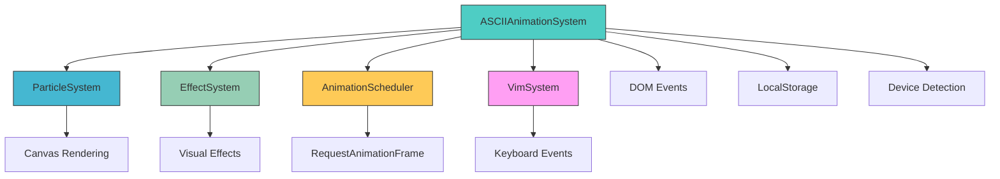
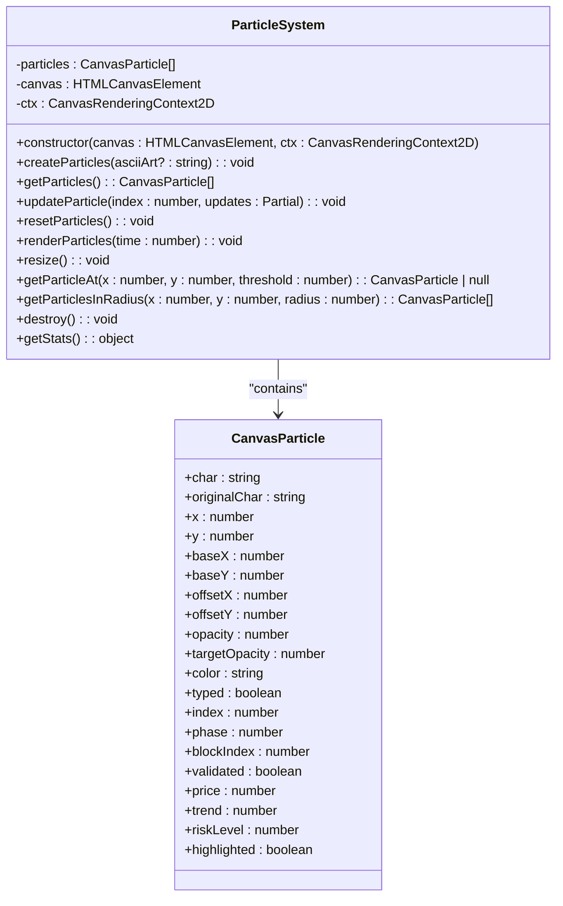
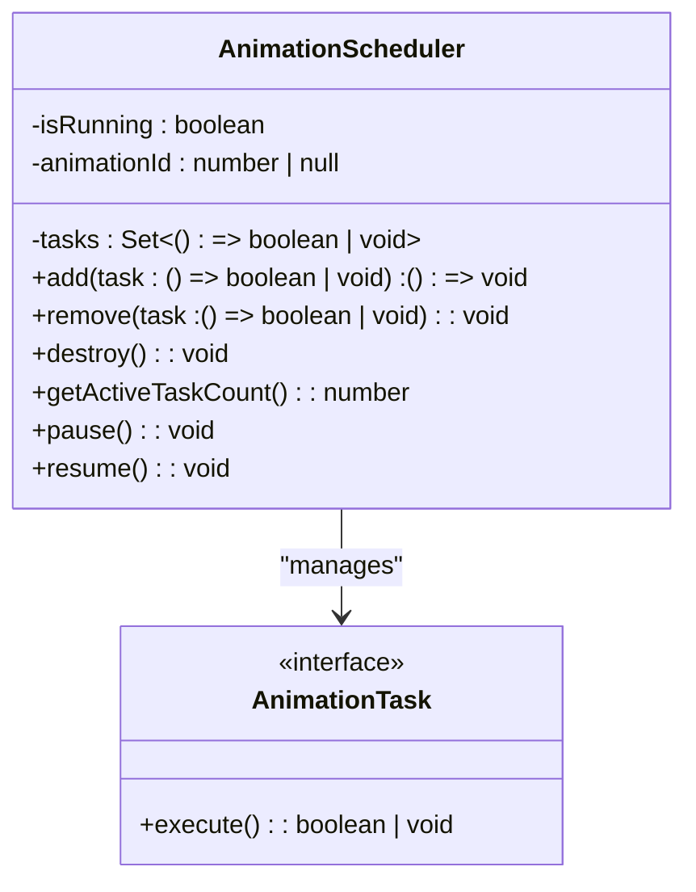
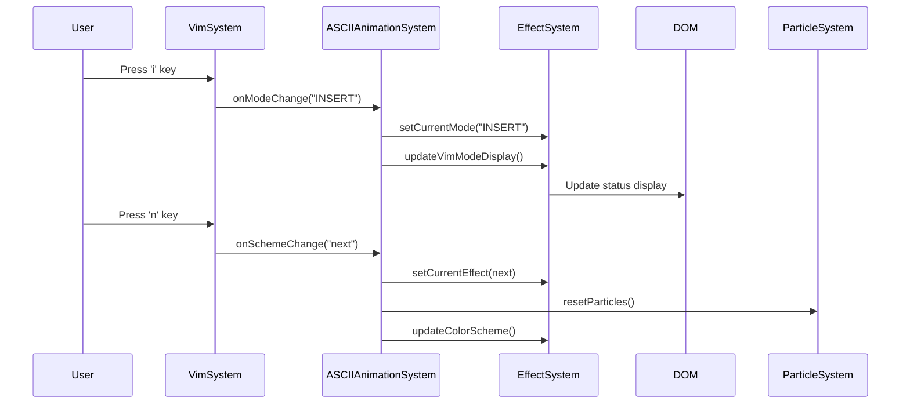

# ASCII Animation System

<cite>
**Referenced Files in This Document**   
- [ASCIIAnimationSystem.ts](file://src/animation/ASCIIAnimationSystem.ts)
- [ParticleSystem.ts](file://src/animation/ParticleSystem.ts)
- [EffectSystem.ts](file://src/animation/EffectSystem.ts)
- [AnimationScheduler.ts](file://src/animation/AnimationScheduler.ts)
- [VimSystem.ts](file://src/systems/VimSystem.ts)
- [constants.ts](file://src/utils/constants.ts)
- [device.ts](file://src/utils/device.ts)
- [dom.ts](file://src/utils/dom.ts)
- [performance.ts](file://src/utils/performance.ts)
</cite>

## Table of Contents
1. [Introduction](#introduction)
2. [Core Components](#core-components)
3. [Architecture Overview](#architecture-overview)
4. [Detailed Component Analysis](#detailed-component-analysis)
5. [Integration Points](#integration-points)
6. [Lifecycle Management](#lifecycle-management)
7. [Performance Considerations](#performance-considerations)
8. [Troubleshooting Guide](#troubleshooting-guide)
9. [Extension Patterns](#extension-patterns)

## Introduction
The ASCII Animation System serves as the central orchestrator for a sophisticated animation framework that transforms static ASCII art into dynamic, interactive visual experiences. This system coordinates multiple specialized subsystems to create rich animations that respond to user interactions, system events, and environmental conditions. The architecture is designed to provide seamless integration between visual effects, user input handling, and performance optimization, creating an immersive experience that adapts to different devices and user preferences.

## Core Components

The ASCII Animation System comprises several interconnected components that work in concert to deliver dynamic visual experiences. At its core, the system integrates four primary subsystems: the ParticleSystem for managing individual ASCII characters as animated particles, the EffectSystem for applying various visual transformations, the AnimationScheduler for efficient frame rendering, and the VimSystem for handling user input and mode-based interactions. These components are orchestrated by the ASCIIAnimationSystem class, which serves as the central controller responsible for initialization, state management, and lifecycle coordination.

**Section sources**
- [ASCIIAnimationSystem.ts](file://src/animation/ASCIIAnimationSystem.ts#L1-L50)
- [ParticleSystem.ts](file://src/animation/ParticleSystem.ts#L1-L20)
- [EffectSystem.ts](file://src/animation/EffectSystem.ts#L1-L30)
- [AnimationScheduler.ts](file://src/animation/AnimationScheduler.ts#L1-L15)

## Architecture Overview



**Diagram sources**
- [ASCIIAnimationSystem.ts](file://src/animation/ASCIIAnimationSystem.ts#L1-L50)
- [ParticleSystem.ts](file://src/animation/ParticleSystem.ts#L1-L15)
- [EffectSystem.ts](file://src/animation/EffectSystem.ts#L1-L25)
- [AnimationScheduler.ts](file://src/animation/AnimationScheduler.ts#L1-L10)
- [VimSystem.ts](file://src/systems/VimSystem.ts#L1-L15)

## Detailed Component Analysis

### ASCII Animation System Analysis
The ASCIIAnimationSystem class serves as the primary orchestrator of the animation framework, coordinating all subsystems and managing the overall animation state. It initializes with a canvas element ID and sets up the complete animation environment, including particle creation, effect initialization, and event listener registration. The system maintains state variables for animation control, including isRunning and isPaused flags, and manages a collection of cleanup functions to ensure proper resource disposal.

```mermaid
classDiagram
class ASCIIAnimationSystem {
-canvas : HTMLCanvasElement
-ctx : CanvasRenderingContext2D
-time : number
-mousePos : {x : number, y : number}
-particleSystem : ParticleSystem
-effectSystem : EffectSystem
-vimSystem : VimSystem
-animationScheduler : AnimationScheduler
-isRunning : boolean
-isPaused : boolean
-cleanupFunctions : (() => void)[]
+constructor(canvasId : string)
+init() : void
+start() : void
+pause() : void
+resume() : void
+destroy() : void
+getStats() : object
}
ASCIIAnimationSystem --> ParticleSystem : "uses"
ASCIIAnimationSystem --> EffectSystem : "uses"
ASCIIAnimationSystem --> VimSystem : "uses"
ASCIIAnimationSystem --> AnimationScheduler : "uses"
```

**Diagram sources**
- [ASCIIAnimationSystem.ts](file://src/animation/ASCIIAnimationSystem.ts#L1-L368)

**Section sources**
- [ASCIIAnimationSystem.ts](file://src/animation/ASCIIAnimationSystem.ts#L1-L368)

### Particle System Analysis
The ParticleSystem manages individual ASCII characters as discrete particles with their own properties and behaviors. Each particle contains information about its character, position, color, opacity, and various state flags. The system handles particle creation based on predefined ASCII art, rendering with appropriate styling, and provides methods for updating particle properties. It also includes functionality for particle selection based on spatial queries and maintains statistics about the current particle state.



**Diagram sources**
- [ParticleSystem.ts](file://src/animation/ParticleSystem.ts#L1-L166)

**Section sources**
- [ParticleSystem.ts](file://src/animation/ParticleSystem.ts#L1-L166)

### Effect System Analysis
The EffectSystem implements a strategy pattern to manage various visual effects that can be applied to particles. It maintains a collection of EffectStrategy implementations, each responsible for a specific visual transformation. The system supports multiple effects including Matrix Rain, Blockchain Validation, Real-time Trading, and several Gruvbox-themed effects. It applies effects based on the current mode, mouse position, and time, creating dynamic visual responses to user interactions.

```mermaid
classDiagram
class EffectSystem {
-currentEffect : number
-currentMode : VimMode['mode']
-mousePos : {x : number, y : number}
-effects : Map<number, EffectStrategy>
+constructor()
+setCurrentEffect(effect : number) : void
+setCurrentMode(mode : VimMode['mode']) : void
+setMousePosition(x : number, y : number) : void
+getCurrentEffect() : number
+getCurrentEffectName() : string
+getCurrentMode() : VimMode['mode']
+applyEffectToParticle(particle : CanvasParticle, time : number) : void
+updateVimModeDisplay() : void
+destroy() : void
}
class EffectStrategy {
<<interface>>
+apply(particle : CanvasParticle, context : EffectContext) : void
}
class MatrixRainEffect {
+apply(particle : CanvasParticle, context : EffectContext) : void
}
class BlockchainValidationEffect {
+apply(particle : CanvasParticle, context : EffectContext) : void
}
class TradingEffect {
+apply(particle : CanvasParticle, context : EffectContext) : void
}
class GruvboxTypingEffect {
+apply(particle : CanvasParticle, context : EffectContext) : void
}
EffectSystem --> EffectStrategy : "uses"
EffectStrategy <|-- MatrixRainEffect
EffectStrategy <|-- BlockchainValidationEffect
EffectStrategy <|-- TradingEffect
EffectStrategy <|-- GruvboxTypingEffect
```

**Diagram sources**
- [EffectSystem.ts](file://src/animation/EffectSystem.ts#L1-L860)

**Section sources**
- [EffectSystem.ts](file://src/animation/EffectSystem.ts#L1-L860)

### Animation Scheduler Analysis
The AnimationScheduler provides a centralized mechanism for managing animation frames using requestAnimationFrame. It maintains a set of animation tasks and ensures they are executed efficiently during each animation frame. The scheduler handles task addition and removal, manages the animation loop, and provides methods for pausing and resuming animation. This centralized approach prevents multiple competing animation loops and ensures consistent frame timing.



**Diagram sources**
- [AnimationScheduler.ts](file://src/animation/AnimationScheduler.ts#L1-L86)

**Section sources**
- [AnimationScheduler.ts](file://src/animation/AnimationScheduler.ts#L1-L86)

## Integration Points

### Vim System Integration
The ASCII Animation System integrates with the VimSystem to provide mode-based visual feedback and keyboard-driven interactions. The system registers callbacks for various Vim events, including mode changes, scheme changes, scrolling, and navigation commands. When a mode change occurs, the system updates the current effect and visual display accordingly. This integration enables users to navigate and interact with the animation using familiar Vim keybindings.



**Diagram sources**
- [ASCIIAnimationSystem.ts](file://src/animation/ASCIIAnimationSystem.ts#L1-L368)
- [VimSystem.ts](file://src/systems/VimSystem.ts#L1-L251)

**Section sources**
- [ASCIIAnimationSystem.ts](file://src/animation/ASCIIAnimationSystem.ts#L1-L368)
- [VimSystem.ts](file://src/systems/VimSystem.ts#L1-L251)

## Lifecycle Management

### Initialization Process
The ASCII Animation System follows a structured initialization process that sets up all components and prepares the animation environment. During initialization, the system restores the previously selected color scheme from localStorage, resizes the canvas to match its container, creates the initial set of particles, sets up event listeners with appropriate debouncing and throttling, and applies mobile-specific optimizations. The initialization concludes with starting the animation loop.

**Section sources**
- [ASCIIAnimationSystem.ts](file://src/animation/ASCIIAnimationSystem.ts#L50-L100)

### Start and Pause Operations
The system provides explicit methods for controlling the animation lifecycle. The start() method begins the animation loop by adding the animate function to the AnimationScheduler, while the pause() method stops the animation by pausing the scheduler. The resume() method restarts the animation if it was previously paused. These methods allow for fine-grained control over animation execution, enabling features like pausing when the document is not visible.

**Section sources**
- [ASCIIAnimationSystem.ts](file://src/animation/ASCIIAnimationSystem.ts#L300-L350)

### Cleanup and Destruction
The destroy() method performs comprehensive cleanup of all system resources. It stops the animation, clears all event listeners, and destroys each subsystem in turn. The system maintains a collection of cleanup functions that are executed during destruction, ensuring that all event listeners and resources are properly released. This prevents memory leaks and allows for safe recreation of the animation system if needed.

**Section sources**
- [ASCIIAnimationSystem.ts](file://src/animation/ASCIIAnimationSystem.ts#L320-L340)

## Performance Considerations

### Mobile Optimizations
The system includes specific optimizations for mobile devices to ensure smooth performance across different hardware capabilities. It detects mobile devices and applies appropriate settings, including memory monitoring that can pause animations when memory usage is high. The system also monitors battery status and can pause animations when the device is in low battery mode. These optimizations help maintain performance and extend battery life on mobile devices.

**Section sources**
- [ASCIIAnimationSystem.ts](file://src/animation/ASCIIAnimationSystem.ts#L130-L180)
- [device.ts](file://src/utils/device.ts#L1-L387)

### Frame Rate Management
The AnimationScheduler ensures consistent frame timing by using requestAnimationFrame, which synchronizes with the browser's refresh rate. The system uses throttling for mouse movement events to limit updates to approximately 60fps, preventing excessive processing. The centralized scheduler prevents multiple animation loops from competing for resources, ensuring efficient use of CPU and GPU.

**Section sources**
- [ASCIIAnimationSystem.ts](file://src/animation/ASCIIAnimationSystem.ts#L110-L120)
- [AnimationScheduler.ts](file://src/animation/AnimationScheduler.ts#L1-L86)

### Memory Management
The system implements several strategies for efficient memory management. It uses a cleanup manager to track and release resources, properly removes event listeners when no longer needed, and destroys subsystems completely when the animation is stopped. The particle system recreates particles only when necessary, such as during canvas resize, rather than continuously allocating new objects.

**Section sources**
- [ASCIIAnimationSystem.ts](file://src/animation/ASCIIAnimationSystem.ts#L320-L340)
- [performance.ts](file://src/utils/performance.ts#L1-L354)

## Troubleshooting Guide

### Rendering Glitches
Rendering issues may occur due to canvas sizing problems or timing issues with animation frames. Ensure the canvas element exists and is properly sized before initialization. Check that the animation system is properly destroyed before creating a new instance to prevent multiple animation loops. Verify that the canvas context is successfully obtained, as this can fail in some environments.

**Section sources**
- [ASCIIAnimationSystem.ts](file://src/animation/ASCIIAnimationSystem.ts#L20-L40)

### Initialization Failures
Initialization failures typically occur when required elements are not found in the DOM or when there are issues with dependencies. Verify that the canvas element with the specified ID exists in the document before creating the animation system. Check that all required modules are properly imported and available. Ensure that localStorage is accessible, as the system attempts to restore the previous color scheme from storage.

**Section sources**
- [ASCIIAnimationSystem.ts](file://src/animation/ASCIIAnimationSystem.ts#L20-L40)
- [constants.ts](file://src/utils/constants.ts#L1-L198)

### Cross-Browser Inconsistencies
While the system uses standard web APIs, some features like the Battery API may not be available in all browsers. The system includes fallbacks for these cases, but certain features may be disabled. Test in target browsers to ensure all functionality works as expected. Pay particular attention to event handling and CSS class manipulation, which can vary between browsers.

**Section sources**
- [device.ts](file://src/utils/device.ts#L1-L387)
- [dom.ts](file://src/utils/dom.ts#L1-L529)

## Extension Patterns

### Adding New Animation Sequences
New animation sequences can be added by creating additional EffectStrategy implementations and registering them with the EffectSystem. Each new effect should implement the apply method to define how it transforms particles based on time, mouse position, and other context. The effect should be added to the EffectSystem's effects map with a unique index and corresponding name in the EFFECT_NAMES array.

**Section sources**
- [EffectSystem.ts](file://src/animation/EffectSystem.ts#L1-L860)
- [constants.ts](file://src/utils/constants.ts#L1-L198)

### Integrating External Triggers
The system can be extended to respond to external triggers by adding new callback methods to the ASCIIAnimationSystem and exposing them through the public API. For example, external components could trigger specific effects or animations by calling methods on the animation system instance. Event listeners can be added to respond to custom events or API calls from other parts of the application.

**Section sources**
- [ASCIIAnimationSystem.ts](file://src/animation/ASCIIAnimationSystem.ts#L1-L368)