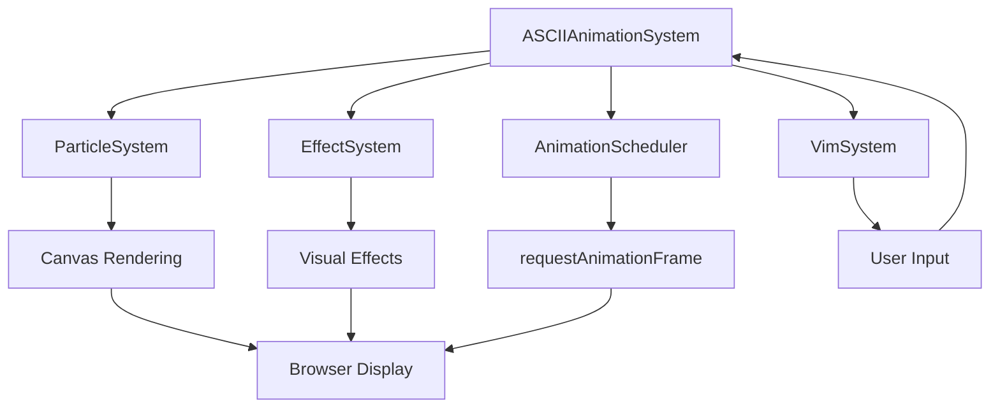
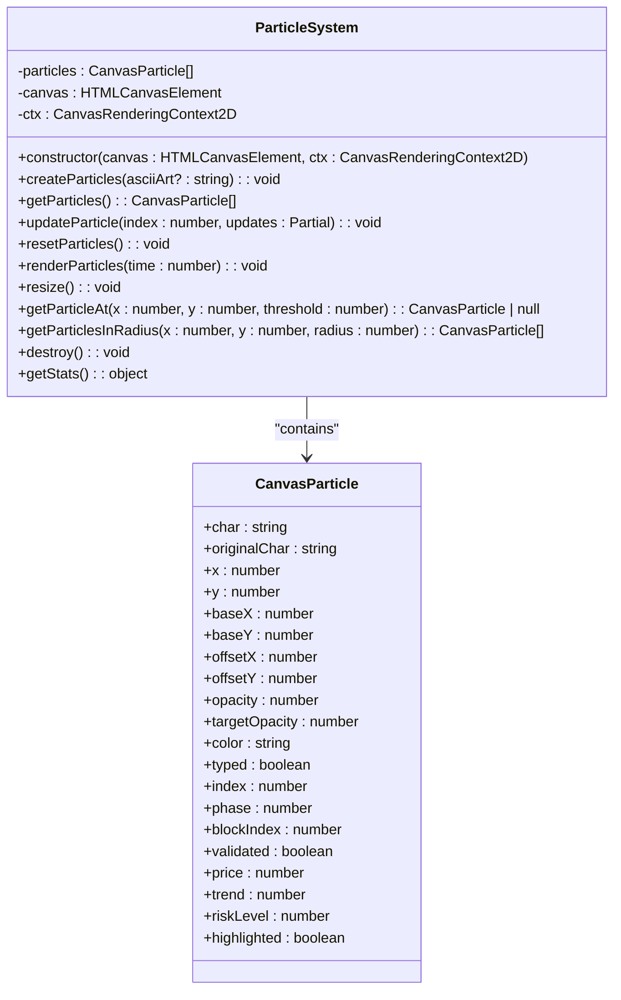
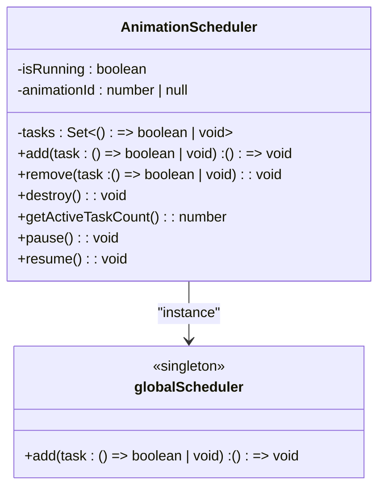
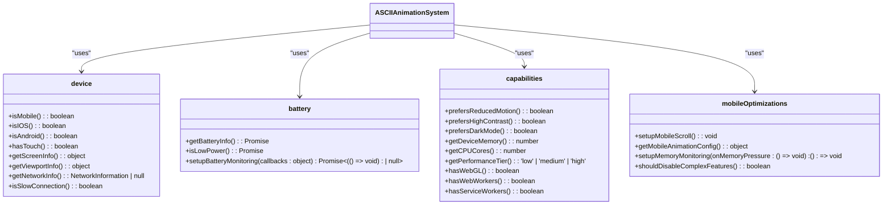
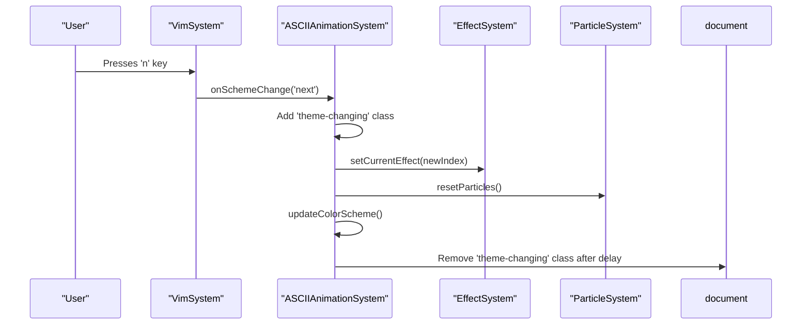

# Animation Framework

<cite>
**Referenced Files in This Document**   
- [ASCIIAnimationSystem.ts](file://src/animation/ASCIIAnimationSystem.ts)
- [ParticleSystem.ts](file://src/animation/ParticleSystem.ts)
- [EffectSystem.ts](file://src/animation/EffectSystem.ts)
- [AnimationScheduler.ts](file://src/animation/AnimationScheduler.ts)
- [device.ts](file://src/utils/device.ts)
- [constants.ts](file://src/utils/constants.ts)
- [types/index.ts](file://src/types/index.ts)
</cite>

## Table of Contents
1. [Introduction](#introduction)
2. [Core Components](#core-components)
3. [Architecture Overview](#architecture-overview)
4. [Detailed Component Analysis](#detailed-component-analysis)
5. [Effect System Implementation](#effect-system-implementation)
6. [Animation Scheduling and Performance](#animation-scheduling-and-performance)
7. [Dynamic Effect Transitions](#dynamic-effect-transitions)
8. [Canvas and Rendering Optimization](#canvas-and-rendering-optimization)
9. [Troubleshooting and Best Practices](#troubleshooting-and-best-practices)

## Introduction
The Animation Framework is a sophisticated system designed to create dynamic ASCII-based visual effects synchronized with user interactions and system events. This document provides a comprehensive analysis of the animation subsystem, focusing on its core components: the ASCIIAnimationSystem as the central orchestrator, the ParticleSystem for managing individual particle physics, the EffectSystem for applying named visual themes, and the AnimationScheduler for frame management. The framework leverages canvas-based rendering to create visually rich animations while implementing performance optimizations for various device capabilities.

## Core Components
The animation framework consists of four primary components that work in concert to deliver synchronized visual effects. The ASCIIAnimationSystem serves as the main coordinator, initializing and managing all animation components. The ParticleSystem handles the creation, positioning, and lifecycle management of individual particles that form the ASCII art. The EffectSystem applies named visual themes by manipulating particle behaviors and colors based on the current effect. The AnimationScheduler manages the animation loop using requestAnimationFrame with throttling and performance monitoring. These components are tightly integrated through dependency injection and event-driven communication, ensuring smooth coordination between particle rendering, visual effects, and frame scheduling.

**Section sources**
- [ASCIIAnimationSystem.ts](file://src/animation/ASCIIAnimationSystem.ts#L1-L50)
- [ParticleSystem.ts](file://src/animation/ParticleSystem.ts#L1-L30)
- [EffectSystem.ts](file://src/animation/EffectSystem.ts#L1-L50)
- [AnimationScheduler.ts](file://src/animation/AnimationScheduler.ts#L1-L20)

## Architecture Overview
The animation framework follows a modular architecture with clear separation of concerns. The ASCIIAnimationSystem acts as the central orchestrator, coordinating between the ParticleSystem, EffectSystem, and AnimationScheduler. This design enables independent development and testing of each component while maintaining tight integration for synchronized visual effects.



**Diagram sources**
- [ASCIIAnimationSystem.ts](file://src/animation/ASCIIAnimationSystem.ts#L1-L50)
- [ParticleSystem.ts](file://src/animation/ParticleSystem.ts#L1-L10)
- [EffectSystem.ts](file://src/animation/EffectSystem.ts#L1-L10)
- [AnimationScheduler.ts](file://src/animation/AnimationScheduler.ts#L1-L10)

## Detailed Component Analysis

### ASCIIAnimationSystem Analysis
The ASCIIAnimationSystem serves as the central orchestrator of the animation framework, responsible for initializing and synchronizing all animation components. It manages the canvas context, coordinates particle rendering with visual effects, and handles the animation lifecycle. The system implements comprehensive event handling for window resize, mouse movement, and visibility changes, ensuring responsive behavior across different scenarios.

```mermaid
classDiagram
class ASCIIAnimationSystem {
+canvas : HTMLCanvasElement
+ctx : CanvasRenderingContext2D
+time : number
+mousePos : {x : number, y : number}
-particleSystem : ParticleSystem
-effectSystem : EffectSystem
-vimSystem : VimSystem
-animationScheduler : AnimationScheduler
-isRunning : boolean
-isPaused : boolean
-cleanupFunctions : (() => void)[]
+constructor(canvasId : string)
+init() : void
+start() : void
+pause() : void
+resume() : void
+destroy() : void
+getStats() : object
}
ASCIIAnimationSystem --> ParticleSystem : "uses"
ASCIIAnimationSystem --> EffectSystem : "uses"
ASCIIAnimationSystem --> AnimationScheduler : "uses"
ASCIIAnimationSystem --> VimSystem : "uses"
```

**Diagram sources**
- [ASCIIAnimationSystem.ts](file://src/animation/ASCIIAnimationSystem.ts#L15-L50)

**Section sources**
- [ASCIIAnimationSystem.ts](file://src/animation/ASCIIAnimationSystem.ts#L1-L368)

### ParticleSystem Analysis
The ParticleSystem manages individual particle physics including position, velocity, and lifecycle using canvas-based rendering. Each particle is represented as a character with properties for position, color, opacity, and various state indicators. The system handles particle creation based on ASCII art templates, rendering with time-based animations, and responsive interactions through mouse position tracking.



**Diagram sources**
- [ParticleSystem.ts](file://src/animation/ParticleSystem.ts#L15-L45)
- [types/index.ts](file://src/types/index.ts#L150-L180)

**Section sources**
- [ParticleSystem.ts](file://src/animation/ParticleSystem.ts#L1-L166)

## Effect System Implementation
The EffectSystem plays a crucial role in applying named visual themes by manipulating particle behaviors and colors. It implements a strategy pattern with various EffectStrategy classes, each responsible for a specific visual effect. The system supports multiple named effects such as Matrix Rain, Blockchain Validation, and Trading, allowing dynamic transitions between different visual themes based on user actions or system events.

### Effect Strategy Pattern
The EffectSystem uses a strategy pattern to manage different visual effects, with each effect implemented as a separate class that conforms to the EffectStrategy interface. This design enables easy extension with new effects while maintaining a consistent API for effect application.

```mermaid
classDiagram
class EffectSystem {
-currentEffect : number
-currentMode : VimMode['mode']
-mousePos : {x : number, y : number}
-effects : Map<number, EffectStrategy>
+setCurrentEffect(effect : number) : void
+setCurrentMode(mode : VimMode['mode']) : void
+setMousePosition(x : number, y : number) : void
+getCurrentEffect() : number
+getCurrentEffectName() : string
+applyEffectToParticle(particle : CanvasParticle, time : number) : void
}
class EffectStrategy {
<<interface>>
+apply(particle : CanvasParticle, context : EffectContext) : void
}
class MatrixRainEffect {
+apply(particle : CanvasParticle, context : EffectContext) : void
}
class BlockchainValidationEffect {
+apply(particle : CanvasParticle, context : EffectContext) : void
}
class TradingEffect {
+apply(particle : CanvasParticle, context : EffectContext) : void
}
class SWIFTNetworkEffect {
+apply(particle : CanvasParticle, context : EffectContext) : void
}
class RiskAssessmentEffect {
+apply(particle : CanvasParticle, context : EffectContext) : void
}
EffectSystem --> EffectStrategy : "uses"
EffectStrategy <|-- MatrixRainEffect
EffectStrategy <|-- BlockchainValidationEffect
EffectStrategy <|-- TradingEffect
EffectStrategy <|-- SWIFTNetworkEffect
EffectStrategy <|-- RiskAssessmentEffect
```

**Diagram sources**
- [EffectSystem.ts](file://src/animation/EffectSystem.ts#L150-L200)
- [types/index.ts](file://src/types/index.ts#L130-L150)

**Section sources**
- [EffectSystem.ts](file://src/animation/EffectSystem.ts#L1-L861)

### Named Visual Effects
The framework includes several named visual effects, each with unique particle manipulation patterns:

- **Matrix Rain**: Creates a cascading effect with character morphing and color transitions
- **Blockchain Validation**: Simulates hash generation with progressive validation states
- **Trading Effect**: Implements realistic price movements with momentum and trend calculations
- **SWIFT Network**: Visualizes international banking message routing with currency symbols
- **Risk Assessment**: Displays dynamic risk visualization with heat map movement
- **Compliance Check**: Simulates document scanning and validation processes
- **Trade Settlement**: Animates the T+2 settlement cycle with matching, clearing, and settlement phases
- **Gruvbox Typing**: Implements a multi-phase code compilation and debugging visualization

These effects are registered in the EffectSystem during initialization and can be dynamically switched based on user input or system events.

## Animation Scheduling and Performance
The AnimationScheduler provides centralized management of animation frames using requestAnimationFrame with performance optimizations. It implements a task-based system that allows multiple animation functions to be coordinated through a single animation loop, reducing browser overhead and improving performance.

### AnimationScheduler Implementation
The AnimationScheduler uses a Set to store animation tasks, ensuring each task is only executed once per frame. It manages the animation loop lifecycle with start, stop, and tick methods, and includes error handling to prevent animation crashes from stopping the entire system.



**Diagram sources**
- [AnimationScheduler.ts](file://src/animation/AnimationScheduler.ts#L15-L45)

**Section sources**
- [AnimationScheduler.ts](file://src/animation/AnimationScheduler.ts#L1-L86)

### Performance Monitoring with device.ts
The framework leverages the device.ts utility module for comprehensive performance monitoring and device capability detection. This module provides utilities for detecting mobile devices, touch capabilities, screen information, and network conditions. It also includes battery monitoring and memory usage tracking to optimize performance on resource-constrained devices.

The mobileOptimizations module implements adaptive behavior based on device capabilities, including memory monitoring that can pause animations when memory usage exceeds 80% of the heap limit. The battery module sets up monitoring for low battery conditions, automatically pausing animations to conserve power when battery level drops below 15% and the device is not charging.



**Diagram sources**
- [device.ts](file://src/utils/device.ts#L15-L100)
- [ASCIIAnimationSystem.ts](file://src/animation/ASCIIAnimationSystem.ts#L1-L368)

**Section sources**
- [device.ts](file://src/utils/device.ts#L1-L387)

## Dynamic Effect Transitions
The animation framework supports dynamic loading and transitioning between effects based on user actions or system events. This is primarily achieved through the VimSystem, which listens for keyboard events and triggers effect changes accordingly.

### Effect Transition Mechanism
When a user presses the 'n' key (next) or 'N' key (previous), the VimSystem triggers the handleSchemeChange method in the ASCIIAnimationSystem. This method implements a visual transition effect by adding a CSS class to the document body, creating a flash effect during the theme change. The transition includes:

1. Adding a 'theme-changing' CSS class to trigger a visual flash
2. Calculating the new effect index based on the direction (next or previous)
3. Setting the new effect in the EffectSystem
4. Resetting particles to their initial state
5. Updating the color scheme and persisting the selection to localStorage



**Diagram sources**
- [ASCIIAnimationSystem.ts](file://src/animation/ASCIIAnimationSystem.ts#L150-L200)
- [VimSystem.ts](file://src/systems/VimSystem.ts#L1-L251)

**Section sources**
- [ASCIIAnimationSystem.ts](file://src/animation/ASCIIAnimationSystem.ts#L150-L200)
- [VimSystem.ts](file://src/systems/VimSystem.ts#L1-L251)

## Canvas and Rendering Optimization
The animation framework implements several optimization techniques for canvas rendering and GPU/memory efficiency. These optimizations ensure smooth performance across different devices and screen sizes.

### Canvas Setup and Character Mapping
The framework uses a monospace font (12px) for consistent character alignment in the ASCII art. Characters are positioned based on a grid system with deterministic spacing calculations to ensure proper alignment. The createParticles method in the ParticleSystem calculates the total width of the ASCII art and centers it horizontally on the canvas.

Character mapping is implemented through the ASCII_CHARS constant in constants.ts, which defines various character sets for different visual effects:
- FILLED_BLOCKS: ['█', '▉', '▊', '▋', '▌', '▍', '▎', '▏']
- SHADE_BLOCKS: ['░', '▒', '▓', '█']
- BOX_DRAWING: Various line drawing characters
- PROGRESS: Characters for progress indicators

### GPU and Memory Optimization Techniques
The framework employs several optimization techniques to minimize GPU and memory usage:

1. **Object pooling**: Particles are reused rather than created and destroyed repeatedly
2. **Batch rendering**: All particles are rendered in a single loop to minimize context switching
3. **Throttled event listeners**: Mouse movement events are throttled to 60fps to prevent excessive processing
4. **Debounced resize handling**: Canvas resize events are debounced to prevent excessive re-rendering
5. **Memory monitoring**: On mobile devices, memory usage is monitored and animations are paused if usage exceeds 80% of the heap limit
6. **Battery-aware operation**: Animations are paused on low battery conditions to conserve power

The framework also implements a cleanup system that properly removes event listeners and destroys components when the animation system is destroyed, preventing memory leaks.

**Section sources**
- [ParticleSystem.ts](file://src/animation/ParticleSystem.ts#L50-L100)
- [constants.ts](file://src/utils/constants.ts#L150-L200)
- [device.ts](file://src/utils/device.ts#L200-L300)

## Troubleshooting and Best Practices

### Common Issues and Solutions
**Flickering Animations**: This issue can occur when multiple animation loops are running simultaneously. The solution is to ensure all animations are coordinated through the central AnimationScheduler rather than using multiple requestAnimationFrame calls.

**Battery Drain on Mobile Devices**: The framework addresses this through several mechanisms:
- Battery monitoring that pauses animations when battery level drops below 15%
- Memory monitoring that pauses animations when memory usage exceeds 80% of the heap limit
- Adaptive frame rate based on device capabilities

**Performance Issues on Low-End Devices**: The framework detects low-performance devices and adjusts animation complexity accordingly. The capabilities.getPerformanceTier() method classifies devices into low, medium, or high tiers based on memory and CPU cores, allowing the system to adjust animation quality.

### Best Practices for Extending with Custom Effects
When extending the framework with custom effects, follow these best practices:

1. **Implement the EffectStrategy interface**: Create a new class that implements the EffectStrategy interface with an apply method that manipulates particle properties based on time and context.

2. **Register the effect in EffectSystem**: Add the new effect to the initializeEffects method in the EffectSystem, assigning it a unique index.

3. **Use deterministic values**: For consistent behavior across devices, use deterministic values based on particle index or position rather than random values.

4. **Optimize for performance**: Minimize expensive operations in the apply method, as it is called for every particle on every frame. Use simple mathematical operations and avoid DOM manipulation.

5. **Handle cleanup properly**: If your effect uses external resources or creates intervals, implement proper cleanup in the destroy method.

6. **Test on multiple devices**: Verify that your effect performs well on both high-end and low-end devices, adjusting complexity as needed.

7. **Follow existing patterns**: Study the implementation of existing effects like MatrixRainEffect or BlockchainValidationEffect to understand the framework's patterns and conventions.

**Section sources**
- [EffectSystem.ts](file://src/animation/EffectSystem.ts#L1-L861)
- [device.ts](file://src/utils/device.ts#L1-L387)
- [performance.ts](file://src/utils/performance.ts#L1-L354)