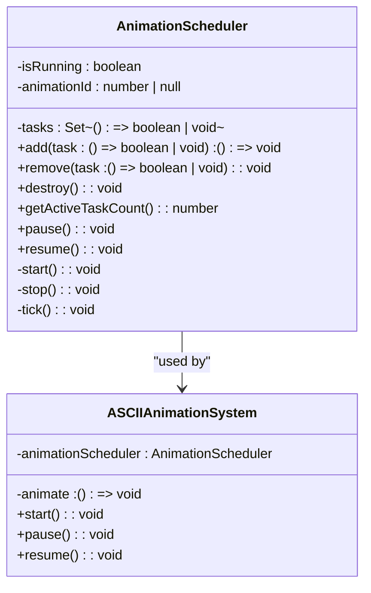
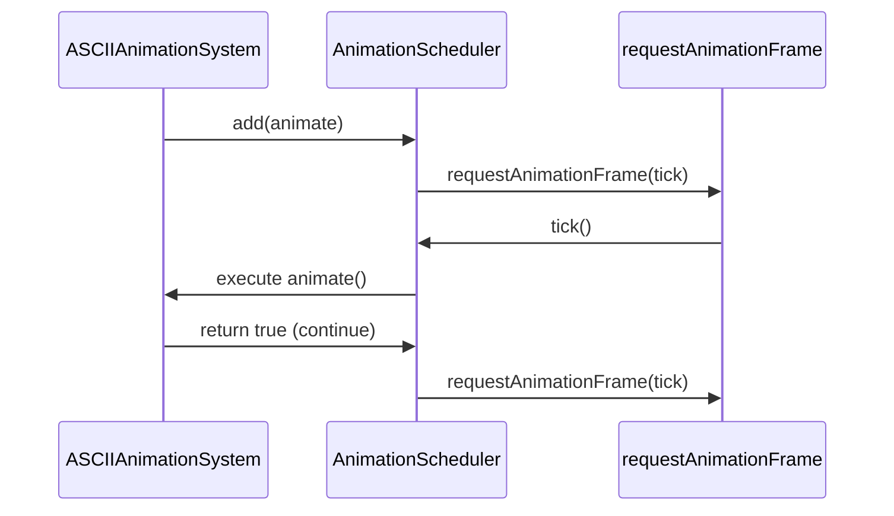
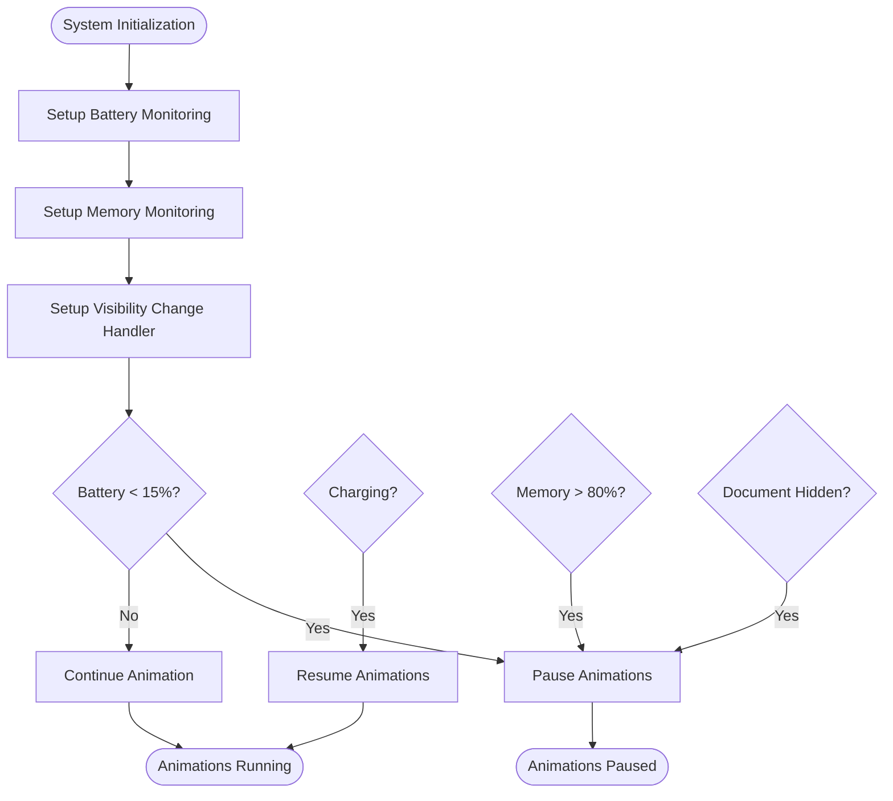

# Animation Scheduler

<cite>
**Referenced Files in This Document**   
- [AnimationScheduler.ts](file://src/animation/AnimationScheduler.ts)
- [ASCIIAnimationSystem.ts](file://src/animation/ASCIIAnimationSystem.ts)
- [device.ts](file://src/utils/device.ts)
- [performance.ts](file://src/utils/performance.ts)
</cite>

## Table of Contents
1. [Introduction](#introduction)
2. [Core Architecture](#core-architecture)
3. [Scheduling Loop and Frame Management](#scheduling-loop-and-frame-management)
4. [Integration with ASCIIAnimationSystem](#integration-with-asciianimationsystem)
5. [Performance Optimization Strategies](#performance-optimization-strategies)
6. [Device and Battery-Aware Throttling](#device-and-battery-aware-throttling)
7. [Common Issues and Troubleshooting](#common-issues-and-troubleshooting)
8. [Extension Points and Customization](#extension-points-and-customization)
9. [Conclusion](#conclusion)

## Introduction

The AnimationScheduler is a centralized system for managing animation frames using `requestAnimationFrame` (RAF), designed to optimize performance and resource usage across different devices. It serves as the backbone for smooth, efficient animations in the portfolio application by coordinating multiple animation tasks through a single RAF loop. The scheduler integrates with device and performance utilities to adapt behavior based on hardware capabilities, battery status, and user preferences. This document details its architecture, integration points, optimization strategies, and extension capabilities.

**Section sources**
- [AnimationScheduler.ts](file://src/animation/AnimationScheduler.ts#L1-L86)
- [ASCIIAnimationSystem.ts](file://src/animation/ASCIIAnimationSystem.ts#L1-L368)

## Core Architecture

The AnimationScheduler implements a singleton pattern with a global instance (`globalScheduler`) that centralizes all animation logic. It maintains a set of animation tasks, each represented as a callback function that returns a boolean indicating whether it should continue running. The scheduler ensures only one active RAF loop exists at any time, preventing redundant browser rendering cycles and reducing CPU usage.

Tasks are added via the `add()` method, which automatically starts the scheduling loop if not already running. Each task addition returns a cleanup function to remove the task, enabling automatic lifecycle management. The internal `tick()` method executes all registered tasks in sequence, handles errors gracefully, and removes tasks that return `false` or throw exceptions.

**Diagram sources**
- [AnimationScheduler.ts](file://src/animation/AnimationScheduler.ts#L6-L86)
- [ASCIIAnimationSystem.ts](file://src/animation/ASCIIAnimationSystem.ts#L25-L368)

**Section sources**
- [AnimationScheduler.ts](file://src/animation/AnimationScheduler.ts#L6-L86)
- [ASCIIAnimationSystem.ts](file://src/animation/ASCIIAnimationSystem.ts#L25-L368)

## Scheduling Loop and Frame Management

The scheduling loop is driven by `requestAnimationFrame`, ensuring synchronization with the browser's refresh rate. The `tick()` method iterates through all active tasks, executing them in the order they were added. After each frame, the scheduler checks if any tasks remain; if not, it stops the loop to conserve resources.

Frame timing is implicitly managed by RAF, which aims for 60 FPS but adapts to device capabilities. The scheduler does not implement explicit frame skipping but allows tasks to self-terminate by returning `false`. This design enables individual animations to control their own lifecycle while benefiting from centralized performance monitoring.

The `getActiveTaskCount()` method provides visibility into the current animation load, useful for performance monitoring and debugging. The `destroy()` method clears all tasks and stops the loop, ensuring proper cleanup during application shutdown or component unmounting.

**Section sources**
- [AnimationScheduler.ts](file://src/animation/AnimationScheduler.ts#L45-L64)
- [ASCIIAnimationSystem.ts](file://src/animation/ASCIIAnimationSystem.ts#L348-L368)

## Integration with ASCIIAnimationSystem

The AnimationScheduler is tightly integrated with the ASCIIAnimationSystem, which uses it to manage the main animation loop. During initialization, the ASCIIAnimationSystem creates a reference to the scheduler and registers its `animate()` method as a task. This method handles canvas rendering, particle updates, and effect application.

When the system starts, it calls `animationScheduler.add(this.animate)` to begin the animation loop. The scheduler automatically manages the RAF lifecycle, starting the loop when the first task is added and stopping it when all tasks are removed. The ASCIIAnimationSystem also uses `getActiveTaskCount()` in its `getStats()` method to expose animation state for monitoring.

**Diagram sources**
- [ASCIIAnimationSystem.ts](file://src/animation/ASCIIAnimationSystem.ts#L15-L25)
- [AnimationScheduler.ts](file://src/animation/AnimationScheduler.ts#L45-L64)

**Section sources**
- [ASCIIAnimationSystem.ts](file://src/animation/ASCIIAnimationSystem.ts#L15-L25)
- [AnimationScheduler.ts](file://src/animation/AnimationScheduler.ts#L45-L64)

## Performance Optimization Strategies

The AnimationScheduler contributes to performance optimization by consolidating multiple animation tasks into a single RAF loop, reducing browser overhead. It works in conjunction with utility functions from `performance.ts` such as `throttle()` and `debounce()` to manage event-driven updates efficiently.

The system implements adaptive behavior through integration with device detection utilities. On mobile devices, memory monitoring is set up to pause animations when heap usage exceeds 80% of the limit. The `mobileOptimizations.getMobileAnimationConfig()` method always returns maximum quality settings, prioritizing visual fidelity across devices.

FPS monitoring is achieved through the `getActiveTaskCount()` method and the ASCIIAnimationSystem's `getStats()` method, which exposes animation state including running status, pause state, and current time. These metrics can be used to detect performance degradation or unresponsive rendering.

**Section sources**
- [performance.ts](file://src/utils/performance.ts#L0-L238)
- [device.ts](file://src/utils/device.ts#L274-L387)

## Device and Battery-Aware Throttling

The AnimationScheduler enables device and battery-aware throttling through integration with the `device.ts` utilities. The ASCIIAnimationSystem sets up battery monitoring via `device.battery.setupBatteryMonitoring()`, which pauses animations when battery level drops below 15% and resumes them when charging begins.

Performance tier detection is handled by `capabilities.getPerformanceTier()`, which evaluates device memory, CPU cores, and mobile status to classify devices as 'low', 'medium', or 'high' performance. Although the current implementation always runs at maximum quality, this framework supports conditional frame skipping or complexity reduction based on performance tier.

Memory pressure monitoring is implemented for mobile devices, with a 10-second interval check that triggers animation pausing when JS heap usage exceeds 80% of the limit. This prevents out-of-memory crashes on low-end devices while maintaining smooth performance on capable hardware.

**Diagram sources**
- [device.ts](file://src/utils/device.ts#L125-L179)
- [ASCIIAnimationSystem.ts](file://src/animation/ASCIIAnimationSystem.ts#L153-L193)

**Section sources**
- [device.ts](file://src/utils/device.ts#L125-L179)
- [ASCIIAnimationSystem.ts](file://src/animation/ASCIIAnimationSystem.ts#L153-L193)

## Common Issues and Troubleshooting

Common issues with the animation system include janky animations, excessive CPU usage, and unresponsive rendering on low-end devices. Jank typically occurs when individual animation tasks perform expensive operations; this is mitigated by the scheduler's error handling, which removes failing tasks to prevent cascading failures.

Excessive CPU usage can result from too many concurrent animation tasks. The centralized scheduler helps identify this through `getActiveTaskCount()`, allowing developers to audit and optimize animation load. On low-end devices, the system may become unresponsive due to memory pressure, but the mobile optimization layer automatically pauses animations when heap usage is high.

To troubleshoot animation issues:
1. Check `getStats()` output for active task count and pause state
2. Verify battery and memory status on mobile devices
3. Ensure cleanup functions are properly registered to prevent memory leaks
4. Monitor console for "Animation task failed" error messages
5. Test visibility change handling to confirm pause/resume behavior

**Section sources**
- [AnimationScheduler.ts](file://src/animation/AnimationScheduler.ts#L50-L55)
- [ASCIIAnimationSystem.ts](file://src/animation/ASCIIAnimationSystem.ts#L153-L193)

## Extension Points and Customization

The AnimationScheduler provides several extension points for customization. The `add()` method accepts any function returning `boolean | void`, allowing integration of custom animation logic. Developers can create specialized timing functions by wrapping animations with utility functions from `performance.ts` such as `throttle()` or `debounce()`.

External synchronization sources can be integrated by creating adapter functions that translate external events (e.g., WebSockets, sensors) into animation tasks. The cleanup function returned by `add()` enables precise lifecycle management, supporting dynamic addition and removal of animation effects.

The global `globalScheduler` instance can be extended or wrapped to implement additional features like:
- Frame rate limiting for power saving
- Priority-based task scheduling
- Animation grouping and batch control
- Custom FPS monitoring and logging
- Integration with Web Workers for off-main-thread animation

**Section sources**
- [AnimationScheduler.ts](file://src/animation/AnimationScheduler.ts#L15-L25)
- [performance.ts](file://src/utils/performance.ts#L121-L173)

## Conclusion

The AnimationScheduler provides a robust foundation for efficient animation management, leveraging `requestAnimationFrame` to maintain smooth performance while conserving system resources. Its integration with device and performance utilities enables adaptive behavior based on battery status, memory pressure, and hardware capabilities. The centralized architecture simplifies lifecycle management and error handling, while providing visibility into animation state through monitoring APIs. By coordinating with the ASCIIAnimationSystem, it ensures consistent, high-quality visual experiences across diverse devices and conditions.