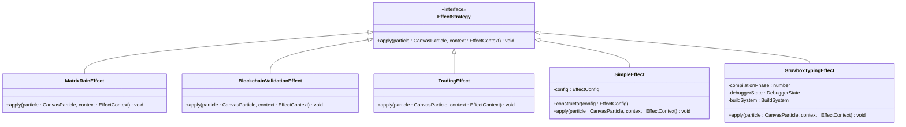
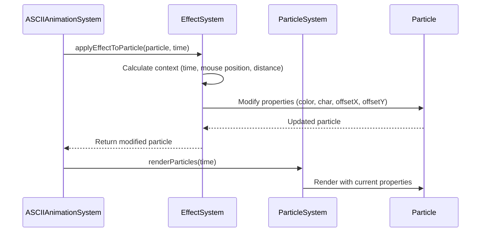
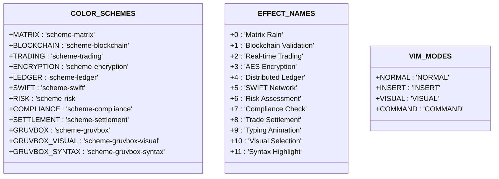
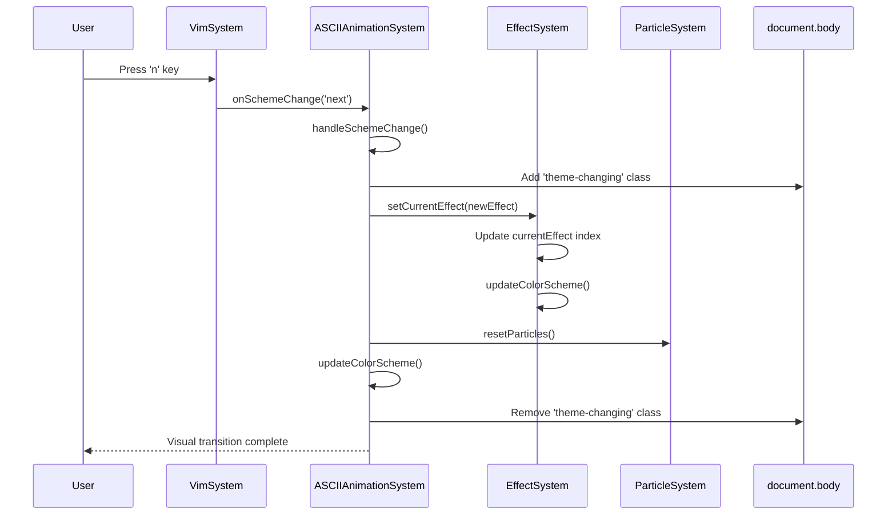
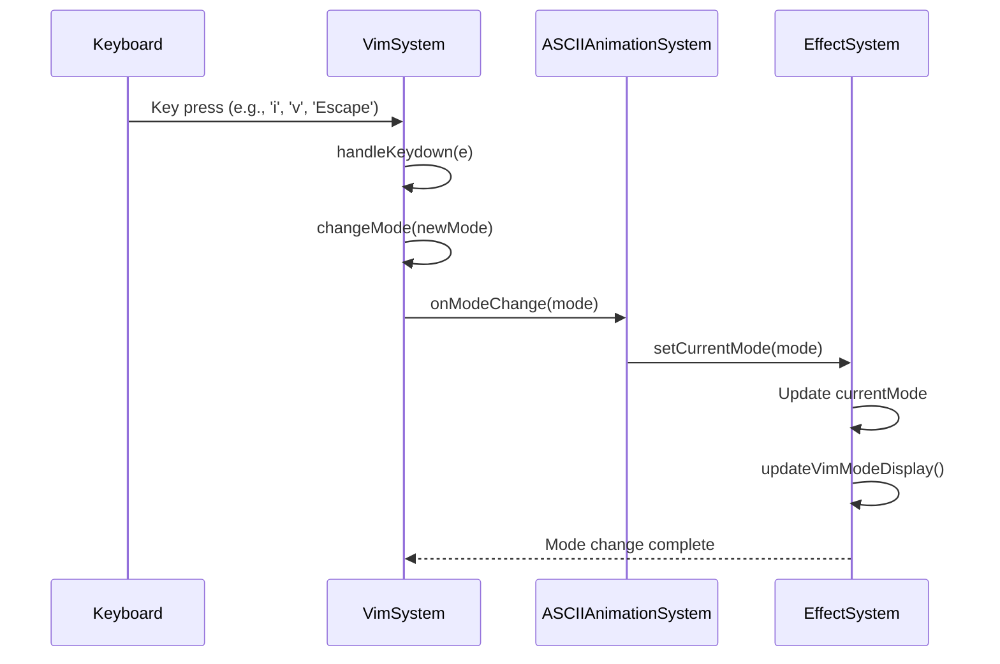
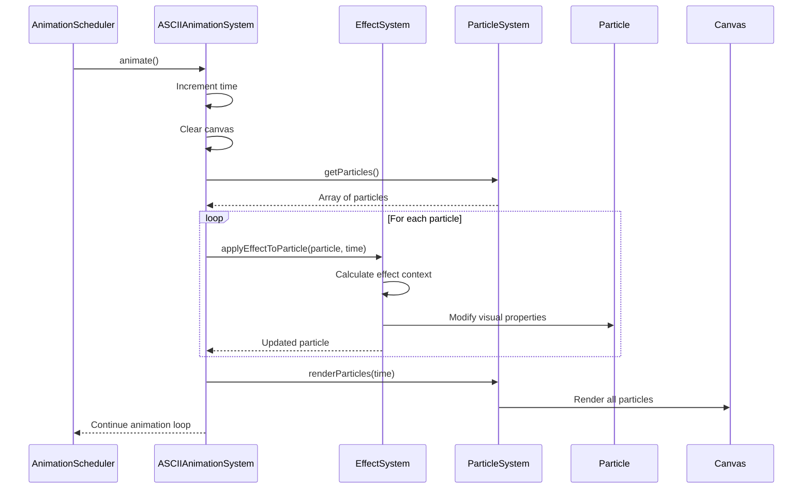

# Effect System

<cite>
**Referenced Files in This Document**   
- [EffectSystem.ts](file://src/animation/EffectSystem.ts)
- [constants.ts](file://src/utils/constants.ts)
- [ASCIIAnimationSystem.ts](file://src/animation/ASCIIAnimationSystem.ts)
- [ParticleSystem.ts](file://src/animation/ParticleSystem.ts)
- [VimSystem.ts](file://src/systems/VimSystem.ts)
- [index.ts](file://src/types/index.ts)
</cite>

## Table of Contents
1. [Introduction](#introduction)
2. [Core Components](#core-components)
3. [Architecture Overview](#architecture-overview)
4. [Detailed Component Analysis](#detailed-component-analysis)
5. [Effect Registration and Transition Mechanism](#effect-registration-and-transition-mechanism)
6. [State Management and Event-Driven Activation](#state-management-and-event-driven-activation)
7. [Integration with AnimationScheduler](#integration-with-animationscheduler)
8. [Troubleshooting Guide](#troubleshooting-guide)
9. [Best Practices for Custom Effects](#best-practices-for-custom-effects)
10. [Conclusion](#conclusion)

## Introduction
The Effect System is a sophisticated visual engine that manages named themes such as Matrix Rain, Blockchain Validation, and AES Encryption. It operates as a strategy pattern implementation where each effect manipulates particle properties including colors, movement patterns, and rendering styles. The system integrates with the ASCIIAnimationSystem to provide dynamic, interactive visual experiences that respond to user interactions and mode changes. This documentation details the architecture, implementation, and usage patterns of the Effect System, providing comprehensive guidance for developers working with or extending the visual effects framework.

## Core Components

The Effect System consists of several key components that work together to create dynamic visual effects. The system is built around the Strategy pattern, where each visual theme is implemented as a separate class that conforms to the `EffectStrategy` interface. These strategies manipulate `CanvasParticle` objects based on time, mouse position, and interaction state. The system maintains internal state for the current effect and Vim mode, coordinating with the AnimationScheduler for time-based updates. Effects are registered and managed through a central `EffectSystem` class that handles effect switching, state persistence, and integration with the broader animation framework.

**Section sources**
- [EffectSystem.ts](file://src/animation/EffectSystem.ts#L0-L861)
- [constants.ts](file://src/utils/constants.ts#L0-L199)
- [index.ts](file://src/types/index.ts#L0-L737)

## Architecture Overview

The Effect System follows a modular architecture that separates concerns between effect implementation, state management, and animation coordination. At its core, the system uses the Strategy pattern to encapsulate different visual effects, allowing for easy extension and modification. The architecture integrates with the ASCIIAnimationSystem, which coordinates the overall animation lifecycle, and the ParticleSystem, which manages individual particle rendering. The system also responds to Vim mode changes through the VimSystem, enabling context-aware visual behaviors.

```mermaid
graph TB
subgraph "Animation Framework"
A[ASCIIAnimationSystem] --> B[EffectSystem]
A --> C[ParticleSystem]
A --> D[AnimationScheduler]
A --> E[VimSystem]
end
subgraph "Effect System"
B --> F[EffectStrategy Interface]
F --> G[MatrixRainEffect]
F --> H[BlockchainValidationEffect]
F --> I[TradingEffect]
F --> J[SimpleEffect]
F --> K[SWIFTNetworkEffect]
F --> L[RiskAssessmentEffect]
F --> M[ComplianceCheckEffect]
F --> N[TradeSettlementEffect]
F --> O[GruvboxTypingEffect]
F --> P[GruvboxVisualSelectionEffect]
F --> Q[GruvboxSyntaxHighlightEffect]
end
E --> B: Mode Change Events
D --> B: Time Updates
C --> B: Particle Access
B --> C: Modified Particles
```

**Diagram sources **
- [EffectSystem.ts](file://src/animation/EffectSystem.ts#L0-L861)
- [ASCIIAnimationSystem.ts](file://src/animation/ASCIIAnimationSystem.ts#L0-L369)
- [ParticleSystem.ts](file://src/animation/ParticleSystem.ts#L0-L167)

## Detailed Component Analysis

### Effect Strategy Pattern Implementation
The Effect System implements the Strategy pattern through the `EffectStrategy` interface, which defines a contract for all visual effects. Each effect class implements the `apply` method that manipulates particle properties based on the current animation context.



**Diagram sources **
- [EffectSystem.ts](file://src/animation/EffectSystem.ts#L15-L17)
- [EffectSystem.ts](file://src/animation/EffectSystem.ts#L20-L150)

### Particle System Integration
The Effect System works closely with the ParticleSystem to manipulate individual particles that make up the ASCII animations. The ParticleSystem creates and manages particles based on the ASCII art, while the EffectSystem modifies their visual properties during animation.



**Diagram sources **
- [ASCIIAnimationSystem.ts](file://src/animation/ASCIIAnimationSystem.ts#L250-L260)
- [ParticleSystem.ts](file://src/animation/ParticleSystem.ts#L110-L130)

### Configuration and Constants
The Effect System relies on configuration constants defined in the `constants.ts` file, which provides effect names, color schemes, and Vim mode definitions. These constants ensure consistency across the application and provide a single source of truth for effect-related metadata.



**Diagram sources **
- [constants.ts](file://src/utils/constants.ts#L0-L199)

## Effect Registration and Transition Mechanism

The Effect System implements a robust registration and transition mechanism that allows for smooth switching between different visual themes. Effects are registered during system initialization and can be activated through programmatic calls or user interactions. The transition mechanism ensures visual continuity by coordinating particle state resets and applying smooth crossfading effects.

### Effect Registration Process
Effects are registered in the `initializeEffects` method of the `EffectSystem` class, where each effect is instantiated and stored in a Map with a numeric key. This approach allows for efficient effect lookup and switching.

```mermaid
flowchart TD
Start([EffectSystem Constructor]) --> Init[initializeEffects()]
Init --> MR[Register MatrixRainEffect]
Init --> BV[Register BlockchainValidationEffect]
Init --> TE[Register TradingEffect]
Init --> SE[Register SimpleEffect for AES Encryption]
Init --> DL[Register SimpleEffect for Distributed Ledger]
Init --> SN[Register SWIFTNetworkEffect]
Init --> RA[Register RiskAssessmentEffect]
Init --> CC[Register ComplianceCheckEffect]
Init --> TS[Register TradeSettlementEffect]
Init --> GT[Register GruvboxTypingEffect]
Init --> GV[Register GruvboxVisualSelectionEffect]
Init --> GS[Register GruvboxSyntaxHighlightEffect]
Init --> Update[updateColorScheme()]
Update --> End([Effects Ready])
```

**Diagram sources **
- [EffectSystem.ts](file://src/animation/EffectSystem.ts#L693-L757)

### Effect Transition Workflow
When transitioning between effects, the system follows a coordinated process that ensures visual consistency and proper state management. The transition is triggered by user input or programmatic calls and involves updating the current effect index, resetting particle states, and synchronizing the color scheme.



**Diagram sources **
- [ASCIIAnimationSystem.ts](file://src/animation/ASCIIAnimationSystem.ts#L195-L243)
- [EffectSystem.ts](file://src/animation/EffectSystem.ts#L758-L763)

## State Management and Event-Driven Activation

The Effect System maintains internal state for the current effect and Vim mode, responding to various events to trigger appropriate visual behaviors. The state management system ensures that effects can adapt to user interactions and application context, providing a dynamic and responsive visual experience.

### Internal State Management
The EffectSystem class maintains several state variables that track the current visual effect, Vim mode, and mouse position. These states are updated through public methods and used to determine which effect strategy to apply during animation.

```mermaid
classDiagram
class EffectSystem {
-currentEffect : number
-currentMode : VimMode['mode']
-mousePos : {x : number, y : number}
-effects : Map<number, EffectStrategy>
+setCurrentEffect(effect : number) void
+setCurrentMode(mode : VimMode['mode']) void
+setMousePosition(x : number, y : number) void
+getCurrentEffect() number
+getCurrentEffectName() string
+getCurrentMode() VimMode['mode']
+applyEffectToParticle(particle : CanvasParticle, time : number) void
}
```

**Diagram sources **
- [EffectSystem.ts](file://src/animation/EffectSystem.ts#L693-L763)

### Event-Driven Activation
The Effect System responds to various events, particularly Vim mode changes, to activate different visual behaviors. When the Vim mode changes, the system updates its internal state and can modify the visual presentation accordingly.



**Diagram sources **
- [VimSystem.ts](file://src/systems/VimSystem.ts#L0-L252)
- [ASCIIAnimationSystem.ts](file://src/animation/ASCIIAnimationSystem.ts#L195-L202)

## Integration with AnimationScheduler

The Effect System integrates with the AnimationScheduler to ensure efficient and synchronized animation updates. The AnimationScheduler provides a centralized requestAnimationFrame loop that coordinates all animation tasks, including effect application and particle rendering.

### Animation Coordination
The ASCIIAnimationSystem uses the AnimationScheduler to manage the animation loop, calling the `applyEffectToParticle` method for each particle during each frame. This ensures that effects are applied consistently and efficiently.



**Diagram sources **
- [ASCIIAnimationSystem.ts](file://src/animation/ASCIIAnimationSystem.ts#L250-L260)
- [AnimationScheduler.ts](file://src/animation/AnimationScheduler.ts#L0-L87)

### Performance Considerations
The integration with AnimationScheduler ensures optimal performance by batching animation tasks and minimizing layout thrashing. The scheduler also provides lifecycle management methods to pause and resume animations when appropriate, such as when the tab is not visible.

```mermaid
flowchart TD
Start([Document Hidden]) --> Pause[AnimationScheduler.pause()]
Pause --> Wait[Wait for visibility change]
Wait --> Visible{Document Visible?}
Visible --> |Yes| Resume[AnimationScheduler.resume()]
Visible --> |No| Wait
Resume --> End([Animations Resumed])
class Pause,Resume Wait;
```

**Diagram sources **
- [ASCIIAnimationSystem.ts](file://src/animation/ASCIIAnimationSystem.ts#L195-L202)
- [AnimationScheduler.ts](file://src/animation/AnimationScheduler.ts#L50-L60)

## Troubleshooting Guide

This section addresses common issues that may occur when working with the Effect System, providing diagnostic steps and solutions for various problems.

### Effect Flickering
Flickering effects may occur due to rapid state changes or conflicting animations. This can be resolved by ensuring proper state synchronization and animation timing.

**Symptoms:**
- Particles rapidly changing appearance
- Visual artifacts during effect transitions
- Inconsistent rendering between frames

**Solutions:**
- Ensure the AnimationScheduler is properly managing the animation loop
- Verify that effect transitions include appropriate delays or easing
- Check for conflicting state updates from multiple sources

**Section sources**
- [EffectSystem.ts](file://src/animation/EffectSystem.ts#L0-L861)
- [ASCIIAnimationSystem.ts](file://src/animation/ASCIIAnimationSystem.ts#L250-L260)

### Incorrect Color Rendering
Color rendering issues may occur when the color scheme is not properly synchronized with the effect state.

**Symptoms:**
- Colors not matching the expected theme
- Inconsistent color application across particles
- Colors reverting to default values

**Solutions:**
- Verify that `updateColorScheme()` is called after effect changes
- Check that the correct CSS classes are applied to the document
- Ensure that particle color properties are properly reset during transitions

**Section sources**
- [EffectSystem.ts](file://src/animation/EffectSystem.ts#L758-L763)
- [ASCIIAnimationSystem.ts](file://src/animation/ASCIIAnimationSystem.ts#L270-L290)

### Failed Transitions
Effect transitions may fail to complete or produce unexpected visual results.

**Symptoms:**
- Effect changes not taking place
- Partial application of new effect
- Animation glitches during transitions

**Solutions:**
- Ensure `resetParticles()` is called during effect transitions
- Verify that the theme-changing CSS class is properly applied and removed
- Check that the effect index is correctly calculated and within bounds

**Section sources**
- [ASCIIAnimationSystem.ts](file://src/animation/ASCIIAnimationSystem.ts#L210-L243)
- [EffectSystem.ts](file://src/animation/EffectSystem.ts#L758-L763)

## Best Practices for Custom Effects

When creating custom effects for the Effect System, follow these best practices to ensure performance efficiency and visual consistency.

### Performance Optimization
Custom effects should be designed with performance in mind, minimizing computational overhead and ensuring smooth animation.

**Recommendations:**
- Use deterministic calculations where possible to reduce randomness
- Cache frequently used values to avoid redundant calculations
- Limit the number of DOM manipulations and style changes
- Use efficient mathematical operations and avoid expensive functions

**Section sources**
- [EffectSystem.ts](file://src/animation/EffectSystem.ts#L20-L150)

### Visual Consistency
Custom effects should maintain visual consistency across different display resolutions and color schemes.

**Recommendations:**
- Use relative positioning and sizing rather than absolute values
- Ensure effects are responsive to different screen sizes
- Test effects with both light and dark color schemes
- Maintain consistent animation timing and easing

**Section sources**
- [constants.ts](file://src/utils/constants.ts#L0-L199)
- [EffectSystem.ts](file://src/animation/EffectSystem.ts#L0-L861)

### Code Structure and Maintainability
Custom effects should follow the established code structure and patterns to ensure maintainability and extensibility.

**Recommendations:**
- Implement the `EffectStrategy` interface consistently
- Use descriptive variable and method names
- Include comprehensive comments and documentation
- Follow the same coding style as existing effects

**Section sources**
- [EffectSystem.ts](file://src/animation/EffectSystem.ts#L15-L17)
- [index.ts](file://src/types/index.ts#L0-L737)

## Conclusion
The Effect System provides a robust and extensible framework for managing visual themes in the ASCII animation system. By implementing the Strategy pattern, it allows for easy addition of new effects while maintaining a consistent interface. The system integrates seamlessly with the AnimationScheduler and ParticleSystem, ensuring efficient and synchronized animations. Through its event-driven architecture and state management, the Effect System responds dynamically to user interactions and mode changes, creating an engaging and interactive visual experience. Developers can extend the system by creating custom effects that follow the established patterns and best practices, ensuring performance efficiency and visual consistency across different contexts and display environments.