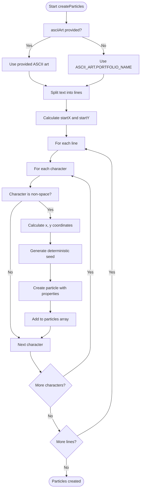
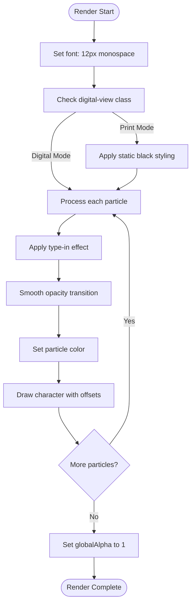
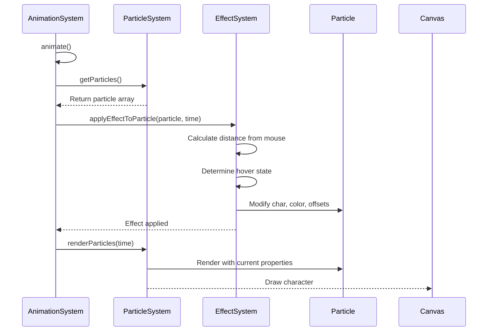

# Particle System

<cite>
**Referenced Files in This Document**   
- [ParticleSystem.ts](file://src/animation/ParticleSystem.ts)
- [EffectSystem.ts](file://src/animation/EffectSystem.ts)
- [constants.ts](file://src/utils/constants.ts)
- [index.ts](file://src/types/index.ts)
</cite>

## Table of Contents
1. [Introduction](#introduction)
2. [Core Components](#core-components)
3. [Particle Properties and Physics](#particle-properties-and-physics)
4. [Particle Generation Algorithm](#particle-generation-algorithm)
5. [Rendering Pipeline](#rendering-pipeline)
6. [Integration with EffectSystem](#integration-with-effectsystem)
7. [Animation and Update Cycle](#animation-and-update-cycle)
8. [Memory Management and Performance](#memory-management-and-performance)
9. [Common Issues and Optimization Strategies](#common-issues-and-optimization-strategies)
10. [Customization and Extension](#customization-and-extension)

## Introduction
The ParticleSystem is a core animation component responsible for managing ASCII-based particle effects in the portfolio application. It handles particle creation, positioning, state management, and canvas rendering, working in conjunction with the EffectSystem to produce dynamic visualizations. The system is designed to render text-based ASCII art as individual particles that can be animated with various effects based on user interaction and system state.

**Section sources**
- [ParticleSystem.ts](file://src/animation/ParticleSystem.ts#L1-L20)

## Core Components

The ParticleSystem class manages a collection of CanvasParticle objects, each representing a single character from the ASCII art. It interfaces directly with the HTML5 Canvas API for rendering and coordinates with the EffectSystem to apply dynamic visual effects. The system supports multiple rendering modes (digital and print) and responds to canvas resizing by regenerating particles to maintain proper layout.

```mermaid
classDiagram
class ParticleSystem {
-particles : CanvasParticle[]
-canvas : HTMLCanvasElement
-ctx : CanvasRenderingContext2D
+createParticles(asciiArt? : string) : void
+getParticles() : CanvasParticle[]
+updateParticle(index : number, updates : Partial~CanvasParticle~) : void
+resetParticles() : void
+renderParticles(time : number) : void
+resize() : void
+getParticleAt(x : number, y : number, threshold : number) : CanvasParticle | null
+getParticlesInRadius(x : number, y : number, radius : number) : CanvasParticle[]
+destroy() : void
+getStats() : object
}
class CanvasParticle {
+char : string
+originalChar : string
+x : number
+y : number
+baseX : number
+baseY : number
+offsetX : number
+offsetY : number
+opacity : number
+targetOpacity : number
+color : string
+typed : boolean
+index : number
+phase : number
+blockIndex : number
+validated : boolean
+price : number
+trend : number
+riskLevel : number
+highlighted : boolean
}
class EffectSystem {
-currentEffect : number
-currentMode : VimMode['mode']
-mousePos : {x : number, y : number}
-effects : Map~number, EffectStrategy~
+setCurrentEffect(effect : number) : void
+setCurrentMode(mode : VimMode['mode']) : void
+setMousePosition(x : number, y : number) : void
+applyEffectToParticle(particle : CanvasParticle, time : number) : void
+updateColorScheme() : void
}
ParticleSystem --> CanvasParticle : "contains"
EffectSystem --> ParticleSystem : "modifies"
```

**Diagram sources**
- [ParticleSystem.ts](file://src/animation/ParticleSystem.ts#L8-L166)
- [index.ts](file://src/types/index.ts#L92-L113)
- [EffectSystem.ts](file://src/animation/EffectSystem.ts#L721-L860)

**Section sources**
- [ParticleSystem.ts](file://src/animation/ParticleSystem.ts#L8-L166)
- [EffectSystem.ts](file://src/animation/EffectSystem.ts#L721-L860)

## Particle Properties and Physics

Each CanvasParticle maintains a comprehensive set of properties that define its visual appearance and behavior. Particles have both absolute (x, y) and relative (baseX, baseY) positioning to support offset animations. The physics model includes offset-based movement (offsetX, offsetY) for dynamic effects, opacity transitions for fade effects, and additional data properties (price, trend, riskLevel) that support domain-specific visualizations.

Particles also track their animation state through properties like 'typed' (for type-in effects) and 'validated' (for blockchain-style validation effects). The 'phase' property enables wave-like animations, while 'blockIndex' groups particles for coordinated effects. All particle properties are initialized deterministically based on position to ensure consistent behavior across sessions.

**Section sources**
- [index.ts](file://src/types/index.ts#L92-L113)
- [ParticleSystem.ts](file://src/animation/ParticleSystem.ts#L45-L78)

## Particle Generation Algorithm

The particle generation algorithm converts ASCII art into individual particles with precise positioning. It uses the PORTFOLIO_NAME constant from the ASCII_ART collection as the default source, splitting it into lines and processing each character. The algorithm centers the ASCII art horizontally on the canvas by calculating the total width and applying an appropriate startX offset.

For each non-space character, a particle is created with its position calculated based on character index and line number, using a fixed font size of 12px and character width of 60% of the font size. The algorithm employs deterministic seeding based on line and character indices to generate consistent values for properties like price, trend, and riskLevel, ensuring reproducible animations. This approach avoids randomization in favor of predictable, position-based values that create coherent visual patterns.



**Diagram sources**
- [constants.ts](file://src/utils/constants.ts#L159-L166)
- [ParticleSystem.ts](file://src/animation/ParticleSystem.ts#L25-L78)

**Section sources**
- [ParticleSystem.ts](file://src/animation/ParticleSystem.ts#L25-L78)
- [constants.ts](file://src/utils/constants.ts#L159-L166)

## Rendering Pipeline

The rendering pipeline processes particles through a series of animation stages before drawing them to the canvas. It begins by setting the font to 12px monospace and checking the current view mode. In print mode, particles are rendered as static black text without effects, while digital mode enables all animations.

Each animation frame, the pipeline processes every particle through several stages: type-in animation (where particles appear sequentially based on their index), opacity interpolation (smoothly transitioning from current to target opacity), and mode-based styling. The actual rendering uses fillText to draw each particle's character at its base position plus any offsets, with the current color and opacity applied through canvas state settings. After rendering all particles, the global alpha is reset to 1 to prevent bleed-through to other canvas operations.



**Diagram sources**
- [ParticleSystem.ts](file://src/animation/ParticleSystem.ts#L80-L118)

**Section sources**
- [ParticleSystem.ts](file://src/animation/ParticleSystem.ts#L80-L118)

## Integration with EffectSystem

The ParticleSystem integrates with the EffectSystem through a coordinated update cycle managed by the ASCIIAnimationSystem. During each animation frame, the EffectSystem applies the current visual effect to each particle based on contextual information including time, mouse position, and hover state. The integration occurs through the applyEffectToParticle method, which calculates the distance between the mouse and each particle to determine hover status.

The EffectSystem uses strategy pattern implementations (such as MatrixRainEffect, BlockchainValidationEffect, etc.) that modify particle properties directly. These effects can change a particle's character, color, and offset values based on the current effect type and animation time. The ParticleSystem remains agnostic to the specific effects, simply providing access to its particles and rendering them according to their current state. This separation of concerns allows for easy addition of new effects without modifying the core particle system.



**Diagram sources**
- [EffectSystem.ts](file://src/animation/EffectSystem.ts#L800-L830)
- [ASCIIAnimationSystem.ts](file://src/animation/ASCIIAnimationSystem.ts#L241-L260)
- [ParticleSystem.ts](file://src/animation/ParticleSystem.ts#L80-L118)

**Section sources**
- [EffectSystem.ts](file://src/animation/EffectSystem.ts#L800-L830)
- [ASCIIAnimationSystem.ts](file://src/animation/ASCIIAnimationSystem.ts#L241-L260)

## Animation and Update Cycle

The animation update cycle is driven by the requestAnimationFrame loop through the AnimationScheduler. Each frame, the system increments a time counter and clears the canvas before processing particles. The update cycle follows a specific sequence: first, the EffectSystem applies the current effect to each particle based on the current time and mouse position; then, the ParticleSystem renders all particles with their updated properties.

Particles have several time-dependent behaviors: the type-in effect reveals particles sequentially based on their index and the current time, while various effects use the time parameter to create oscillating movements through trigonometric functions. The smooth opacity animation uses linear interpolation (lerp) to create gradual transitions. The cycle also handles user interaction by updating the mouse position on movement events and triggering particle effects when the cursor approaches particles.

**Section sources**
- [ASCIIAnimationSystem.ts](file://src/animation/ASCIIAnimationSystem.ts#L241-L260)
- [ParticleSystem.ts](file://src/animation/ParticleSystem.ts#L80-L118)
- [EffectSystem.ts](file://src/animation/EffectSystem.ts#L800-L830)

## Memory Management and Performance

The ParticleSystem employs several memory-efficient techniques to maintain performance. It uses object pooling implicitly by reusing the same particle objects throughout the application lifecycle rather than creating and destroying them frequently. The system regenerates particles only when necessary, such as during canvas resize operations, rather than on every frame.

The implementation avoids unnecessary object creation by using direct property assignment through Object.assign in the updateParticle method. The rendering process uses canvas state management efficiently, setting font properties once per frame rather than for each particle. The system also provides a destroy method to clear all particles when the component is unmounted, preventing memory leaks.

For performance optimization, the system uses deterministic values rather than random number generation, which is computationally expensive. The particle count is kept reasonable by processing only non-space characters from the ASCII art, and the rendering loop includes early bailout conditions for paused or non-running states.

**Section sources**
- [ParticleSystem.ts](file://src/animation/ParticleSystem.ts#L145-L166)
- [ASCIIAnimationSystem.ts](file://src/animation/ASCIIAnimationSystem.ts#L241-L260)

## Common Issues and Optimization Strategies

Common issues with the particle system include potential performance degradation on low-end devices, flickering during rapid state changes, and uneven particle distribution. The system addresses performance concerns through automatic pausing when the device battery is low, as detected by the device.battery API. This adaptive behavior conserves resources when system conditions warrant it.

To prevent flickering, the system uses smooth interpolation for opacity changes rather than abrupt transitions. The deterministic seeding approach ensures consistent particle distribution without the clustering that can occur with pure randomization. For optimization, the system could implement culling of particles that are far from the viewport or not currently visible, though this is not currently implemented.

Additional optimization strategies include adjusting the spawn rate based on device performance metrics, using CSS transforms for simple animations instead of canvas rendering when possible, and implementing level-of-detail techniques where distant or less important particles receive simpler effects. The current implementation already includes efficient event handling with proper cleanup to prevent memory leaks.

**Section sources**
- [ASCIIAnimationSystem.ts](file://src/animation/ASCIIAnimationSystem.ts#L153-L193)
- [ParticleSystem.ts](file://src/animation/ParticleSystem.ts#L145-L166)

## Customization and Extension

The particle system can be customized for new use cases by extending the EffectSystem with additional EffectStrategy implementations. New effects can be added to the initializeEffects method in the EffectSystem class, following the same pattern as existing effects. Customization options include modifying the ASCII art source, adjusting the font size and spacing parameters, or changing the centering algorithm for different layout requirements.

For aesthetic customization, developers can modify the color schemes in the constants file or introduce new character sets for different visual styles. The particle properties provide hooks for domain-specific data visualization, such as financial data (price, trend) or risk assessment (riskLevel). The system's modular design allows for easy replacement of the rendering pipeline or integration with alternative animation frameworks while maintaining the core particle management functionality.

**Section sources**
- [EffectSystem.ts](file://src/animation/EffectSystem.ts#L740-L780)
- [constants.ts](file://src/utils/constants.ts#L1-L198)
- [ParticleSystem.ts](file://src/animation/ParticleSystem.ts#L25-L78)