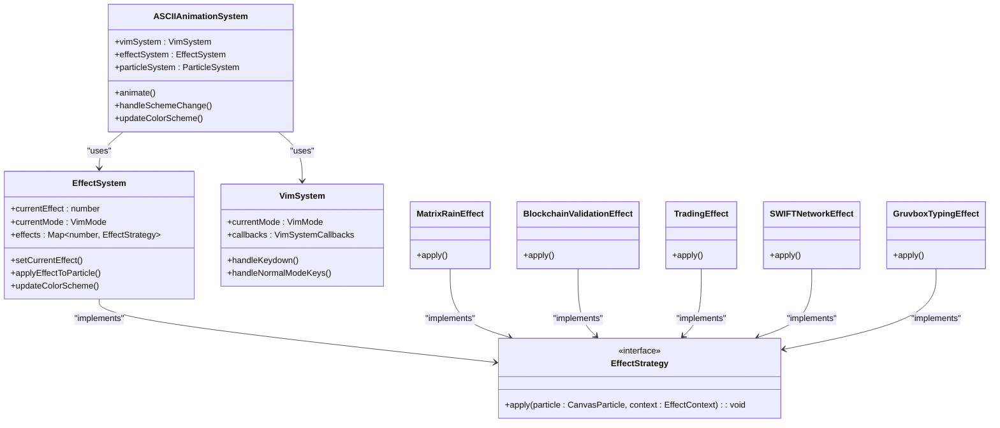
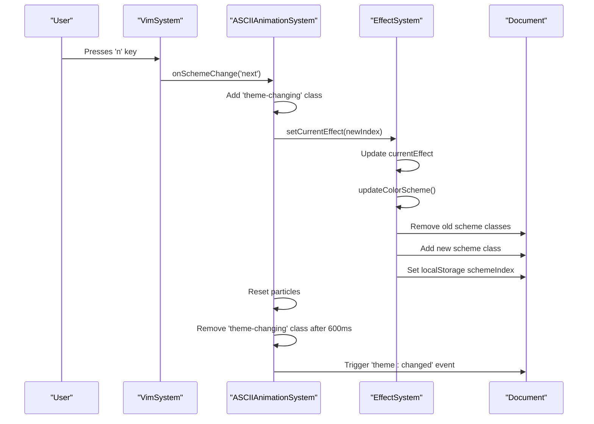
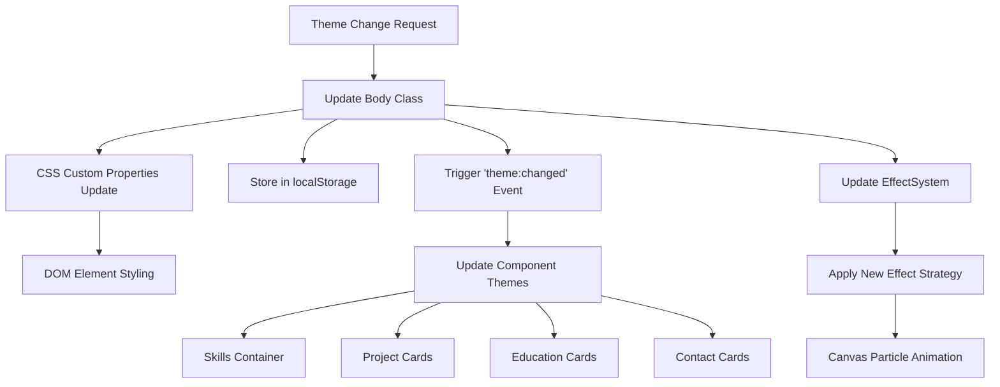

# Configuration & Theming

<cite>
**Referenced Files in This Document**   
- [constants.ts](file://src/utils/constants.ts)
- [config.ts](file://config.ts)
- [content/config.ts](file://src/content/config.ts)
- [VimSystem.ts](file://src/systems/VimSystem.ts)
- [EffectSystem.ts](file://src/animation/EffectSystem.ts)
- [main.css](file://src/styles/main.css)
- [global.css](file://src/styles/global.css)
- [ASCIIAnimationSystem.ts](file://src/animation/ASCIIAnimationSystem.ts)
</cite>

## Table of Contents
1. [Global Configuration Constants](#global-configuration-constants)
2. [Site Configuration Files](#site-configuration-files)
3. [Theme System Architecture](#theme-system-architecture)
4. [Theme Switching Mechanism](#theme-switching-mechanism)
5. [CSS Custom Properties and Styling](#css-custom-properties-and-styling)
6. [Persistence with localStorage](#persistence-with-localstorage)
7. [Integration with Vim Commands](#integration-with-vim-commands)
8. [Visual Updates Across Systems](#visual-updates-across-systems)
9. [Adding New Themes](#adding-new-themes)
10. [Troubleshooting and Versioning](#troubleshooting-and-versioning)

## Global Configuration Constants

The `constants.ts` file serves as the central repository for global configuration settings, defining color schemes, animation parameters, keybindings, and effect names. It exports several key constant objects that establish the foundation for the theming system.

The `COLOR_SCHEMES` object defines 13 distinct color palettes, including thematic options like 'MATRIX', 'BLOCKCHAIN', 'TRADING', and specialized Gruvbox variants ('GRUVBOX', 'GRUVBOX_VISUAL', 'GRUVBOX_SYNTAX'). Each scheme corresponds to a CSS class that will be applied to the document body. The `EFFECT_NAMES` array contains human-readable names for each visual effect, maintaining a one-to-one correspondence with the color schemes.

Animation parameters are defined through `TRANSITION_SPEEDS` (with values like 'FAST' at 150ms and 'NORMAL' at 250ms) and `ANIMATION_EASINGS` (including 'ease-in-out' and custom cubic-bezier curves). The `VIM_KEYBINDINGS` object establishes the keyboard shortcuts for theme navigation, with 'n' for next theme and 'N' for previous theme, while `CSS_VARIABLES` enumerates the CSS custom properties used throughout the application for theming.

**Section sources**
- [constants.ts](file://src/utils/constants.ts#L1-L198)

## Site Configuration Files

The project utilizes two configuration files for site metadata and content structure: the root `config.ts` and `src/content/config.ts`. Both files are functionally identical, defining a blog collection with a schema that specifies required fields: title (string), description (string), publishDate (date), and tags (array of strings).

These configuration files use Astro's content collection system to structure blog content, enabling type-safe access to blog posts throughout the application. The collections are defined using `defineCollection` with Zod validation, ensuring data integrity for blog entries. While these files don't directly participate in the theming system, they establish the content framework within which themes are applied.

The duplication of configuration between the root and content directories suggests a modular approach to configuration management, potentially allowing for environment-specific overrides or different content sources while maintaining consistent schema definitions.

**Section sources**
- [config.ts](file://config.ts#L1-L16)
- [content/config.ts](file://src/content/config.ts#L1-L15)

## Theme System Architecture

The theming system is built on a multi-layered architecture that integrates CSS classes, custom properties, and JavaScript logic. At its core, the system uses CSS class toggling on the document body to activate different color schemes, with each theme corresponding to a specific class like 'scheme-matrix' or 'scheme-gruvbox'.

The visual effects are managed by the `EffectSystem` class, which maintains a mapping between effect indices and `EffectStrategy` implementations. Each predefined theme (MATRIX, BLOCKCHAIN, etc.) has a corresponding effect class that controls particle behavior, colors, and animations. The system synchronizes the current effect index with the active color scheme, ensuring visual consistency across the canvas animations and UI components.

Theme state is centralized in the `ASCIIAnimationSystem`, which coordinates between the `VimSystem` (for input handling), `EffectSystem` (for visual effects), and the DOM (for CSS class management). This architecture enables a cohesive experience where theme changes simultaneously update both the background canvas animations and the foreground UI elements through CSS custom properties.

**Diagram sources**
- [ASCIIAnimationSystem.ts](file://src/animation/ASCIIAnimationSystem.ts#L1-L50)
- [EffectSystem.ts](file://src/animation/EffectSystem.ts#L1-L100)
- [VimSystem.ts](file://src/systems/VimSystem.ts#L1-L50)

## Theme Switching Mechanism

Theme switching is triggered through Vim keybindings ('n' for next, 'N' for previous) and implemented through a coordinated sequence of operations. When a theme change is requested, the `handleSchemeChange` method in `ASCIIAnimationSystem` first adds a 'theme-changing' class to the body, which triggers a CSS animation that creates a radial flash effect to provide visual feedback.

The system then calculates the new effect index by incrementing or decrementing the current index modulo the total number of effects (13). The `EffectSystem`'s `setCurrentEffect` method updates the internal state and calls `updateColorScheme`, which removes all existing color scheme classes from the body and adds the new scheme class (e.g., 'scheme-matrix'). This class change activates the corresponding CSS rules that redefine the custom properties for colors, fonts, and other visual attributes.

The theme change also triggers a reset of the particle system to ensure animations restart with the new visual parameters. The entire process is designed to be seamless, with the flash animation duration (600ms) synchronized with the removal of the 'theme-changing' class to create a smooth transition between themes.

**Diagram sources**
- [VimSystem.ts](file://src/systems/VimSystem.ts#L150-L200)
- [ASCIIAnimationSystem.ts](file://src/animation/ASCIIAnimationSystem.ts#L220-L240)
- [EffectSystem.ts](file://src/animation/EffectSystem.ts#L765-L820)

## CSS Custom Properties and Styling

The theming system relies heavily on CSS custom properties (CSS variables) to achieve dynamic styling. Defined in the `:root` selector of `main.css`, these variables establish the visual language of the application and are organized into semantic groups: colors, fonts, transitions, and layout metrics.

Color variables follow the pattern `--background-digital`, `--foreground-digital`, `--muted-digital`, `--border-digital`, and `--accent-digital`, with corresponding print-mode variants. Each color scheme in `main.css` redefines these variables to create a cohesive palette. For example, the MATRIX theme sets `--foreground-digital` to `#00ff41` (a bright green) and `--background-digital` to `#0a0a0a` (near-black), creating the classic "digital rain" aesthetic.

The system also defines variables for typography (`--font-body`, `--font-accent`), transitions (`--transition-speed`), and responsive design (`--space-md`, `--font-size-lg`). These variables are used throughout the CSS to ensure consistency and enable theme-specific adjustments. The `global.css` file applies transitions to interactive elements, creating smooth color and background changes when switching themes.

The CSS architecture includes responsive adjustments and accessibility features, with media queries for different screen sizes and support for `prefers-reduced-motion` and `prefers-contrast` user preferences. Print styles override the digital theme variables to ensure high-contrast black-and-white output suitable for physical printing.

**Section sources**
- [main.css](file://src/styles/main.css#L1-L1073)
- [global.css](file://src/styles/global.css#L1-L185)

## Persistence with localStorage

Theme preferences are persisted across sessions using `localStorage`, ensuring users return to their preferred theme upon subsequent visits. When a theme change occurs, both the `EffectSystem` and `ASCIIAnimationSystem` attempt to store the new state in `localStorage`.

The `updateColorScheme` method in `EffectSystem` stores the current effect index as a string in the 'schemeIndex' key, while `ASCIIAnimationSystem` additionally stores the derived theme name ('dark' or 'light') in the 'theme' key. This dual storage approach allows the application to restore both the specific visual effect and the appropriate color mode.

The persistence mechanism is wrapped in try-catch blocks to handle cases where `localStorage` might not be available (e.g., due to browser settings or private browsing modes). Upon initialization, the application checks for stored values and applies the corresponding theme if found, falling back to the default MATRIX theme if no preference is stored or if storage is unavailable.

This persistence system ensures a personalized user experience while maintaining graceful degradation when client-side storage is restricted.

**Section sources**
- [EffectSystem.ts](file://src/animation/EffectSystem.ts#L835-L845)
- [ASCIIAnimationSystem.ts](file://src/animation/ASCIIAnimationSystem.ts#L250-L260)

## Integration with Vim Commands

The theming system is tightly integrated with the Vim-inspired navigation system, allowing users to cycle through themes using the 'n' (next) and 'N' (previous) keys in normal mode. This integration is implemented through callback functions passed from `ASCIIAnimationSystem` to `VimSystem` during initialization.

When a keypress event occurs, `VimSystem` checks if the key matches the theme navigation bindings defined in `VIM_KEYBINDINGS.SCHEME`. If a match is found, it invokes the `onSchemeChange` callback with the appropriate direction ('next' or 'prev'). This callback pattern decouples the input handling from the theme logic, allowing for flexible configuration and easy extension.

The Vim system also updates the status display to show the current command ('NEXT →' for 'n', '← PREV' for 'N'), providing immediate feedback to the user. After a short delay (1500ms), the display reverts to showing the current Vim mode. This integration creates a cohesive user experience where theme navigation feels like a natural extension of the Vim modal interface.

**Section sources**
- [VimSystem.ts](file://src/systems/VimSystem.ts#L150-L200)
- [ASCIIAnimationSystem.ts](file://src/animation/ASCIIAnimationSystem.ts#L220-L240)

## Visual Updates Across Systems

Theme changes trigger coordinated visual updates across multiple systems through a combination of CSS class manipulation and event broadcasting. When a new theme is activated, the immediate effect is the application of a new CSS class to the document body, which cascades through the stylesheet to update all elements using the redefined CSS custom properties.

Beyond CSS, the system employs a pub-sub pattern to notify components of theme changes. The `ASCIIAnimationSystem` triggers a 'theme:changed' event with details about the new theme, which is listened for by various components. The `componentEnhancements.ts` file contains an event listener that updates all themed elements (skills containers, project cards, etc.) with the new theme attribute, enabling theme-specific styling in React components.

The canvas-based animations are updated through the `EffectSystem`, which applies the new effect strategy to each particle. Different themes have distinct visual behaviors: the MATRIX theme features falling characters with green trails, while the TRADING theme displays currency symbols with price movement animations. The Gruvbox variants offer specialized effects like code compilation sequences and syntax highlighting.

This multi-layered update system ensures visual consistency across both DOM-rendered UI components and canvas-based animations, creating a unified aesthetic experience regardless of the active theme.

**Diagram sources**
- [ASCIIAnimationSystem.ts](file://src/animation/ASCIIAnimationSystem.ts#L250-L260)
- [componentEnhancements.ts](file://src/utils/componentEnhancements.ts#L89-L122)
- [EffectSystem.ts](file://src/animation/EffectSystem.ts#L820-L860)

## Adding New Themes

Adding new themes requires modifications to multiple files to ensure full integration. First, the new theme must be added to the `COLOR_SCHEMES` object in `constants.ts`, following the naming convention 'scheme-themeName'. A corresponding entry should be added to the `EFFECT_NAMES` array with a descriptive name.

Next, a new CSS rule must be defined in `main.css` using the format `body.scheme-themeName` that redefines the core color variables (`--foreground-digital`, `--background-digital`, etc.) to create the desired palette. The new effect logic should be implemented as a class that implements the `EffectStrategy` interface, defining how particles should behave under this theme.

The new effect class must be registered in the `initializeEffects` method of `EffectSystem`, assigned to the next available index. Finally, the effect index range checks in methods like `setCurrentEffect` will automatically accommodate the new theme due to their reliance on `EFFECT_NAMES.length`.

For example, adding a 'CYBER' theme would involve creating a `CyberEffect` class with appropriate visual behavior, adding `CYBER: 'scheme-cyber'` to `COLOR_SCHEMES`, adding 'Cyber Mode' to `EFFECT_NAMES`, defining the CSS rules for the cyber palette, and registering the effect at index 13 in `initializeEffects`.

**Section sources**
- [constants.ts](file://src/utils/constants.ts#L1-L50)
- [main.css](file://src/styles/main.css#L1-L1073)
- [EffectSystem.ts](file://src/animation/EffectSystem.ts#L700-L760)

## Troubleshooting and Versioning

Common issues with theme consistency typically stem from incomplete CSS variable coverage or event listener registration. If certain elements don't update with theme changes, verify that they use the proper CSS custom properties rather than hardcoded colors. For components that fail to respond to theme changes, ensure they either use the body class directly or listen for the 'theme:changed' event.

Versioning considerations are important when updating default themes, as changes to color variables or effect behaviors may affect user expectations. The localStorage persistence means users will retain their theme preferences across updates, but changes to the effect order or naming could cause unexpected behavior. When modifying existing themes, maintain backward compatibility by preserving the same effect indices and class names.

For major theme overhauls, consider introducing new scheme names rather than modifying existing ones, allowing users to opt into the new design while preserving the original experience. The modular architecture of the theming system facilitates this approach, as new themes can be added without disrupting existing functionality.

**Section sources**
- [main.css](file://src/styles/main.css#L1-L1073)
- [EffectSystem.ts](file://src/animation/EffectSystem.ts#L820-L860)
- [ASCIIAnimationSystem.ts](file://src/animation/ASCIIAnimationSystem.ts#L250-L260)