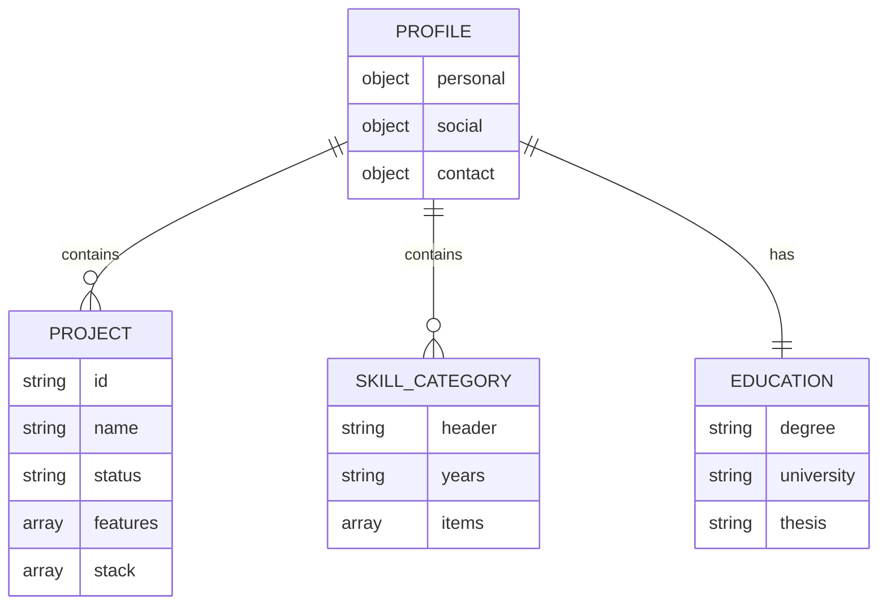
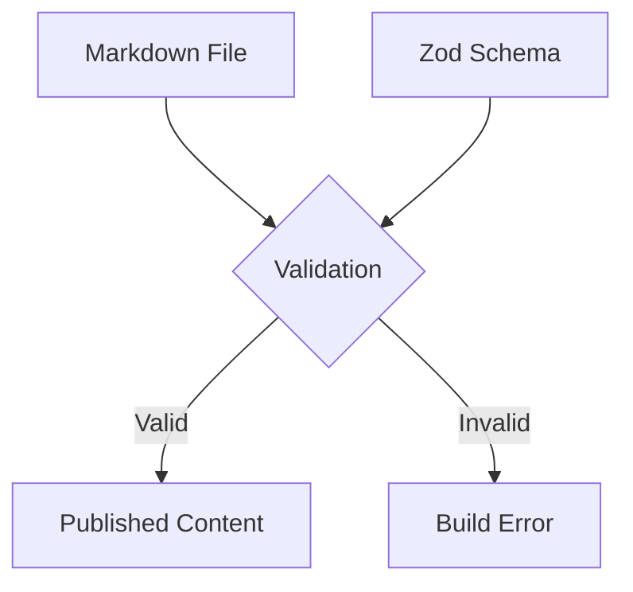
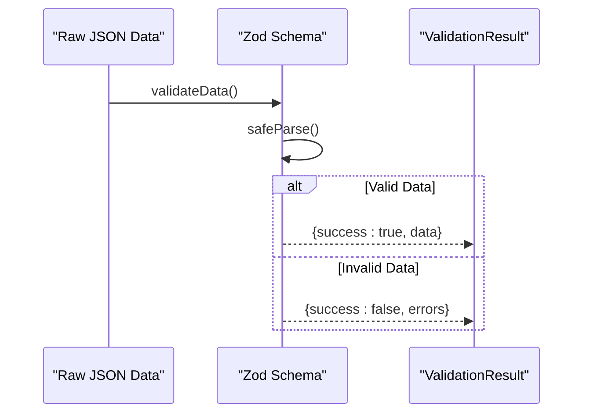

# Data Models & Type Definitions

<cite>
**Referenced Files in This Document**   
- [index.ts](file://src/types/index.ts)
- [profile.json](file://src/data/profile.json)
- [config.ts](file://src/content/config.ts)
- [schemas.ts](file://src/utils/validation/schemas.ts)
</cite>

## Table of Contents
1. [Introduction](#introduction)
2. [Core TypeScript Interfaces](#core-typescript-interfaces)
3. [Profile JSON Structure and UI Integration](#profile-json-structure-and-ui-integration)
4. [Content Configuration and Schema Enforcement](#content-configuration-and-schema-enforcement)
5. [Runtime Validation with Zod Schemas](#runtime-validation-with-zod-schemas)
6. [Type Composition and Advanced Typing Patterns](#type-composition-and-advanced-typing-patterns)
7. [Developer Experience and Error Prevention](#developer-experience-and-error-prevention)
8. [Extending Interfaces and API Integration](#extending-interfaces-and-api-integration)
9. [JSON-to-TypeScript Mapping and Serialization](#json-to-typescript-mapping-and-serialization)
10. [Conclusion](#conclusion)

## Introduction
This document provides comprehensive documentation for the core data models and type definitions used in the portfolio application. It details the structure, usage, and validation mechanisms of key TypeScript interfaces and JSON configurations that underpin the system's architecture. The focus is on ensuring type safety, improving developer experience, and enabling robust runtime validation across animation, navigation, and user data systems.

## Core TypeScript Interfaces

The application defines several foundational interfaces in `index.ts` that govern animation behavior, user interface states, and interaction modes. These types provide strict typing for critical components and ensure consistency across the codebase.

### Position Interface
The `Position` interface represents 2D coordinate data used throughout the animation and rendering systems.

**Section sources**
- [index.ts](file://src/types/index.ts#L81-L84)

### CanvasParticle Interface
The `CanvasParticle` interface extends basic positioning with rich visual and behavioral properties for animated elements in the particle system. It includes rendering attributes such as character representation, opacity, color, and animation phase.

**Section sources**
- [index.ts](file://src/types/index.ts#L92-L113)

### VimMode Interface
The `VimMode` interface defines the supported operational modes for the Vim-inspired interaction system, restricting values to a finite set of valid states.

**Section sources**
- [index.ts](file://src/types/index.ts#L115-L117)

## Profile JSON Structure and UI Integration

The `profile.json` file serves as the primary data source for personal information, projects, skills, and education. This structured JSON is consumed directly by UI components to render dynamic content.

**Diagram sources**
- [profile.json](file://src/data/profile.json#L1-L250)
- [index.ts](file://src/types/index.ts#L484-L506)

The `UserProfile` interface in `index.ts` precisely mirrors the structure of `profile.json`, enabling type-safe access to personal, social, and contact information. Components consume this data through strongly-typed props, preventing runtime errors due to missing or malformed fields.

**Section sources**
- [profile.json](file://src/data/profile.json#L1-L250)
- [index.ts](file://src/types/index.ts#L484-L506)

## Content Configuration and Schema Enforcement

The `config.ts` file uses Astro's content collection system with Zod-based schema validation to enforce structure for blog content. This ensures all markdown files adhere to a consistent format.

**Diagram sources**
- [config.ts](file://src/content/config.ts#L1-L16)

The schema enforces required fields such as title, description, publish date, and tags, providing compile-time guarantees about content structure. This approach prevents common content-related bugs and ensures metadata consistency across blog posts.

**Section sources**
- [config.ts](file://src/content/config.ts#L1-L16)

## Runtime Validation with Zod Schemas

The `schemas.ts` file implements runtime validation using Zod to verify the integrity of dynamic data, particularly user profile information. This is crucial for safely consuming JSON data that may be modified externally.

**Diagram sources**
- [schemas.ts](file://src/utils/validation/schemas.ts#L1-L40)
- [index.ts](file://src/types/index.ts#L68-L71)

The `validateData` function provides a generic interface for validating any data against a Zod schema, returning a standardized `ValidationResult` structure. This pattern enables graceful error handling and prevents type-related runtime exceptions.

**Section sources**
- [schemas.ts](file://src/utils/validation/schemas.ts#L1-L40)

## Type Composition and Advanced Typing Patterns

The codebase employs several advanced TypeScript patterns to enhance type safety and reusability:

### Intersection Types
Interfaces like `ProjectWithMeta` extend base types with additional computed properties, creating richer data models for specific use cases.

### Utility Types
The codebase leverages utility types such as `Optional`, `RequiredOnly`, and `DeepPartial` to create flexible type variations without duplication.

### Generics
Generic types like `ValidationResult<T>` and `APIResponse<T>` provide type-safe containers for dynamic data payloads.

### Type Guards
Functions such as `isProject`, `isSkillItem`, and `isEducation` serve as runtime type guards, narrowing unknown inputs to specific interfaces after validation.

**Section sources**
- [index.ts](file://src/types/index.ts#L68-L71)
- [index.ts](file://src/types/index.ts#L648-L678)

## Developer Experience and Error Prevention

Strict typing significantly improves developer experience by:
- Providing autocompletion and inline documentation in IDEs
- Catching type mismatches during development
- Preventing runtime errors in animation systems where invalid coordinates could break rendering
- Ensuring navigation data adheres to expected structures
- Validating form submissions and API responses

The combination of compile-time type checking and runtime validation creates a robust development environment that reduces debugging time and increases code reliability.

**Section sources**
- [index.ts](file://src/types/index.ts#L81-L117)
- [schemas.ts](file://src/utils/validation/schemas.ts#L1-L40)

## Extending Interfaces and API Integration

To extend existing interfaces for custom data or external API integration:
1. Create new interfaces that extend base types using intersection or inheritance patterns
2. Define corresponding Zod schemas for runtime validation
3. Implement type guards for safe type narrowing
4. Use utility types to manage optional/required field variations

When integrating with external APIs, always validate incoming data using Zod before assigning it to typed variables, never assuming the external structure matches expectations.

**Section sources**
- [index.ts](file://src/types/index.ts#L648-L678)
- [schemas.ts](file://src/utils/validation/schemas.ts#L1-L40)

## JSON-to-TypeScript Mapping and Serialization

Challenges in JSON-to-TypeScript mapping include:
- Date deserialization (strings vs Date objects)
- Optional field handling
- Type narrowing from `unknown` to specific interfaces
- Schema evolution and backward compatibility

Solutions implemented:
- Using Zod for safe parsing with error handling
- Defining `z.infer` types to ensure schema-code consistency
- Implementing validation wrappers like `validateData`
- Using type guards to verify runtime types

Serialization considerations:
- Circular references are avoided in data models
- All types use JSON-compatible primitives
- Complex objects are flattened where necessary

**Section sources**
- [profile.json](file://src/data/profile.json#L1-L250)
- [schemas.ts](file://src/utils/validation/schemas.ts#L1-L40)

## Conclusion
The data model architecture combines static TypeScript typing with dynamic Zod validation to create a robust, maintainable system. This dual-layer approach ensures type safety at both compile time and runtime, preventing errors in critical systems like animations and navigation. The clear separation between data structures, validation logic, and UI components enables scalable development while maintaining high code quality and developer productivity.