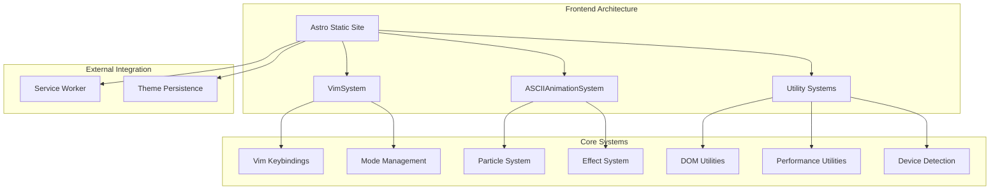
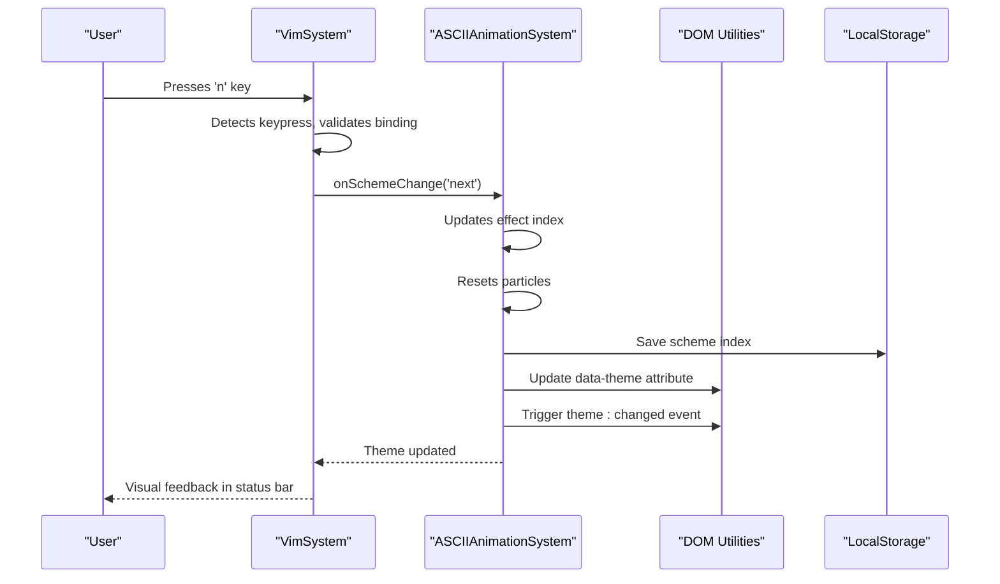

# Project Overview

<cite>
**Referenced Files in This Document**   
- [VimSystem.ts](file://src/systems/VimSystem.ts)
- [ASCIIAnimationSystem.ts](file://src/animation/ASCIIAnimationSystem.ts)
- [constants.ts](file://src/utils/constants.ts)
- [device.ts](file://src/utils/device.ts)
- [performance.ts](file://src/utils/performance.ts)
- [dom.ts](file://src/utils/dom.ts)
- [package.json](file://package.json)
- [astro.config.mjs](file://astro.config.mjs)
</cite>

## Table of Contents
1. [Introduction](#introduction)
2. [Core Mission and Purpose](#core-mission-and-purpose)
3. [Target Audience](#target-audience)
4. [High-Level Architecture](#high-level-architecture)
5. [Key Features](#key-features)
6. [Component Interaction Model](#component-interaction-model)
7. [Development and Deployment Workflow](#development-and-deployment-workflow)
8. [Conclusion](#conclusion)

## Introduction

The manus-reference portfolio website is an advanced interactive developer showcase designed to demonstrate cutting-edge frontend engineering capabilities. Built as a technical demonstration and personal portfolio, the site features Vim-inspired keyboard navigation, ASCII-based animations, and a highly performant, accessible architecture. This document provides a comprehensive overview of the project's purpose, architecture, and key systems, serving as an entry point for both visitors and developers interested in understanding or extending the site.

## Core Mission and Purpose

The primary mission of the manus-reference portfolio is to serve as a living demonstration of advanced frontend engineering skills through a performant, accessible, and themable user interface system. Rather than being a conventional portfolio, it functions as an interactive technical showcase that highlights expertise in several key areas:

- **Advanced UI Engineering**: Implementing complex interaction patterns like modal keyboard navigation inspired by Vim
- **Performance Optimization**: Creating smooth animations while maintaining accessibility and responsiveness across devices
- **Type-Safe Development**: Leveraging TypeScript for robust type checking and code maintainability
- **Modern Web Standards**: Utilizing contemporary web APIs and best practices for a future-proof implementation

The site achieves this through a combination of ASCII-based visual effects, responsive design, and sophisticated state management, creating an immersive experience that simultaneously serves as a functional portfolio and a technical demonstration.

**Section sources**
- [VimSystem.ts](file://src/systems/VimSystem.ts#L1-L252)
- [ASCIIAnimationSystem.ts](file://src/animation/ASCIIAnimationSystem.ts#L1-L369)

## Target Audience

The manus-reference portfolio is designed to appeal to three primary audiences:

- **Technical Recruiters**: Who can evaluate the developer's proficiency in modern frontend technologies, performance optimization, and architectural decision-making
- **Fellow Developers**: Interested in studying advanced frontend patterns, animation systems, and Vim-style navigation implementations
- **Open-Source Contributors**: Looking to understand the codebase structure and potentially contribute to its evolution

Each of these audiences can gain insights from different aspects of the site: recruiters can assess technical depth, developers can learn from the implementation patterns, and contributors can understand the modular architecture that enables extensibility.

## High-Level Architecture

The portfolio website employs a modern, modular architecture built on several key technologies:

- **Astro** for static site generation, enabling fast load times and optimal SEO
- **TypeScript** for type safety and enhanced developer experience
- **Modular Systems Architecture** with dedicated systems for animation, navigation, and device detection

The build system is configured through Astro, with the site property set to `https://alialqattan.dev` in the configuration file. The architecture prioritizes performance by disabling source maps in production and optimizing dependency loading through Vite configuration.

The codebase is organized into distinct modules:
- `animation`: Handles canvas-based ASCII animations and particle systems
- `systems`: Contains the Vim navigation system and other core behavioral systems
- `utils`: Provides reusable utilities for DOM manipulation, performance monitoring, and device detection
- `styles`: Manages CSS and theme variables

This separation of concerns allows for maintainable, testable code while enabling independent development of different system components.

**Diagram sources**
- [astro.config.mjs](file://astro.config.mjs#L1-L31)
- [package.json](file://package.json#L1-L42)

## Key Features

The manus-reference portfolio implements several sophisticated features that demonstrate advanced frontend capabilities:

### Modal Keyboard Navigation
The site features a Vim-inspired navigation system that allows users to interact with the interface using keyboard shortcuts. The system supports multiple modes (NORMAL, INSERT, VISUAL, COMMAND) and responds to keybindings for scrolling, navigation, and theme switching.

### Dynamic Theme Switching
Users can cycle through various color schemes including MATRIX, BLOCKCHAIN, TRADING, and GRUVBOX variants. The theme system persists user preferences via localStorage and synchronizes with CSS custom properties for consistent styling.

### Responsive Design
The interface adapts to different screen sizes and device capabilities, with specific optimizations for mobile devices. The system detects touch capability, screen dimensions, and device type to provide an optimal experience across platforms.

### Service Worker Caching
The site implements offline functionality through a service worker (`sw.js` in the public directory), enabling fast loading and offline access to cached content.

### Performance Monitoring
Comprehensive performance utilities track animation frame rates, memory usage, and system performance, with automatic adjustments for low-power devices or high memory usage scenarios.

### Accessibility Features
The system respects user preferences for reduced motion and dark mode, automatically adjusting animations and color schemes based on system settings.

**Section sources**
- [VimSystem.ts](file://src/systems/VimSystem.ts#L1-L252)
- [constants.ts](file://src/utils/constants.ts#L1-L199)
- [device.ts](file://src/utils/device.ts#L1-L388)
- [performance.ts](file://src/utils/performance.ts#L1-L355)

## Component Interaction Model

The manus-reference portfolio features a sophisticated component interaction model where systems coordinate to create a cohesive user experience. The primary interaction occurs between the VimSystem and ASCIIAnimationSystem:

The **VimSystem** serves as the central navigation controller, managing keyboard input and mode state. When users interact with Vim keybindings, the system triggers callbacks that are handled by the **ASCIIAnimationSystem**. For example, when a user presses 'n' to cycle to the next theme, the VimSystem invokes the `onSchemeChange` callback, which the ASCIIAnimationSystem handles by updating the visual effect and particle system.

This coordination extends to other interactions:
- Scroll commands ('j'/'k') trigger window scrolling while the animation system provides visual feedback
- Mode changes update both the UI display and animation behaviors
- Theme changes are synchronized across the canvas animation, CSS variables, and persistent storage

The system also integrates with utility modules:
- **DOM utilities** handle element selection, event delegation, and animation
- **Performance utilities** manage animation scheduling and resource cleanup
- **Device detection** optimizes behavior based on platform capabilities

This modular approach ensures that each system has a single responsibility while enabling rich interactions through well-defined interfaces and callbacks.

**Diagram sources**
- [VimSystem.ts](file://src/systems/VimSystem.ts#L1-L252)
- [ASCIIAnimationSystem.ts](file://src/animation/ASCIIAnimationSystem.ts#L1-L369)
- [dom.ts](file://src/utils/dom.ts#L1-L530)

## Development and Deployment Workflow

The development workflow for the manus-reference portfolio is designed for efficiency and code quality. The project uses standard npm scripts for common tasks:

- `npm run dev` or `npm run start`: Launches the Astro development server
- `npm run build`: Generates the static site for production
- `npm run preview`: Serves the built site locally for testing
- `npm run test`: Runs unit tests with Vitest
- `npm run lint`: Checks code quality with ESLint
- `npm run format`: Applies code formatting with Prettier

The tooling stack includes TypeScript for type checking, ESLint for code quality enforcement, and Prettier for consistent code formatting. Testing is handled by Vitest with coverage reporting, ensuring code reliability.

For deployment, the static site is generated through the Astro build process and can be hosted on any static hosting service. The configuration specifies the production domain (`https://alialqattan.dev`) and optimizes performance by disabling source maps and the Astro development toolbar in production.

The site also includes a service worker (`sw.js`) for offline caching, enhancing performance and reliability for repeat visitors.

**Section sources**
- [package.json](file://package.json#L1-L42)
- [astro.config.mjs](file://astro.config.mjs#L1-L31)
- [public/sw.js](file://public/sw.js)

## Conclusion

The manus-reference portfolio website represents a sophisticated demonstration of modern frontend engineering principles. By combining Astro's static site generation with TypeScript's type safety and a modular system architecture, it creates an interactive experience that showcases advanced technical capabilities. The Vim-inspired navigation, ASCII animations, and responsive design work together to create a unique developer portfolio that serves both as a functional website and a technical showcase. The well-structured codebase with clear separation of concerns makes it maintainable and extensible, while the comprehensive tooling supports a professional development workflow. This project stands as a testament to the power of modern web technologies when applied with attention to performance, accessibility, and user experience.