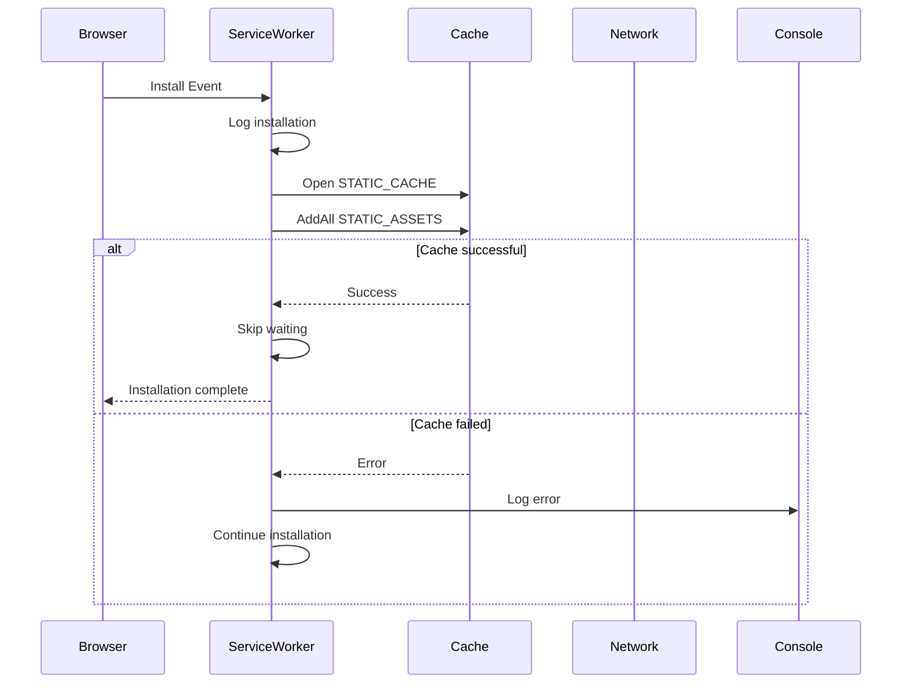
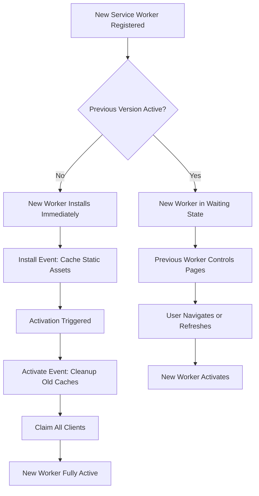
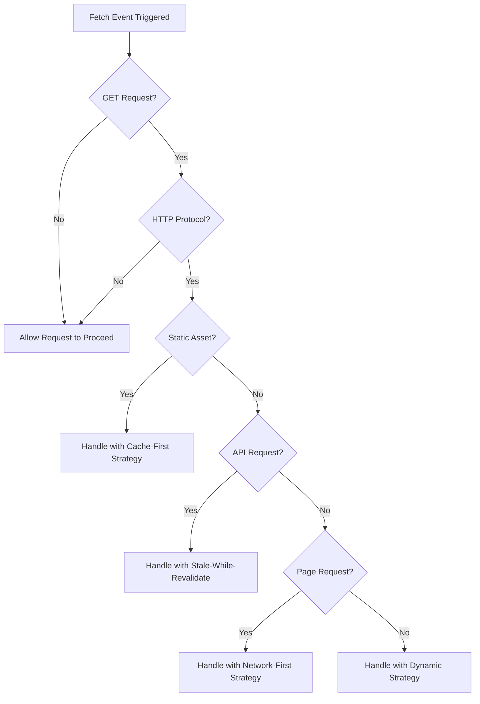
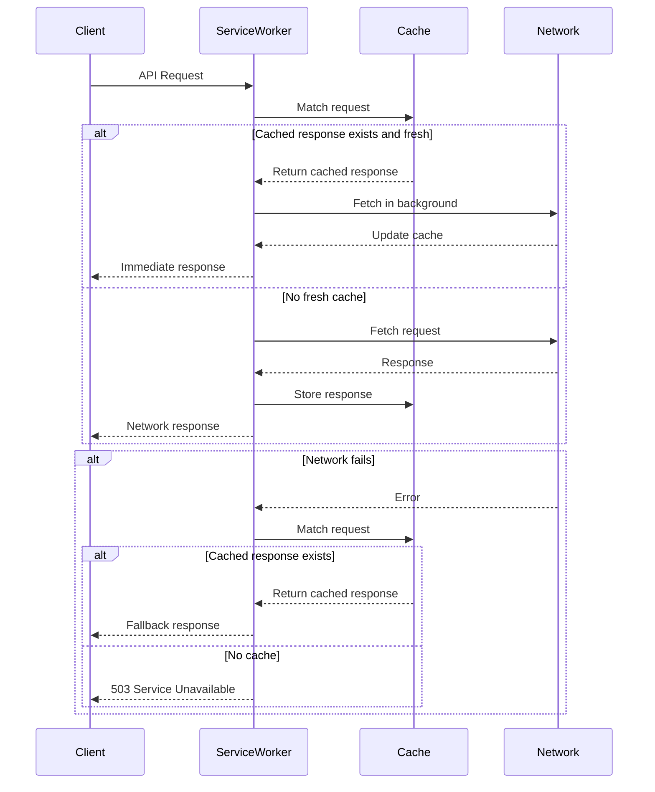

# Service Worker & Offline Functionality

<cite>
**Referenced Files in This Document**  
- [sw.js](file://public/sw.js)
</cite>

## Table of Contents
1. [Service Worker Overview](#service-worker-overview)
2. [Installation and Static Asset Caching](#installation-and-static-asset-caching)
3. [Cache Management and Versioning](#cache-management-and-versioning)
4. [Request Interception and Response Strategies](#request-interception-and-response-strategies)
5. [API Request Handling](#api-request-handling)
6. [Offline Page and Error Recovery](#offline-page-and-error-recovery)
7. [Cache Cleanup and Maintenance](#cache-cleanup-and-maintenance)
8. [Message Communication with Main Thread](#message-communication-with-main-thread)
9. [Background Sync Capabilities](#background-sync-capabilities)
10. [Debugging and Troubleshooting](#debugging-and-troubleshooting)
11. [Customization and Extension](#customization-and-extension)
12. [Browser Compatibility and Update Mechanisms](#browser-compatibility-and-update-mechanisms)

## Service Worker Overview

The service worker implementation in `sw.js` provides comprehensive offline functionality for the portfolio application by intercepting network requests and serving cached content when appropriate. The service worker operates as a programmable network proxy that sits between the web application and the network, enabling reliable offline experiences and improved performance through intelligent caching strategies.

The implementation defines multiple cache storage areas with specific purposes:
- `STATIC_CACHE`: For static assets like CSS, JavaScript, fonts, and images
- `DYNAMIC_CACHE`: For dynamically requested pages and resources
- `API_CACHE`: For API endpoint responses with specific expiration policies

This separation allows for granular control over different types of content and their respective caching behaviors. The service worker is designed to be resilient, with fallback mechanisms that ensure users can access content even when network conditions are poor or unavailable.

**Section sources**
- [sw.js](file://public/sw.js#L1-L20)

## Installation and Static Asset Caching

During the installation phase, the service worker caches critical static assets to ensure immediate offline availability. The installation process is triggered when the service worker is first registered or when a new version is detected. The `install` event handler opens the `STATIC_CACHE` and adds a predefined list of essential resources including the root path, HTML document, favicon, and font files.

The precaching strategy ensures that core application assets are available immediately upon installation, providing a reliable baseline experience even in offline scenarios. The service worker waits for all specified assets to be successfully cached before completing the installation process, ensuring that the cached content is complete and consistent.

If the caching process fails for any reason, the error is logged and the installation continues, allowing the service worker to function with whatever assets were successfully cached. After successful installation, the service worker skips the waiting phase to activate immediately, minimizing the time between registration and full offline capability.

**Diagram sources**
- [sw.js](file://public/sw.js#L50-L69)

**Section sources**
- [sw.js](file://public/sw.js#L50-L69)

## Cache Management and Versioning

The service worker implements a robust cache versioning system to ensure safe updates and prevent conflicts between different versions of cached content. Each cache has a versioned name (e.g., `portfolio-static-v1`) that includes a version identifier, allowing multiple versions to coexist during the update process.

When a new service worker version is activated, the `activate` event triggers a cleanup process that removes outdated caches. This ensures that storage space is efficiently managed and prevents accumulation of obsolete cache data. The cleanup process runs in parallel with claiming clients, which allows the new service worker to take control of all active pages immediately upon activation.

The cache versioning strategy enables zero-downtime updates, as the previous version's caches remain available until the new version is fully activated. This approach eliminates the risk of users encountering broken experiences during deployment and ensures a smooth transition between application versions.

**Diagram sources**
- [sw.js](file://public/sw.js#L70-L78)

**Section sources**
- [sw.js](file://public/sw.js#L70-L78)

## Request Interception and Response Strategies

The service worker intercepts all network requests through the `fetch` event listener, implementing different caching strategies based on the request type. The request handling logic categorizes incoming requests into static assets, API calls, page requests, and dynamic content, applying appropriate caching policies for each category.

For static assets (CSS, JavaScript, images, fonts), the service worker employs a cache-first strategy, serving content from the cache when available and falling back to the network only when necessary. This approach minimizes network usage and provides fast load times for frequently accessed resources.

The fetch event handler includes safeguards to prevent interference with non-HTTP requests and non-GET methods, ensuring compatibility with browser extensions and other web platform features. This selective interception allows the service worker to enhance the user experience without disrupting normal browser functionality.

**Diagram sources**
- [sw.js](file://public/sw.js#L71-L99)

**Section sources**
- [sw.js](file://public/sw.js#L71-L99)

## API Request Handling

API requests to GitHub endpoints are handled with a stale-while-revalidate strategy that balances freshness with availability. When an API request is made, the service worker first checks the `API_CACHE` for a cached response. If a recent response is available (within the 10-minute expiration window), it is served immediately while a background request updates the cache.

This approach provides fast response times for API data while ensuring that content is periodically refreshed from the network. The background update process is non-blocking, meaning users receive immediate feedback even when network conditions are poor. If the background update fails, the cached content remains available for future requests.

The implementation includes error handling that returns cached API responses as fallbacks when network requests fail, preventing complete loss of functionality during connectivity issues. For requests that have never been cached, a structured error response is returned to inform the application of the network unavailability.

**Diagram sources**
- [sw.js](file://public/sw.js#L184-L226)

**Section sources**
- [sw.js](file://public/sw.js#L184-L226)

## Offline Page and Error Recovery

When network requests fail and no cached content is available, the service worker generates a custom offline page to provide users with meaningful feedback. The offline page is constructed programmatically with HTML, CSS, and inline styling to ensure it can be displayed without external dependencies.

The offline experience includes a clear visual indication of the disconnected state, explanatory text, and a retry button that triggers a page refresh. The ASCII art border and terminal-style design maintain consistency with the portfolio's aesthetic while clearly communicating the offline status.

For page requests specifically, the service worker attempts multiple recovery strategies before displaying the offline page. It first tries to serve from the dynamic cache, then falls back to any available cached version, and only resorts to the generated offline page when all other options are exhausted. This layered approach maximizes the chances of providing useful content even in degraded network conditions.

**Section sources**
- [sw.js](file://public/sw.js#L345-L415)

## Cache Cleanup and Maintenance

The service worker implements automated cache maintenance to prevent unbounded storage growth and ensure optimal performance. The `cleanupCache` function monitors the size of each cache and removes the oldest entries when the maximum cache size (50 items) is exceeded.

This eviction policy follows a least-recently-used (LRU) algorithm, prioritizing the retention of frequently accessed content while removing older, less relevant entries. The cleanup process examines the `Date` header of cached responses to determine their age, ensuring that the most recent content remains available.

The cache maintenance system operates transparently in the background, triggered automatically after successful caching operations. This proactive approach prevents storage issues before they impact user experience and ensures that the service worker remains responsive and efficient over extended periods of use.

**Section sources**
- [sw.js](file://public/sw.js#L315-L343)

## Message Communication with Main Thread

The service worker establishes a bidirectional communication channel with the main application thread through the `message` event listener. This interface enables the application to control service worker functionality and retrieve diagnostic information.

The message handling system supports several commands:
- `SKIP_WAITING`: Forces immediate activation of the service worker
- `GET_CACHE_STATUS`: Returns the current size of all caches
- `CLEAR_CACHE`: Removes all cached content
- `PRELOAD_RESOURCES`: Caches additional resources specified by the application

This messaging pattern allows the main application to implement user-initiated cache management, display storage usage information, and trigger background preloading of content. The postMessage API ensures that communication is asynchronous and non-blocking, maintaining application responsiveness.

**Section sources**
- [sw.js](file://public/sw.js#L101-L147)

## Background Sync Capabilities

The service worker includes support for background synchronization through the `sync` event listener. Although the current implementation is minimal, it establishes the foundation for retrying failed requests when the user regains connectivity.

The background sync functionality is designed to handle operations that were interrupted due to network unavailability, such as form submissions or data updates. When a sync event is triggered with the tag 'background-sync', the service worker executes the `doBackgroundSync` function to process any queued operations.

This capability enables the application to provide a seamless user experience by automatically recovering from temporary connectivity issues without requiring user intervention. Future enhancements could integrate with IndexedDB to store failed requests and systematically retry them in the background.

**Section sources**
- [sw.js](file://public/sw.js#L99-L101)

## Debugging and Troubleshooting

Debugging service worker functionality can be accomplished through several methods. The Chrome DevTools Application tab provides comprehensive visibility into service worker status, cache contents, and storage usage. Key debugging areas include:

- **Service Worker panel**: Monitor registration status, version control, and lifecycle events
- **Cache Storage**: Inspect the contents of all caches and verify cached resources
- **Application panel**: View overall storage usage and clear site data
- **Console**: Monitor service worker log messages prefixed with '[SW]'

Common pitfalls to avoid:
- **Stale caches**: Ensure cache version numbers are incremented when updating the service worker
- **Failed registrations**: Verify that the service worker file is served with the correct MIME type
- **Scope issues**: Confirm that the service worker has the appropriate scope for intercepting requests
- **Update delays**: Users may need to close all tabs to trigger service worker updates

The service worker includes extensive console logging to aid in debugging, with messages for installation, activation, caching operations, and request handling. These logs provide valuable insights into the service worker's behavior and can help identify issues during development.

**Section sources**
- [sw.js](file://public/sw.js#L0-L435)

## Customization and Extension

The service worker implementation can be customized and extended to meet specific requirements. To modify cache rules, update the `STATIC_ASSETS` array with additional resources that should be precached during installation. For new asset patterns, extend the `isStaticAsset` function with additional file extensions or path patterns.

To implement runtime caching for API calls, enhance the `PRELOAD_RESOURCES` message handler to accept API endpoints and store their responses in the `API_CACHE`. Consider implementing cache invalidation strategies based on content changes or user actions.

For dynamic content like blog posts, consider implementing a strategy that caches posts when they are first viewed, using the `handlePageRequest` function as a model. This approach would allow previously viewed content to be available offline while still fetching new content when online.

**Section sources**
- [sw.js](file://public/sw.js#L15-L25)

## Browser Compatibility and Update Mechanisms

The service worker implementation follows standard web APIs and is compatible with all modern browsers that support service workers, including Chrome, Firefox, Edge, and Safari. The implementation gracefully degrades on browsers without service worker support, with feature detection in the `device.ts` file confirming service worker availability before attempting registration.

The update mechanism relies on the browser's service worker update algorithm, which checks for changes to the service worker script on each page load. When changes are detected, the new version is installed in the background and waits for activation until all pages controlled by the old version are closed.

To force an update, applications can use the `SKIP_WAITING` message to bypass the waiting phase. This is particularly useful when deploying critical updates that require immediate activation. The cache versioning system ensures that updates do not interfere with the existing user experience, providing a smooth transition between application versions.

**Section sources**
- [sw.js](file://public/sw.js#L0-L435)