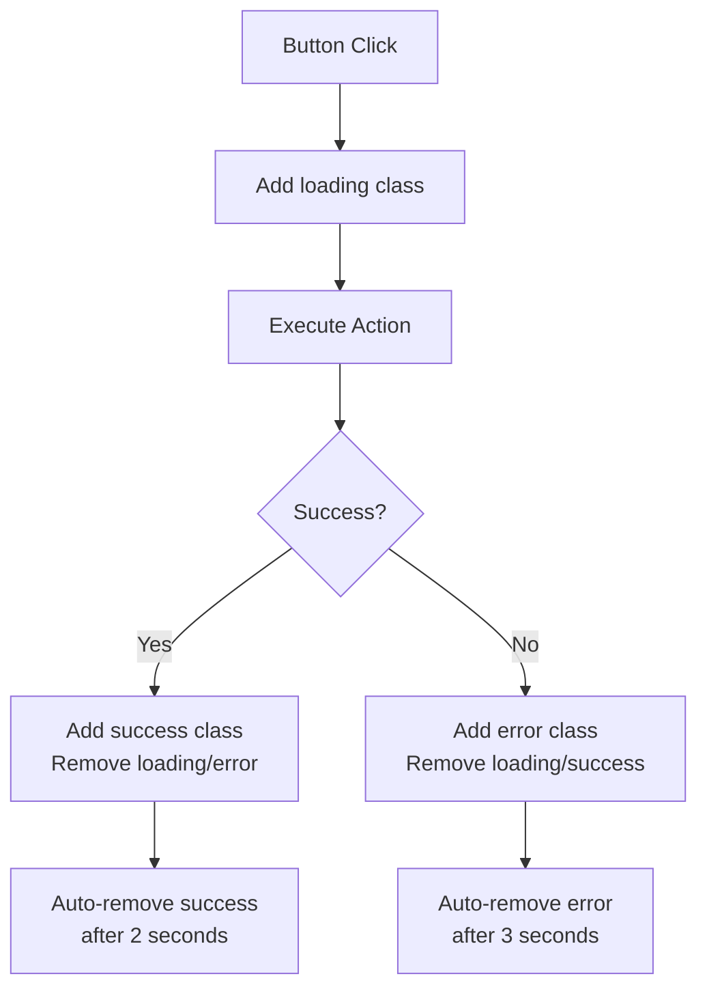
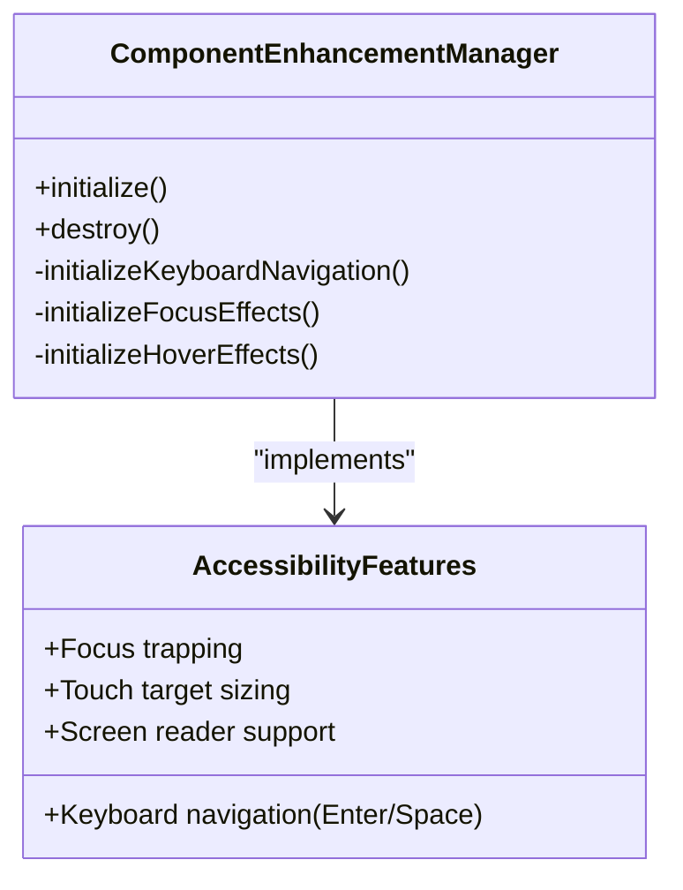
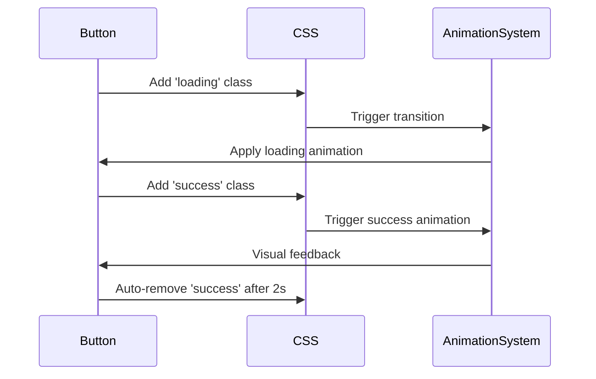
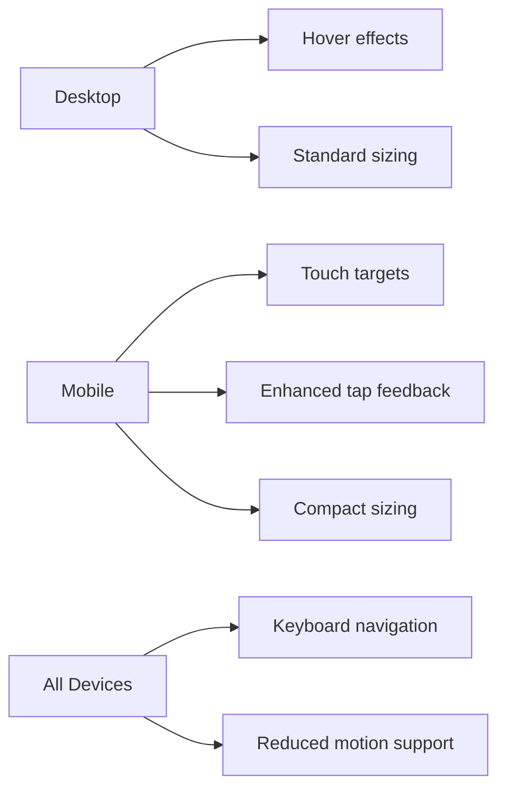

# Action Buttons

<cite>
**Referenced Files in This Document**   
- [client.ts](file://src/utils/client.ts)
- [componentEnhancements.ts](file://src/utils/componentEnhancements.ts)
- [main.css](file://src/styles/main.css)
- [utilities.css](file://src/styles/utilities.css)
</cite>

## Table of Contents
1. [Introduction](#introduction)
2. [Core Functionality](#core-functionality)
3. [Visual Feedback States](#visual-feedback-states)
4. [Accessibility Enhancements](#accessibility-enhancements)
5. [Data Attributes and Configuration](#data-attributes-and-configuration)
6. [Animation Integration](#animation-integration)
7. [Performance Considerations](#performance-considerations)
8. [Responsive Behavior](#responsive-behavior)
9. [Troubleshooting Guide](#troubleshooting-guide)

## Introduction
The Action Button system provides interactive elements for external navigation, downloads, and case study access with comprehensive visual feedback and accessibility support. This documentation details the implementation of state management, accessibility features, responsive behaviors, and integration with the global animation system.

**Section sources**
- [client.ts](file://src/utils/client.ts#L0-L135)
- [main.css](file://src/styles/main.css#L674-L791)

## Core Functionality
The Action Button system supports multiple interaction types including external navigation (GitHub, demo links), file downloads, and case study access. The system uses event delegation through `initActionButtons` to efficiently handle dynamic content and ensure proper cleanup of event listeners.

Button interactions are managed by the `ActionButtonManager` which processes different action types based on the `data-type` attribute. For 'demo' and 'github' types, URLs are opened in new tabs with success state activation upon successful window creation. The 'download' type creates temporary anchor elements to trigger browser downloads. The 'case-study' type is currently marked as a TODO with error state fallback.

**Section sources**
- [client.ts](file://src/utils/client.ts#L0-L46)
- [client.ts](file://src/utils/client.ts#L48-L98)

## Visual Feedback States
The system implements three primary visual states—loading, success, and error—managed programmatically through CSS class manipulation. These states provide immediate user feedback during asynchronous operations.

**Diagram sources**
- [client.ts](file://src/utils/client.ts#L48-L98)
- [client.ts](file://src/utils/client.ts#L93-L134)

**Section sources**
- [client.ts](file://src/utils/client.ts#L48-L98)

## Accessibility Enhancements
Accessibility features are implemented through the `componentEnhancements.ts` module, which adds comprehensive keyboard navigation, focus management, and touch-friendly interactions.

**Diagram sources**
- [componentEnhancements.ts](file://src/utils/componentEnhancements.ts#L200-L261)
- [componentEnhancements.ts](file://src/utils/componentEnhancements.ts#L150-L180)

**Section sources**
- [componentEnhancements.ts](file://src/utils/componentEnhancements.ts#L0-L261)

## Data Attributes and Configuration
Action buttons are configured using data attributes that define behavior and target actions. The system uses `data-url` to specify the destination URL and `data-type` to determine the action type (demo, github, download, case-study).

Additional configuration options include:
- `data-type`: Specifies the action type
- `data-url`: Target URL or resource path
- Button classes: `.primary`, `.demo-btn`, `.github-btn`, `.case-study-btn` for visual styling

The system uses event delegation to capture clicks on any element matching the selector `.action-btn[data-url], .action-btn[data-type]`, allowing dynamic content to be automatically supported without reinitialization.

**Section sources**
- [client.ts](file://src/utils/client.ts#L100-L134)
- [main.css](file://src/styles/main.css#L674-L729)

## Animation Integration
Action buttons integrate with the global animation system through CSS transitions and utility classes. The system respects user preferences for reduced motion and coordinates effects during state changes.

**Diagram sources**
- [main.css](file://src/styles/main.css#L674-L729)
- [utilities.css](file://src/styles/utilities.css#L151-L207)

**Section sources**
- [main.css](file://src/styles/main.css#L674-L863)
- [utilities.css](file://src/styles/utilities.css#L151-L207)

## Performance Considerations
The system implements several performance optimizations to ensure smooth interactions across devices:

- **Event delegation**: Single event listener on root element for all action buttons
- **Duplicate click prevention**: Loading state prevents multiple simultaneous executions
- **Asynchronous operation management**: Try-catch-finally pattern ensures state cleanup
- **Memory management**: Cleanup functions remove event listeners
- **Low-performance device optimization**: Reduced motion preferences respected

The implementation prevents duplicate clicks by setting the loading state immediately upon click, which blocks subsequent interactions until the operation completes or fails.

**Section sources**
- [client.ts](file://src/utils/client.ts#L0-L135)
- [utilities.css](file://src/styles/utilities.css#L151-L207)

## Responsive Behavior
The Action Button system includes comprehensive responsive behaviors for mobile and touch devices:

- Mobile-specific styling with adjusted font sizes and padding
- Touch-friendly hit areas with minimum 44px targets
- Enhanced touch feedback with tap highlights and active states
- Responsive media queries for different screen sizes
- Device-specific interaction patterns

**Diagram sources**
- [main.css](file://src/styles/main.css#L793-L863)
- [utilities.css](file://src/styles/utilities.css#L151-L207)

**Section sources**
- [main.css](file://src/styles/main.css#L793-L863)
- [utilities.css](file://src/styles/utilities.css#L151-L207)

## Troubleshooting Guide
Common issues and their solutions for the Action Button system:

**Unresponsive buttons**: Check for event delegation conflicts or ensure `initActionButtons` has been called on the appropriate root element. Verify that buttons have either `data-url` or `data-type` attributes.

**Incorrect href handling**: Ensure URLs are properly encoded and accessible. For downloads, verify the resource exists and CORS policies allow access.

**Animation glitches**: During rapid interactions, state transitions may conflict. The system automatically handles this by clearing previous states before applying new ones, but excessive rapid clicking may still cause visual artifacts.

**Mobile interaction issues**: Verify touch targets meet minimum size requirements and that touch feedback is not being overridden by other CSS rules.

**Case study functionality**: Currently marked as TODO in the codebase, this feature returns an error state when triggered.

**Section sources**
- [client.ts](file://src/utils/client.ts#L0-L135)
- [componentEnhancements.ts](file://src/utils/componentEnhancements.ts#L200-L261)