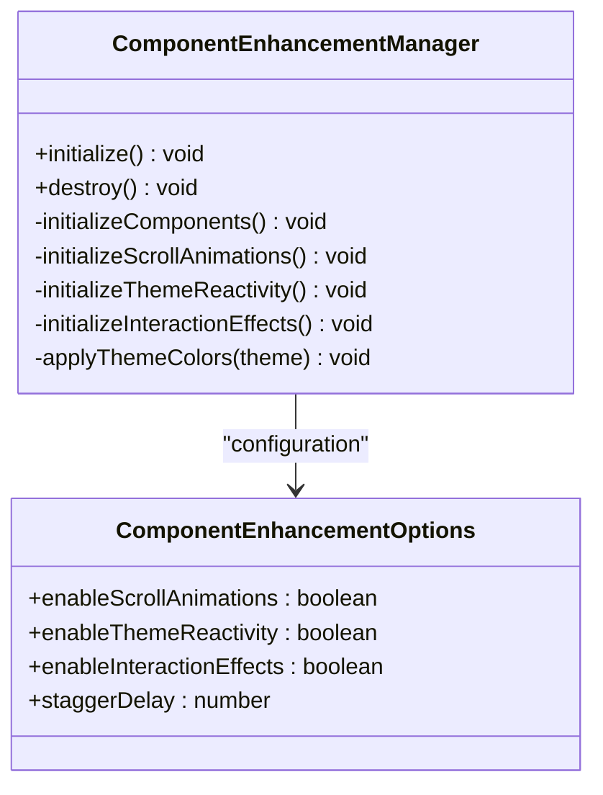
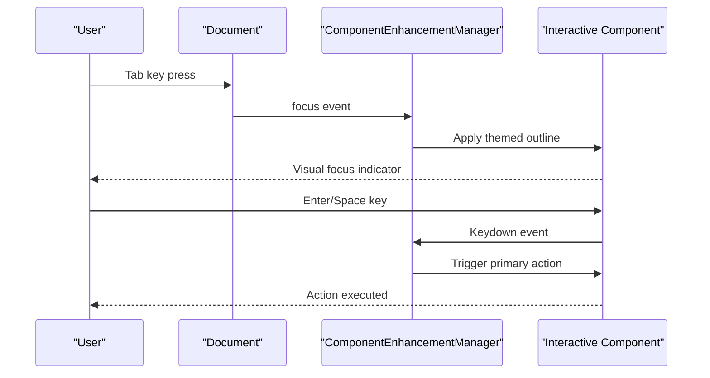
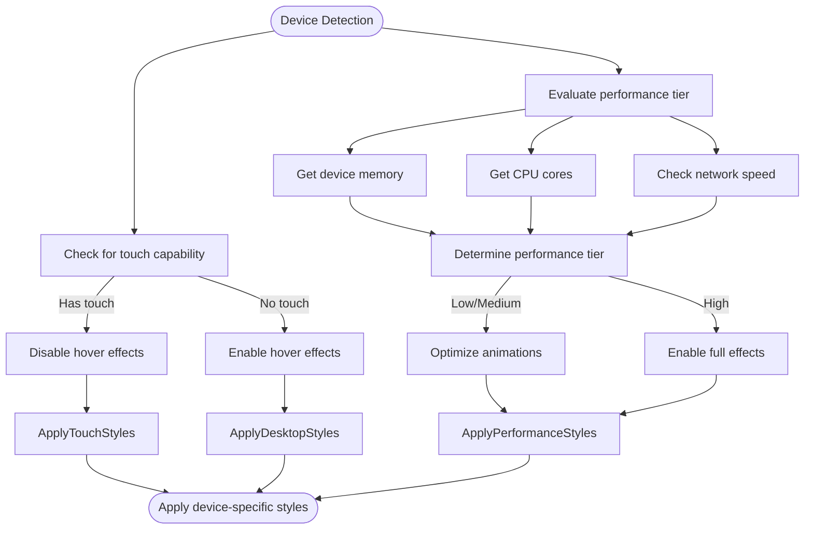
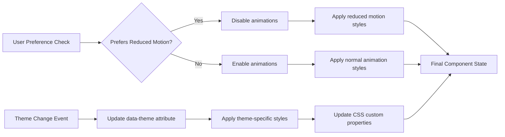

# Component Enhancements

<cite>
**Referenced Files in This Document**   
- [componentEnhancements.ts](file://src/utils/componentEnhancements.ts)
- [device.ts](file://src/utils/device.ts)
- [Skills.astro](file://src/components/Skills.astro)
- [ProjectEntry.astro](file://src/components/ProjectEntry.astro)
</cite>

## Table of Contents
1. [Introduction](#introduction)
2. [Core Architecture](#core-architecture)
3. [Keyboard Accessibility and Focus Management](#keyboard-accessibility-and-focus-management)
4. [Touch and Device-Specific Optimizations](#touch-and-device-specific-optimizations)
5. [Reduced Motion and User Preference Handling](#reduced-motion-and-user-preference-handling)
6. [Integration with Astro Hydration](#integration-with-astro-hydration)
7. [Usage Patterns for Custom Components](#usage-patterns-for-custom-components)
8. [Common Pitfalls and Best Practices](#common-pitfalls-and-best-practices)

## Introduction
The Component Enhancements module provides a unified system for enriching UI components with cross-cutting interaction features. It enables consistent accessibility, theming, and animation behaviors across the application while respecting user preferences and device capabilities. This document details how the enhancement system improves base components through focus management, device-specific optimizations, and responsive interaction patterns.

## Core Architecture
The enhancement system is built around the `ComponentEnhancementManager` class, which orchestrates various enhancement subsystems including scroll animations, theme reactivity, and interaction effects. The system initializes automatically on import and can be reconfigured through optional parameters.

**Diagram sources**
- [componentEnhancements.ts](file://src/utils/componentEnhancements.ts#L10-L261)

**Section sources**
- [componentEnhancements.ts](file://src/utils/componentEnhancements.ts#L10-L261)

## Keyboard Accessibility and Focus Management
The enhancement system implements comprehensive keyboard navigation support, ensuring all interactive components are accessible via keyboard. It automatically adds tabindex attributes to key elements and provides visual focus indicators that respect the current theme.

Focus trapping is implemented through the initialization of focus effects on component entry points such as project cards and skill items. When a component receives focus, it displays a themed outline that enhances visibility while maintaining aesthetic consistency.

Keyboard navigation is enhanced through event listeners that intercept Enter and Space keys on focused elements, triggering appropriate actions like activating primary buttons within project cards.

**Diagram sources**
- [componentEnhancements.ts](file://src/utils/componentEnhancements.ts#L150-L200)
- [ProjectEntry.astro](file://src/components/ProjectEntry.astro#L1-L352)

**Section sources**
- [componentEnhancements.ts](file://src/utils/componentEnhancements.ts#L150-L200)
- [ProjectEntry.astro](file://src/components/ProjectEntry.astro#L1-L352)

## Touch and Device-Specific Optimizations
The enhancement system adapts interaction patterns based on device capabilities, detected through the `device.ts` utilities. On touch devices, hover effects are disabled and replaced with active states that provide tactile feedback.

Device performance tier detection informs animation complexity decisions. The system evaluates device memory, CPU cores, and connection speed to determine whether to enable complex animations or apply performance optimizations.

**Diagram sources**
- [device.ts](file://src/utils/device.ts#L0-L387)
- [componentEnhancements.ts](file://src/utils/componentEnhancements.ts#L175-L185)

**Section sources**
- [device.ts](file://src/utils/device.ts#L0-L387)
- [componentEnhancements.ts](file://src/utils/componentEnhancements.ts#L175-L185)

## Reduced Motion and User Preference Handling
The system respects user preferences for reduced motion by detecting the `prefers-reduced-motion` media query through the capabilities API. When reduced motion is preferred, animation effects are minimized or disabled across components.

Theme-reactive behaviors are synchronized with the ASCII animation system, updating component themes when the global theme changes. This ensures visual consistency while accommodating user preferences for contrast and color schemes.

**Diagram sources**
- [device.ts](file://src/utils/device.ts#L250-L270)
- [componentEnhancements.ts](file://src/utils/componentEnhancements.ts#L90-L110)
- [Skills.astro](file://src/components/Skills.astro#L1-L777)

**Section sources**
- [device.ts](file://src/utils/device.ts#L250-L270)
- [componentEnhancements.ts](file://src/utils/componentEnhancements.ts#L90-L110)
- [Skills.astro](file://src/components/Skills.astro#L1-L777)

## Integration with Astro Hydration
The enhancement system integrates with Astro's partial hydration model by initializing enhancements after the DOM is ready. The `initialize()` method checks the document ready state and either runs immediately or waits for `DOMContentLoaded`.

Enhancement cleanup is properly handled through the `destroy()` method, which disconnects all IntersectionObservers and removes event listeners. This prevents memory leaks during route changes or component reinitialization.

The global instance pattern ensures only one enhancement manager is active at a time, with automatic cleanup of previous instances when reinitializing with new options.

**Section sources**
- [componentEnhancements.ts](file://src/utils/componentEnhancements.ts#L40-L55)
- [componentEnhancements.ts](file://src/utils/componentEnhancements.ts#L247-L261)

## Usage Patterns for Custom Components
Custom components can leverage the enhancement system by ensuring they use the appropriate CSS classes that the enhancement manager targets. Components should include structural classes like `entry`, `project-card`, or `skill-item` to receive automatic enhancements.

For components requiring special handling, developers can access the global enhancement manager instance via `getComponentEnhancementManager()` and extend its functionality through custom initialization methods.

The enhancement system's modular design allows for selective enabling or disabling of features through the options parameter when initializing the manager, enabling fine-grained control over enhancement behaviors.

**Section sources**
- [componentEnhancements.ts](file://src/utils/componentEnhancements.ts#L247-L261)
- [Skills.astro](file://src/components/Skills.astro#L1-L777)
- [ProjectEntry.astro](file://src/components/ProjectEntry.astro#L1-L352)

## Common Pitfalls and Best Practices
Common pitfalls include memory leaks from uncleaned event listeners and observers. The enhancement system mitigates this through its `destroy()` method, which properly cleans up all resources.

Conflicts with third-party widgets can occur when multiple systems attempt to manage focus or animations. To avoid conflicts, ensure third-party components are initialized after the enhancement system or use the enhancement manager's cleanup functions.

Inconsistent behavior across browsers is minimized by using feature detection rather than browser detection, and by relying on standardized APIs like IntersectionObserver and CSS custom properties.

Best practices include:
- Always calling `destroy()` when reinitializing the enhancement manager
- Using the global instance pattern to prevent multiple active managers
- Respecting user preferences for motion and contrast
- Testing on various device types and performance tiers
- Ensuring keyboard navigation works for all interactive elements

**Section sources**
- [componentEnhancements.ts](file://src/utils/componentEnhancements.ts#L225-L245)
- [device.ts](file://src/utils/device.ts#L250-L270)
- [componentEnhancements.ts](file://src/utils/componentEnhancements.ts#L150-L200)