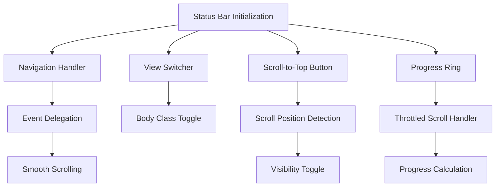
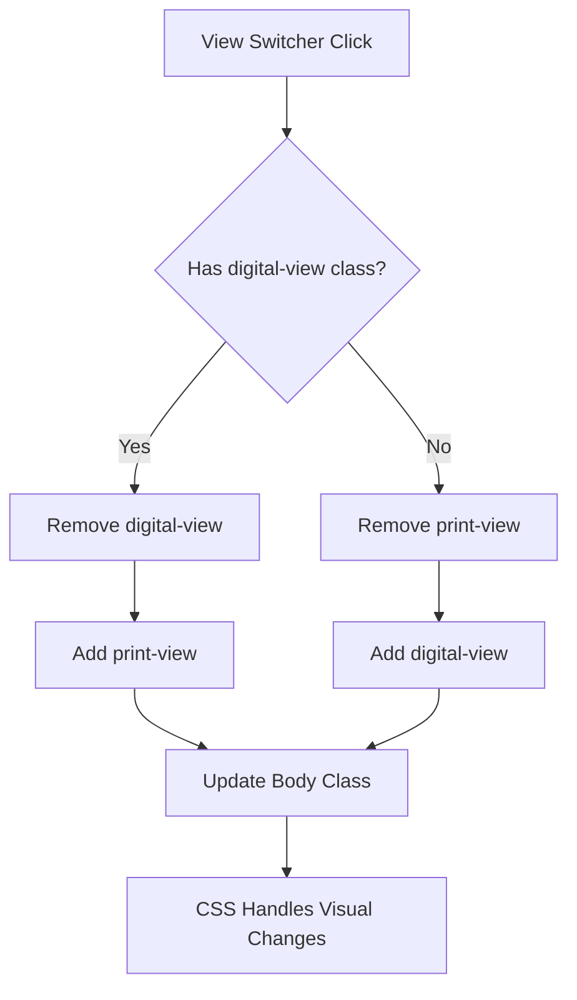
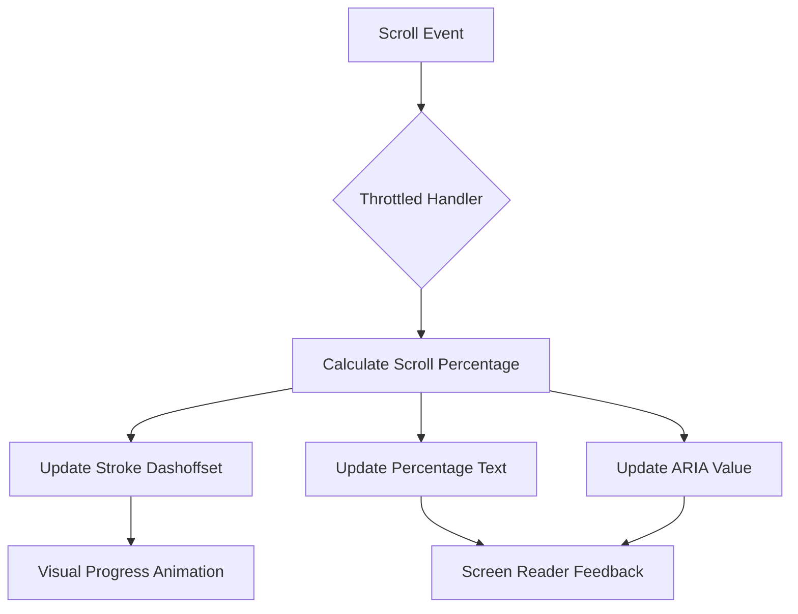
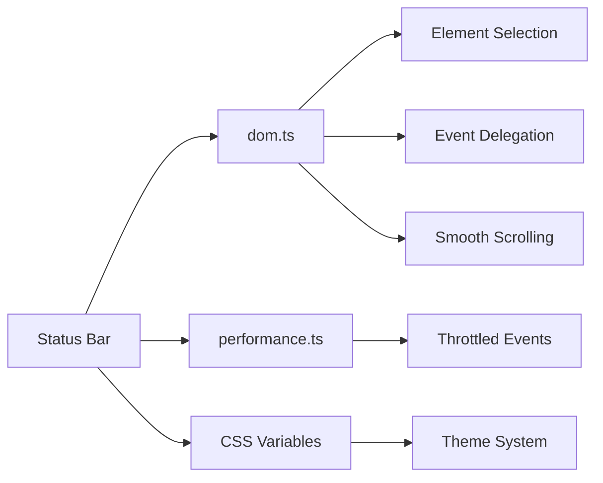

# Status Bar

<cite>
**Referenced Files in This Document**   
- [statusBar.ts](file://src/scripts/statusBar.ts)
- [dom.ts](file://src/utils/dom.ts)
- [performance.ts](file://src/utils/performance.ts)
- [main.css](file://src/styles/main.css)
- [global.css](file://src/styles/global.css)
</cite>

## Table of Contents
1. [Introduction](#introduction)
2. [Core Components](#core-components)
3. [Architecture Overview](#architecture-overview)
4. [Detailed Component Analysis](#detailed-component-analysis)
5. [Dependency Analysis](#dependency-analysis)
6. [Performance Considerations](#performance-considerations)
7. [Troubleshooting Guide](#troubleshooting-guide)
8. [Conclusion](#conclusion)

## Introduction
The Status Bar is a persistent UI component that provides navigation, progress feedback, and view control functionality. It enables users to navigate between sections, monitor scroll progress, toggle between digital and print views, and quickly return to the top of the page. The implementation leverages DOM utilities for element manipulation, performance optimizations through throttling, and integrates with the global theme system via CSS variables. This document details the initialization process, event handling mechanisms, and integration points that make the Status Bar a responsive and accessible component.

## Core Components

The Status Bar functionality is implemented through several key functions in `statusBar.ts` that initialize and manage different aspects of the component. These include navigation handling, view switching, scroll-to-top behavior, and progress ring animation. The component relies on utility functions from `dom.ts` for DOM manipulation and `performance.ts` for optimized event handling. The initialization occurs automatically when the DOM is ready, ensuring the Status Bar is functional as soon as the page loads.

**Section sources**
- [statusBar.ts](file://src/scripts/statusBar.ts#L177-L217)

## Architecture Overview

The Status Bar follows a modular architecture where each functional aspect is handled by a dedicated initialization function. The component uses event delegation for navigation links, direct event listeners for interactive elements, and throttled handlers for scroll and resize events to maintain performance. The architecture separates concerns between DOM manipulation, event handling, and state management, allowing for clean separation of responsibilities and easier maintenance.

**Diagram sources**
- [statusBar.ts](file://src/scripts/statusBar.ts#L1-L217)

## Detailed Component Analysis

### Navigation System
The navigation system enables smooth scrolling to different sections of the page through status bar links. It uses event delegation on the status bar container to efficiently handle clicks on navigation items. When a navigation link is clicked, the component prevents the default anchor behavior and uses `requestAnimationFrame` to initiate smooth scrolling to the target element. This approach improves performance by reducing the number of event listeners and ensuring smooth animation timing.

**Section sources**
- [statusBar.ts](file://src/scripts/statusBar.ts#L15-L39)

### View Switching Logic
The view switcher toggles between digital and print modes by modifying CSS classes on the document body. When the view switcher button is clicked, the component checks for the presence of `digital-view` or `print-view` classes and swaps them accordingly. This class-based approach allows CSS to handle the visual presentation differences between modes, with the digital view optimized for screen display and the print view optimized for physical printing with high contrast and minimal ink usage.

**Diagram sources**
- [statusBar.ts](file://src/scripts/statusBar.ts#L44-L62)
- [main.css](file://src/styles/main.css#L100-L120)
- [global.css](file://src/styles/global.css#L100-L110)

### Scroll-to-Top Functionality
The scroll-to-top button appears when the user scrolls beyond a threshold defined in the button's `data-show-after` attribute. The visibility is controlled by a throttled scroll event handler that checks the current scroll position against this threshold. The button includes both click and keyboard event listeners to ensure accessibility, supporting Enter and Space keys for activation. This implementation provides a seamless way for users to return to the top of long pages without disrupting their reading flow.

**Section sources**
- [statusBar.ts](file://src/scripts/statusBar.ts#L67-L114)

### Progress Ring Animation
The progress ring visually represents the user's scroll position through an animated SVG circle. The component calculates the circumference of the progress ring based on its radius and uses stroke dasharray and dashoffset properties to create the animation effect. As the user scrolls, a throttled event handler updates the dashoffset value proportionally to the scroll percentage, creating a smooth visual feedback mechanism. The percentage text is also updated in real-time and exposed through ARIA attributes for accessibility.

**Diagram sources**
- [statusBar.ts](file://src/scripts/statusBar.ts#L119-L172)
- [main.css](file://src/styles/main.css#L38-L45)

## Dependency Analysis

The Status Bar component depends on several utility modules to provide its functionality. It imports DOM manipulation functions from `dom.ts` for element selection, event handling, and style manipulation. The component also uses the `throttle` function from `performance.ts` to optimize scroll event handling and prevent performance issues. These dependencies enable the Status Bar to follow best practices for web performance and accessibility while maintaining clean, readable code.

**Diagram sources**
- [statusBar.ts](file://src/scripts/statusBar.ts#L2-L3)
- [dom.ts](file://src/utils/dom.ts#L1-L530)
- [performance.ts](file://src/utils/performance.ts#L1-L355)

## Performance Considerations

The Status Bar implementation prioritizes performance through several optimization techniques. Scroll events are throttled using the `throttle` function from `performance.ts`, with different intervals for the progress ring (approximately 60fps) and scroll-to-top visibility (100ms). Event delegation is used for navigation links to minimize the number of event listeners. The component also stores cleanup functions for all event listeners, allowing for proper resource management during hot reloading or component unmounting. These optimizations ensure the Status Bar remains responsive even on lower-powered devices.

**Section sources**
- [statusBar.ts](file://src/scripts/statusBar.ts#L108-L110)
- [statusBar.ts](file://src/scripts/statusBar.ts#L162-L164)
- [performance.ts](file://src/utils/performance.ts#L150-L170)

## Troubleshooting Guide

Common issues with the Status Bar include layout shifts during hydration in Astro, inconsistent progress calculations across devices, and accessibility concerns with focus management. To address layout shifts, ensure the Status Bar HTML structure is included in the server-rendered markup. For consistent progress calculations, verify that the document height calculation accounts for all content, including dynamically loaded elements. Accessibility can be improved by ensuring all interactive elements have proper ARIA attributes and keyboard support. The component already includes several safeguards, such as error handling in the toggle functions and ARIA attribute updates for the progress ring.

**Section sources**
- [statusBar.ts](file://src/scripts/statusBar.ts#L85-L90)
- [statusBar.ts](file://src/scripts/statusBar.ts#L145-L155)
- [main.css](file://src/styles/main.css#L100-L120)

## Conclusion

The Status Bar component provides essential navigation and feedback functionality through a well-structured implementation that balances performance, accessibility, and maintainability. By leveraging utility functions for DOM manipulation and performance optimization, the component achieves smooth interactions while minimizing resource usage. The modular architecture allows for easy customization and extension, such as adding new view modes or navigation shortcuts. Integration with the global theme system through CSS variables ensures visual consistency across different color schemes and viewing modes.