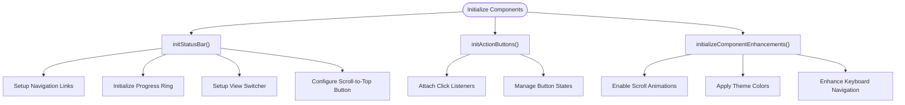
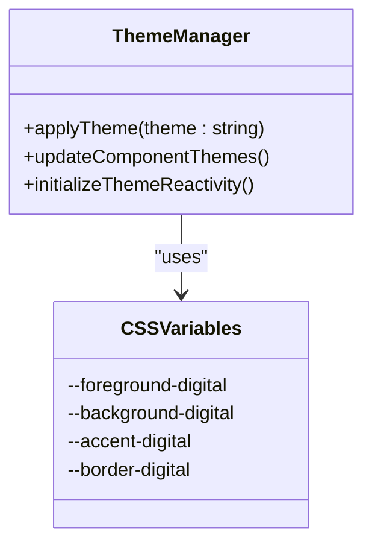

# UI Components

<cite>
**Referenced Files in This Document**   
- [statusBar.ts](file://src/scripts/statusBar.ts)
- [componentEnhancements.ts](file://src/utils/componentEnhancements.ts)
- [client.ts](file://src/utils/client.ts)
- [utilities.css](file://src/styles/utilities.css)
- [main.css](file://src/styles/main.css)
- [global.css](file://src/styles/global.css)
</cite>

## Table of Contents
1. [StatusBar Component](#statusbar-component)
2. [Action Button System](#action-button-system)
3. [Component Enhancements](#component-enhancements)
4. [Styling Architecture](#styling-architecture)
5. [Responsive and Accessibility Features](#responsive-and-accessibility-features)
6. [Usage Examples](#usage-examples)
7. [Common Issues and Solutions](#common-issues-and-solutions)
8. [Theming and Customization](#theming-and-customization)

## StatusBar Component

The StatusBar component serves as the primary navigation and status indicator for the application, integrating multiple interactive elements: navigation links, a scroll progress ring, a view switcher (digital/print), and a scroll-to-top button. These elements are initialized and managed through the `statusBar.ts` script, which leverages DOM utilities and event listeners to ensure smooth and responsive behavior.

The `initStatusBar` function orchestrates the initialization of all status bar components, including navigation, view switching, scroll-to-top functionality, and progress ring updates. Each component is initialized through dedicated functions that attach event listeners and manage state changes. For example, `initStatusBarNavigation` uses event delegation to handle clicks on navigation links, preventing default behavior and smoothly scrolling to the target section using `requestAnimationFrame` for optimal performance.

The scroll progress ring is updated dynamically based on the user's scroll position. The `initProgressRing` function calculates the circumference of the SVG circle and updates the `stroke-dashoffset` property to reflect the scroll percentage. This provides a visual indication of the user's progress through the page, with the percentage text and ARIA attributes updated for accessibility.

The view switcher toggles between digital and print views by modifying the body's class list, which triggers corresponding CSS rules to adjust the appearance and layout of the page. The scroll-to-top button is shown or hidden based on the scroll position, with a threshold defined by the `showAfter` data attribute. Keyboard support is included to ensure accessibility, allowing users to activate the button using the Enter or Space keys.

**Section sources**
- [statusBar.ts](file://src/scripts/statusBar.ts#L0-L217)

## Action Button System

The Action Button system is designed to support various states, including loading, success, and error feedback, as well as external navigation. Implemented in `client.ts`, this system uses a manager pattern to handle button interactions, ensuring consistent behavior across different types of actions such as opening links, downloading files, or triggering modals.

The `ActionButtonManager` object defines methods for handling clicks, setting loading states, and providing feedback. When a button is clicked, it enters a loading state, during which the button is disabled and a loading indicator is displayed. Depending on the action type, the system either opens a new window, triggers a download, or logs a warning for unsupported actions. Success or error states are visually indicated by adding corresponding classes, which are removed after a timeout to provide temporary feedback.

Event delegation is used to attach click listeners to all action buttons, allowing the system to handle dynamically added buttons without requiring individual event listeners. This approach improves performance and ensures that buttons added after the initial page load are still functional.

**Section sources**
- [client.ts](file://src/utils/client.ts#L0-L135)

## Component Enhancements

The `componentEnhancements.ts` file implements a comprehensive system for enhancing component interactions, including focus trapping, keyboard accessibility, and touch-friendly interactions. The `ComponentEnhancementManager` class encapsulates these enhancements, providing a unified interface for initializing and managing various interaction effects.

The manager supports scroll animations, theme reactivity, and interaction effects, each of which can be enabled or disabled through configuration options. Scroll animations are implemented using the Intersection Observer API, which detects when elements enter the viewport and applies an `animate-in` class. Child elements are staggered using a configurable delay, creating a cascading entrance effect.

Theme reactivity is achieved by listening for `theme:changed` events and updating the `data-theme` attribute of themed elements. The `applyThemeColors` method sets CSS custom properties based on the current theme, allowing for dynamic color changes without requiring a page reload. Interaction effects include enhanced focus indicators, hover effects on non-touch devices, and keyboard navigation enhancements that allow users to trigger actions using the Enter or Space keys.

The manager also provides a `destroy` method to clean up observers and event listeners, which is useful for hot reloading or component unmounting scenarios.

**Section sources**
- [componentEnhancements.ts](file://src/utils/componentEnhancements.ts#L0-L261)

## Styling Architecture

The styling architecture is built around a utility-first CSS approach, with styles defined in `utilities.css` and layout definitions in `main.css` and `global.css`. This modular approach allows for consistent and reusable styles across the application.

`utilities.css` provides a comprehensive set of utility classes for spacing, layout, typography, colors, and interactions. These classes are designed to be composable, allowing developers to build complex layouts using simple, atomic classes. For example, the `flex`, `items-center`, and `justify-between` classes can be combined to create a horizontally centered flex container with space between its children.

`main.css` defines the core design system variables, including fluid spacing, typography, and animation values. These variables are used throughout the application to ensure consistency and responsiveness. The file also includes theme color schemes, with different color palettes for various themes such as Matrix, Blockchain, and Gruvbox. These themes are applied by adding a corresponding class to the body element, which triggers the appropriate CSS rules.

`global.css` contains global styles and reset rules, ensuring a consistent baseline across different browsers. It also includes responsive adjustments and print styles, which optimize the layout for different devices and printing scenarios.

**Section sources**
- [utilities.css](file://src/styles/utilities.css#L0-L293)
- [main.css](file://src/styles/main.css#L0-L799)
- [global.css](file://src/styles/global.css#L0-L185)

## Responsive and Accessibility Features

The application includes several features to ensure responsiveness and accessibility across different devices and user preferences. Responsive behaviors are implemented using media queries and fluid design principles, with breakpoints defined for various screen sizes. The `responsive-grid` class, for example, creates a grid layout that adapts to the available space, with a single column on small screens and multiple columns on larger screens.

Accessibility is prioritized through the use of ARIA attributes, keyboard navigation, and focus management. The progress ring includes an `aria-valuenow` attribute to indicate the current scroll percentage, and all interactive elements are focusable and navigable using the keyboard. The `componentEnhancements.ts` file enhances focus indicators and ensures that hover effects are disabled on touch devices to prevent unintended interactions.

Client-side detection of interaction preferences is handled by the `client.ts` file, which checks for features such as hover support and reduced motion preferences. These preferences are used to adjust the user experience, such as disabling animations for users who prefer reduced motion.

**Section sources**
- [statusBar.ts](file://src/scripts/statusBar.ts#L0-L217)
- [componentEnhancements.ts](file://src/utils/componentEnhancements.ts#L0-L261)
- [client.ts](file://src/utils/client.ts#L0-L135)

## Usage Examples

To instantiate and customize components programmatically, developers can use the provided initialization functions. For example, the StatusBar component can be initialized by calling `initStatusBar()`, which sets up all its subcomponents. Similarly, the Action Button system can be initialized by calling `initActionButtons()`, which attaches event listeners to all action buttons in the specified root element.

Customization is achieved through data attributes and CSS classes. For example, the scroll-to-top button's visibility threshold can be adjusted using the `data-show-after` attribute, and the Action Button's behavior can be configured using `data-url` and `data-type` attributes. Themes can be changed by adding the appropriate class to the body element, such as `scheme-matrix` or `scheme-gruvbox`.

**Diagram sources**
- [statusBar.ts](file://src/scripts/statusBar.ts#L177-L217)
- [client.ts](file://src/utils/client.ts#L100-L135)
- [componentEnhancements.ts](file://src/utils/componentEnhancements.ts#L10-L261)

## Common Issues and Solutions

Common issues in the application include layout shifts, hydration mismatches in Astro, and cross-browser inconsistencies. Layout shifts can occur when dynamically loaded content changes the page's dimensions, which can be mitigated by reserving space for expected content or using CSS containment.

Hydration mismatches in Astro can arise when server-rendered HTML does not match the client-side rendered HTML, leading to errors or unexpected behavior. This can be addressed by ensuring that all dynamic content is properly synchronized between the server and client, or by using Astro's hydration directives to control when and how components are hydrated.

Cross-browser inconsistencies are minimized by using feature detection and polyfills for unsupported features. For example, the `dom.scroll.to` method includes a fallback for browsers that do not support smooth scrolling, ensuring that the scroll-to-top functionality works across all browsers.

**Section sources**
- [statusBar.ts](file://src/scripts/statusBar.ts#L0-L217)
- [client.ts](file://src/utils/client.ts#L0-L135)

## Theming and Customization

Theming is a core feature of the application, with support for multiple color schemes and dynamic theme switching. Themes are defined in `main.css` using CSS custom properties, with each theme corresponding to a specific class that can be applied to the body element. The `componentEnhancements.ts` file listens for theme changes and updates the `data-theme` attribute of themed elements, ensuring that the entire application reflects the current theme.

Customization is facilitated through CSS variables and utility classes, allowing developers to easily modify colors, spacing, and typography. New themes can be added by defining a new set of CSS custom properties and a corresponding body class. Similarly, new component variants can be created by extending existing utility classes or defining new ones in `utilities.css`.

**Diagram sources**
- [main.css](file://src/styles/main.css#L0-L799)
- [componentEnhancements.ts](file://src/utils/componentEnhancements.ts#L50-L100)