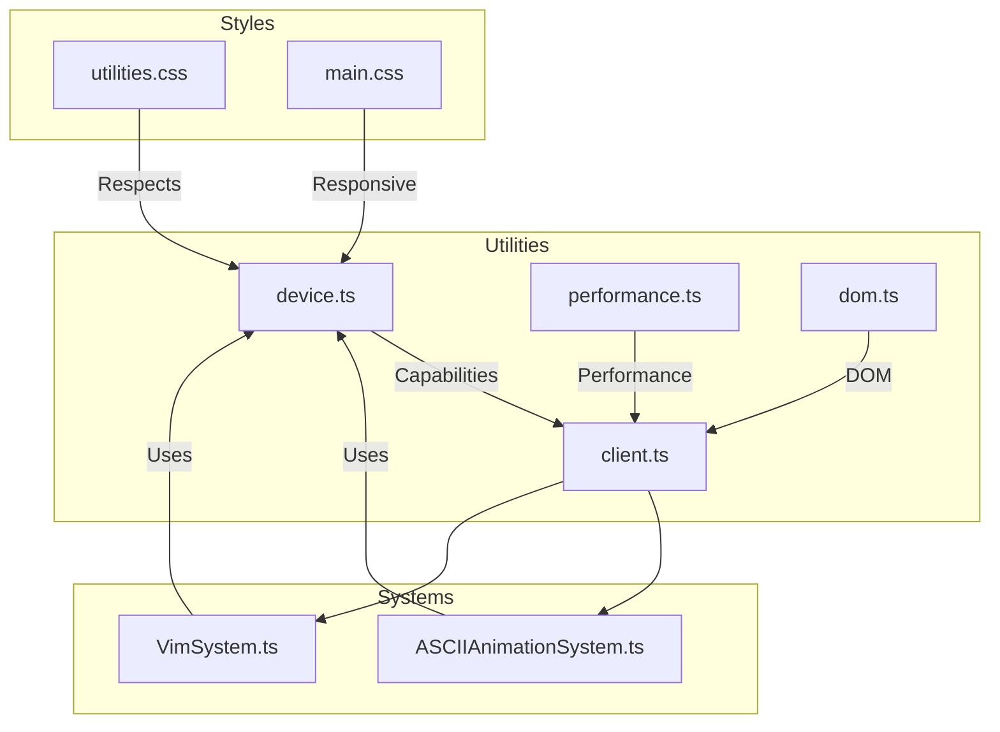
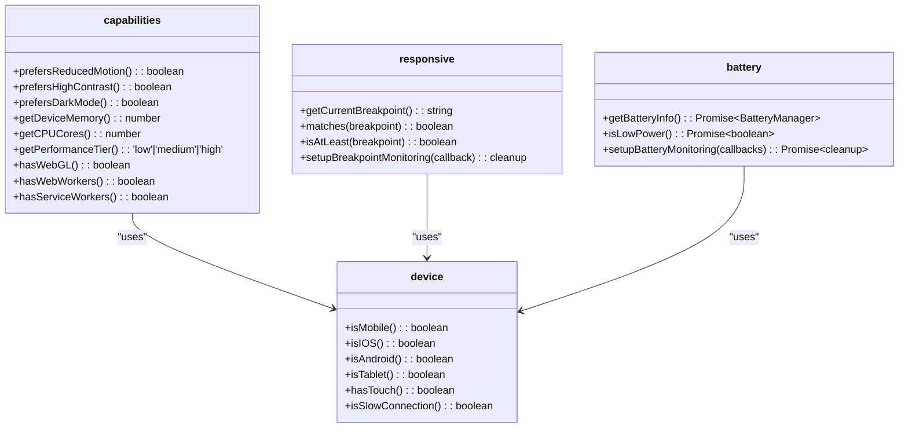
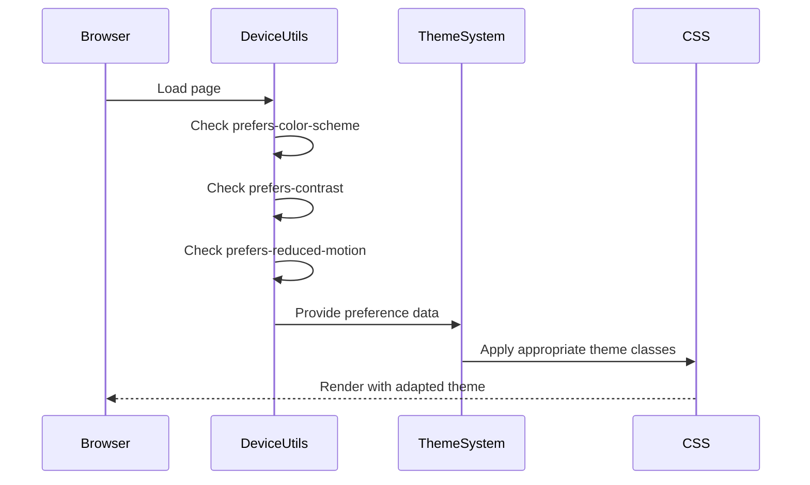
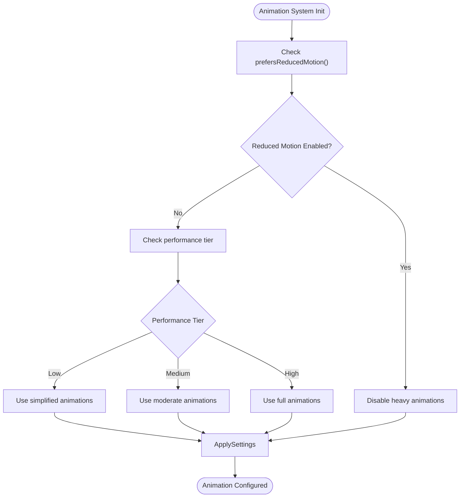
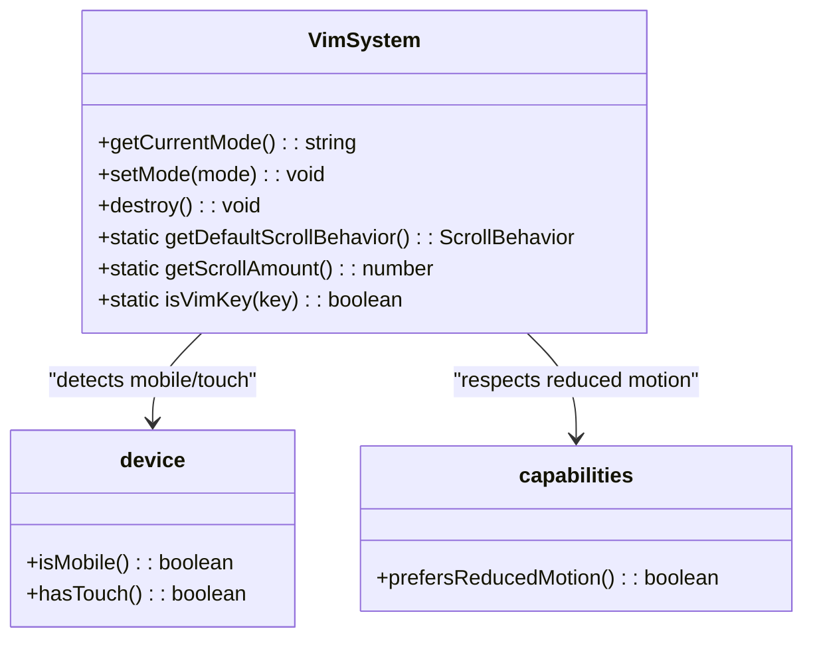
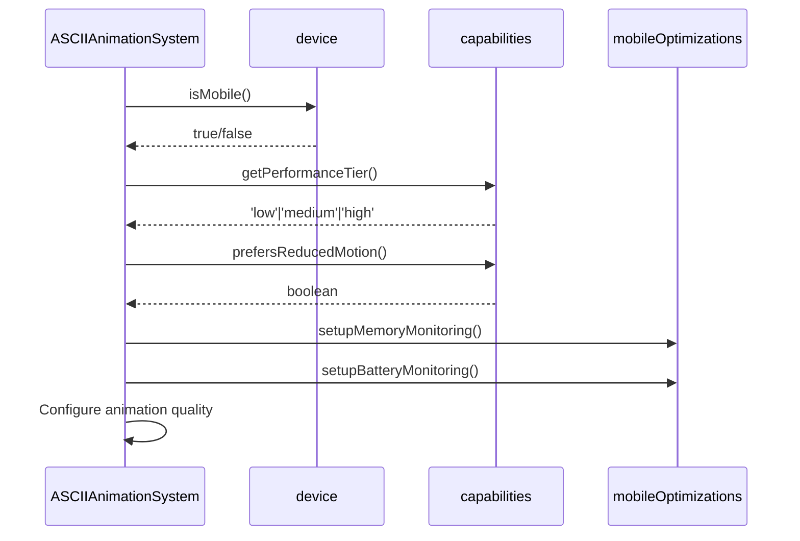
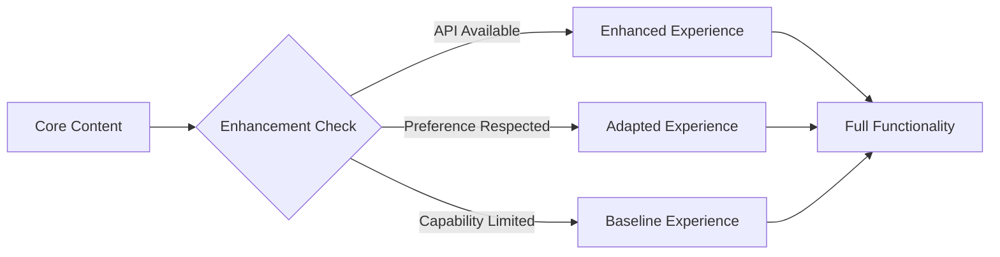
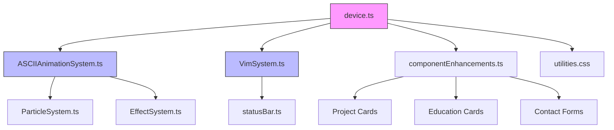
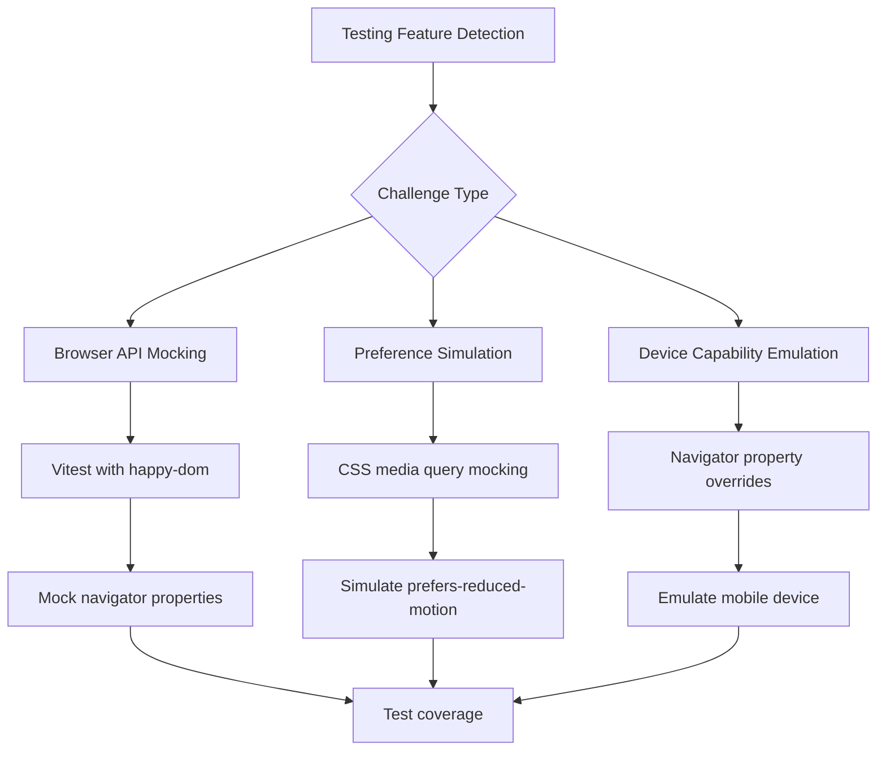

# Client Feature Detection

<cite>
**Referenced Files in This Document**   
- [client.ts](file://src/utils/client.ts)
- [device.ts](file://src/utils/device.ts)
- [performance.ts](file://src/utils/performance.ts)
- [ASCIIAnimationSystem.ts](file://src/animation/ASCIIAnimationSystem.ts)
- [VimSystem.ts](file://src/systems/VimSystem.ts)
- [utilities.css](file://src/styles/utilities.css)
- [main.css](file://src/styles/main.css)
- [componentEnhancements.ts](file://src/utils/componentEnhancements.ts)
- [vitest.config.ts](file://vitest.config.ts)
</cite>

## Table of Contents
1. [Introduction](#introduction)
2. [Project Structure](#project-structure)
3. [Core Components](#core-components)
4. [Architecture Overview](#architecture-overview)
5. [Detailed Component Analysis](#detailed-component-analysis)
6. [Dependency Analysis](#dependency-analysis)
7. [Performance Considerations](#performance-considerations)
8. [Troubleshooting Guide](#troubleshooting-guide)
9. [Conclusion](#conclusion)

## Introduction
The client feature detection system in this portfolio application enables adaptive behavior based on browser capabilities, user preferences, and device characteristics. The system leverages modern web APIs to detect features such as Intersection Observer, Resize Observer, WebGL, Web Workers, and service workers, while also respecting user preferences like reduced motion, color scheme, and contrast settings. This documentation details how the detection system integrates with the theme system and animation framework, supports progressive enhancement, and enables components like VimSystem and ASCIIAnimationSystem to modify their behavior based on detected capabilities.

## Project Structure
The client feature detection functionality is primarily organized within the `src/utils` directory, with supporting components in animation, systems, and styles. The detection logic is distributed across multiple utility modules that handle different aspects of capability detection.



**Diagram sources**
- [device.ts](file://src/utils/device.ts#L0-L387)
- [client.ts](file://src/utils/client.ts#L0-L135)

**Section sources**
- [device.ts](file://src/utils/device.ts#L0-L387)
- [client.ts](file://src/utils/client.ts#L0-L135)

## Core Components
The core feature detection functionality is implemented across several utility modules that provide comprehensive client capability assessment. The system detects browser support for modern APIs, user preference settings, device characteristics, and network conditions to enable adaptive behavior throughout the application.

**Section sources**
- [device.ts](file://src/utils/device.ts#L0-L387)
- [performance.ts](file://src/utils/performance.ts#L0-L238)

## Architecture Overview
The feature detection architecture follows a modular design where different aspects of client capabilities are handled by specialized utility modules. These modules expose detection methods that are consumed by higher-level systems to adapt their behavior based on the detected environment.

```mermaid
graph TB
subgraph "Detection Layer"
A[Device Detection] --> |device.ts|
B[Performance Detection] --> |performance.ts|
C[Network Detection] --> |device.ts|
D[User Preferences] --> |device.ts|
end
subgraph "Integration Layer"
E[Animation System] --> A
E --> B
F[Theme System] --> D
G[Vim System] --> A
H[Component Enhancements] --> D
end
subgraph "Presentation Layer"
I[CSS Utilities] --> D
J[Responsive Design] --> A
end
A --> |prefersReducedMotion| I
B --> |performanceTier| E
D --> |prefersColorScheme| F
```

**Diagram sources**
- [device.ts](file://src/utils/device.ts#L0-L387)
- [performance.ts](file://src/utils/performance.ts#L0-L238)
- [ASCIIAnimationSystem.ts](file://src/animation/ASCIIAnimationSystem.ts#L0-L368)

## Detailed Component Analysis

### Feature Detection Implementation
The feature detection system provides comprehensive methods for detecting browser capabilities and user preferences, enabling adaptive behavior throughout the application.

#### Capability Detection Methods:


**Diagram sources**
- [device.ts](file://src/utils/device.ts#L0-L387)

#### API Feature Detection:
The system includes detection for modern browser APIs that enable enhanced functionality:

- **Intersection Observer**: Used for lazy loading and visibility detection
- **Resize Observer**: Monitors element size changes
- **WebGL**: Detects 3D graphics capabilities
- **Web Workers**: Checks for background thread support
- **Service Workers**: Determines PWA capabilities
- **Battery API**: Monitors device power status
- **Network Information API**: Assesses connection quality

**Section sources**
- [device.ts](file://src/utils/device.ts#L181-L241)
- [performance.ts](file://src/utils/performance.ts#L121-L173)

### Integration with Theme System
The feature detection system integrates with the theme system to provide adaptive visual experiences based on user preferences and device capabilities.

#### Theme Adaptation Flow:


The system respects the `prefers-color-scheme` media query to automatically adapt to the user's light/dark mode preference, and honors `prefers-contrast` for high-contrast requirements.

**Diagram sources**
- [device.ts](file://src/utils/device.ts#L125-L179)
- [utilities.css](file://src/styles/utilities.css#L151-L207)

### Integration with Animation Framework
The animation system leverages feature detection to provide appropriate visual experiences based on device capabilities and user preferences.

#### Animation Adaptation Logic:


The system respects the `prefers-reduced-motion` preference by disabling or simplifying animations when requested by the user, ensuring accessibility compliance.

**Diagram sources**
- [device.ts](file://src/utils/device.ts#L243-L272)
- [ASCIIAnimationSystem.ts](file://src/animation/ASCIIAnimationSystem.ts#L0-L368)

### VimSystem and ASCIIAnimationSystem Integration
The VimSystem and ASCIIAnimationSystem components use client hints to modify their interaction models and rendering fidelity based on detected capabilities.

#### VimSystem Capability Usage:


The VimSystem adapts its behavior based on device type and user preferences, modifying scroll behavior and interaction patterns accordingly.

#### ASCIIAnimationSystem Adaptive Behavior:


The ASCIIAnimationSystem uses capability detection to optimize performance on mobile devices, implementing memory and battery monitoring to pause animations when system resources are constrained.

**Diagram sources**
- [VimSystem.ts](file://src/systems/VimSystem.ts#L0-L251)
- [ASCIIAnimationSystem.ts](file://src/animation/ASCIIAnimationSystem.ts#L0-L368)

### Progressive Enhancement and Graceful Degradation
The codebase applies progressive enhancement principles through the feature detection system, ensuring core functionality remains available while enhancing the experience when capabilities permit.

#### Progressive Enhancement Strategy:


The system follows these principles:
- **Core content first**: Essential information is always available
- **Enhancement second**: Additional features are added when supported
- **Preference respect**: User settings take precedence over enhancements
- **Fallbacks provided**: Alternative experiences when features are unavailable

**Section sources**
- [device.ts](file://src/utils/device.ts#L274-L324)
- [componentEnhancements.ts](file://src/utils/componentEnhancements.ts#L89-L122)

## Dependency Analysis
The feature detection system has dependencies across multiple layers of the application, providing capability information that influences behavior throughout the codebase.



**Diagram sources**
- [device.ts](file://src/utils/device.ts#L0-L387)
- [go.mod](file://package.json#L0-L10)

**Section sources**
- [device.ts](file://src/utils/device.ts#L0-L387)
- [package.json](file://package.json#L0-L10)

## Performance Considerations
The feature detection system is designed with performance in mind, minimizing overhead while providing comprehensive capability assessment.

- **Lazy evaluation**: Many detection methods are called only when needed
- **Caching**: Results of expensive operations are cached where appropriate
- **Event delegation**: Monitoring uses efficient event handling patterns
- **Resource monitoring**: Memory and battery usage are tracked to prevent performance issues
- **Conditional feature activation**: Complex features are disabled on low-end devices

The system balances thorough detection with performance considerations, ensuring that capability checks do not negatively impact the user experience.

## Troubleshooting Guide
When testing feature detection logic, several challenges arise that require specific approaches to address.

#### Testing Challenges and Solutions:


**Best Practices for Testing:**
- Use Vitest with happy-dom environment for browser API mocking
- Mock navigator properties to simulate different device capabilities
- Override window.matchMedia to test preference detection
- Use setup files to configure test environments consistently
- Test both positive and negative detection cases
- Verify fallback behaviors when features are unavailable

**Section sources**
- [vitest.config.ts](file://vitest.config.ts#L0-L23)
- [device.ts](file://src/utils/device.ts#L0-L387)

## Conclusion
The client feature detection system provides a comprehensive foundation for adaptive behavior in the portfolio application. By detecting browser capabilities, user preferences, and device characteristics, the system enables components to deliver optimized experiences across a wide range of environments. The integration with the theme system and animation framework ensures accessibility and performance, while the application of progressive enhancement principles guarantees core functionality remains available. The system's modular design allows for easy extension and maintenance, making it a robust solution for client-side capability detection.