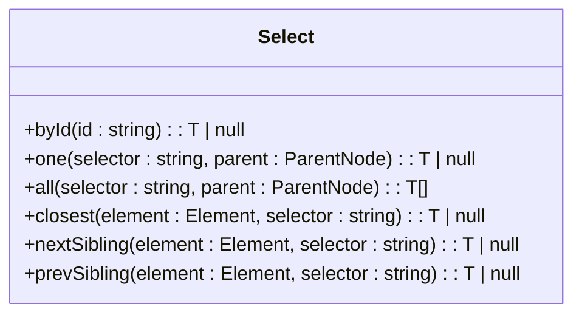
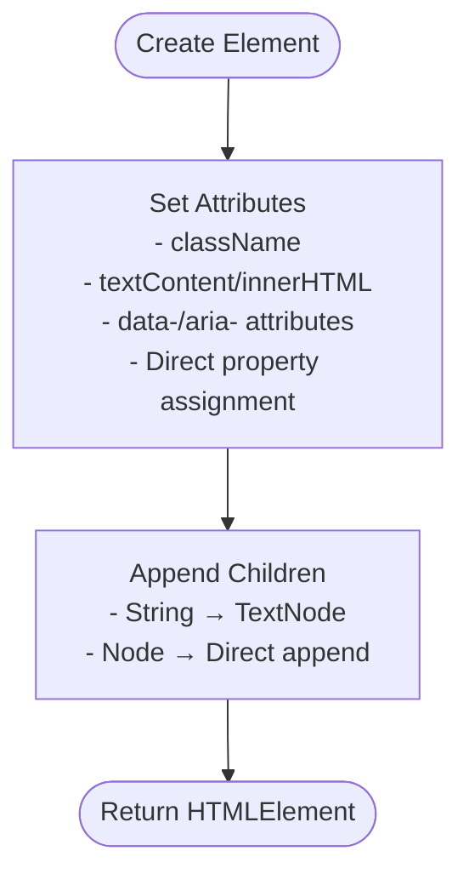
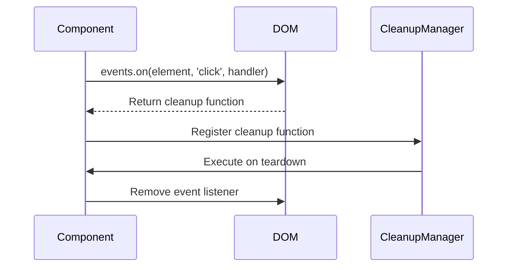
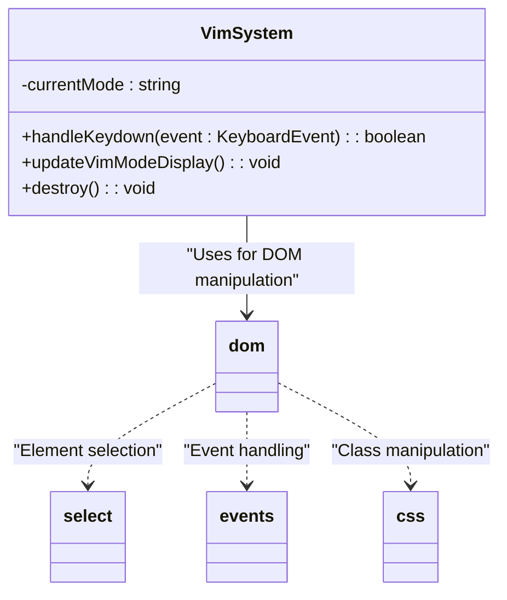
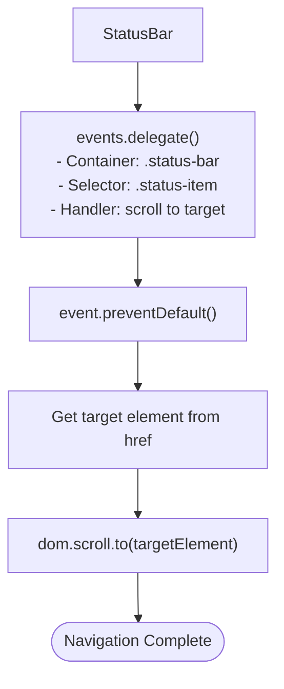
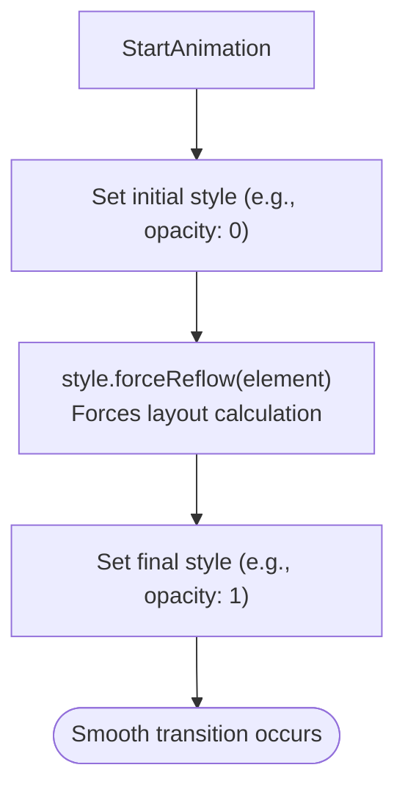
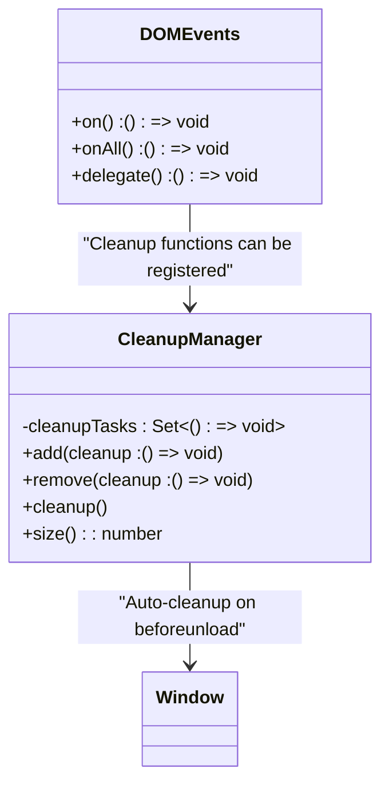
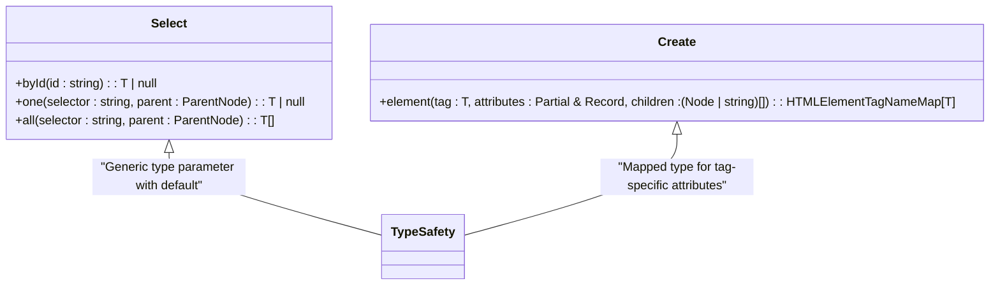

# DOM Utilities

<cite>
**Referenced Files in This Document**   
- [dom.ts](file://src/utils/dom.ts)
- [performance.ts](file://src/utils/performance.ts)
- [index.ts](file://src/types/index.ts)
- [VimSystem.ts](file://src/systems/VimSystem.ts)
- [statusBar.ts](file://src/scripts/statusBar.ts)
</cite>

## Table of Contents
1. [Introduction](#introduction)
2. [Core DOM Abstraction](#core-dom-abstraction)
3. [Element Creation and Manipulation](#element-creation-and-manipulation)
4. [Event Management System](#event-management-system)
5. [Integration with Application Systems](#integration-with-application-systems)
6. [Performance Optimization](#performance-optimization)
7. [Memory Leak Prevention](#memory-leak-prevention)
8. [Extending the DOM Module](#extending-the-dom-module)
9. [Best Practices](#best-practices)

## Introduction
The DOM utility module provides a comprehensive set of tools for safe, efficient, and type-safe DOM manipulation. Designed as a centralized abstraction layer, it encapsulates common DOM operations while implementing performance optimizations and memory management patterns. The module serves as the foundation for interactive components throughout the application, enabling consistent patterns for element selection, creation, event handling, and cleanup.

**Section sources**
- [dom.ts](file://src/utils/dom.ts#L1-L50)

## Core DOM Abstraction
The module exports a unified `dom` object that organizes utilities into logical namespaces for element selection, creation, styling, and event handling. This structured approach promotes discoverability and consistency across the codebase.

### Element Selection
The `select` namespace provides type-safe wrappers around native DOM selection methods with null safety and optional type parameters:



**Diagram sources**
- [dom.ts](file://src/utils/dom.ts#L53-L100)

These methods return properly typed HTMLElements or null, eliminating the need for type assertions in consuming code. The generic type parameter allows for precise typing when the element type is known.

**Section sources**
- [dom.ts](file://src/utils/dom.ts#L53-L100)

## Element Creation and Manipulation
The `create` namespace offers factory functions for generating DOM elements with comprehensive attribute and content handling.

### Element Factory
The `element` function creates elements with attributes and children in a single call, handling various attribute types appropriately:



**Diagram sources**
- [dom.ts](file://src/utils/dom.ts#L105-L150)

Specialized creation methods include `text()` for text nodes, `fragment()` for document fragments, and `fromHTML()` for parsing HTML strings into elements.

**Section sources**
- [dom.ts](file://src/utils/dom.ts#L105-L156)

## Event Management System
The `events` namespace implements an observer-style event management system with automatic cleanup registration, preventing common memory leak patterns.

### Event Registration and Cleanup
Each event binding method returns a cleanup function that removes the listener, enabling efficient teardown:



**Diagram sources**
- [dom.ts](file://src/utils/dom.ts#L255-L330)
- [performance.ts](file://src/utils/performance.ts#L294-L354)

### Advanced Event Patterns
The module supports sophisticated event patterns including:

- **Delegation**: `delegate()` for efficient event handling on dynamic content
- **Throttling**: `onThrottled()` for performance-critical events
- **Debouncing**: `onDebounced()` for user input events

These patterns are implemented using the `throttle` and `debounce` utilities from the performance module.

**Section sources**
- [dom.ts](file://src/utils/dom.ts#L255-L330)

## Integration with Application Systems
The DOM utilities are integral to key application systems, providing the foundation for interactive components.

### VimSystem Integration
The VimSystem uses DOM utilities for mode display updates and element selection:



**Diagram sources**
- [VimSystem.ts](file://src/systems/VimSystem.ts#L80-L85)
- [dom.ts](file://src/utils/dom.ts)

The system updates the status display by selecting elements with `select.byId()` and modifying their content and classes.

**Section sources**
- [VimSystem.ts](file://src/systems/VimSystem.ts#L80-L85)
- [dom.ts](file://src/utils/dom.ts)

### StatusBar Integration
The status bar script demonstrates event delegation and navigation patterns:



**Diagram sources**
- [statusBar.ts](file://src/scripts/statusBar.ts#L10-L25)

The implementation uses event delegation to handle clicks on status items, preventing default link behavior and scrolling to target sections.

**Section sources**
- [statusBar.ts](file://src/scripts/statusBar.ts#L10-L25)

## Performance Optimization
The module incorporates several performance optimizations to minimize layout thrashing and improve rendering efficiency.

### Reflow Minimization
The `style.forceReflow()` method strategically forces reflows when necessary for CSS transitions:



**Diagram sources**
- [dom.ts](file://src/utils/dom.ts#L245-L250)

This pattern ensures that CSS transitions animate properly by separating style changes across reflow boundaries.

### Batch Operations
Document fragments and batch methods enable efficient DOM updates:

- `create.fragment()` for batch insertion
- `css.add()` with multiple classes
- `events.onAll()` for binding to multiple elements

**Section sources**
- [dom.ts](file://src/utils/dom.ts#L145-L150)

## Memory Leak Prevention
The module addresses common memory leak scenarios through systematic cleanup registration.

### Automatic Cleanup Registration
Event binding methods return cleanup functions that can be registered with the global cleanup manager:



**Diagram sources**
- [performance.ts](file://src/utils/performance.ts#L294-L354)
- [dom.ts](file://src/utils/dom.ts#L255-L330)

The global cleanup manager automatically executes registered tasks during page unload, ensuring proper resource cleanup.

**Section sources**
- [performance.ts](file://src/utils/performance.ts#L294-L354)

## Extending the DOM Module
The module can be extended with new utilities while maintaining type safety through TypeScript generics and interfaces.

### Type Safety with Generics
The existing API demonstrates proper use of generics for type safety:



**Diagram sources**
- [dom.ts](file://src/utils/dom.ts#L53-L150)

New utilities should follow similar patterns, leveraging the type definitions in `src/types/index.ts` for consistency.

**Section sources**
- [dom.ts](file://src/utils/dom.ts#L53-L150)
- [index.ts](file://src/types/index.ts)

## Best Practices
When using the DOM utilities, follow these best practices for optimal performance and maintainability.

### Event Delegation for Dynamic Content
Use `events.delegate()` for elements that may be added or removed dynamically:

```typescript
// Recommended: Delegation for dynamic content
const cleanup = dom.events.delegate(
  container,
  'click',
  '.dynamic-item',
  (event, target) => {
    // Handle click on any .dynamic-item, current or future
  }
);
```

### Cleanup Registration Pattern
Always register cleanup functions with the appropriate lifecycle manager:

```typescript
// Register cleanup with component lifecycle
const eventCleanup = dom.events.on(element, 'click', handler);
const animationCleanup = animate(animationCallback);

// Register with global or component-specific cleanup manager
globalCleanupManager.add(() => {
  eventCleanup();
  animationCleanup();
});
```

### Minimize DOM Access
Batch DOM operations and cache element references when possible:

```typescript
// Cache element references
const elements = {
  header: dom.select.one('.header'),
  content: dom.select.one('.content'),
  footer: dom.select.one('.footer')
};

// Perform multiple operations
dom.css.add(elements.header, 'active');
dom.css.remove(elements.footer, 'hidden');
```

**Section sources**
- [dom.ts](file://src/utils/dom.ts)
- [performance.ts](file://src/utils/performance.ts)