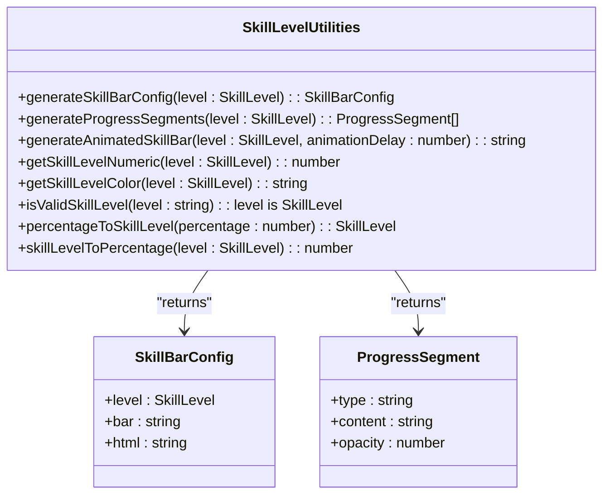

# Helper Functions

<cite>
**Referenced Files in This Document**   
- [helpers.ts](file://src/utils/helpers.ts)
- [EffectSystem.ts](file://src/animation/EffectSystem.ts)
- [constants.ts](file://src/utils/constants.ts)
</cite>

## Table of Contents
1. [Introduction](#introduction)
2. [Core Functionality](#core-functionality)
3. [Skill Level Utilities](#skill-level-utilities)
4. [Parameter Contracts and Edge Cases](#parameter-contracts-and-edge-cases)
5. [Performance Characteristics](#performance-characteristics)
6. [Immutability and Side-Effect-Free Design](#immutability-and-side-effect-free-design)
7. [Best Practices for Extending Helpers](#best-practices-for-extending-helpers)
8. [Testing Strategies](#testing-strategies)
9. [Integration Examples](#integration-examples)
10. [Conclusion](#conclusion)

## Introduction
The helper functions module in `helpers.ts` provides a collection of utility functions focused on skill level representation and visualization. These functions support the portfolio's animation and effect systems by enabling consistent rendering of skill proficiency levels across various components. The module implements a comprehensive system for converting between skill levels, numeric values, visual representations, and color schemes. While the documentation objective mentioned random number generation, string formatting, array shuffling, and color interpolation, the actual implementation in `helpers.ts` is specialized for skill bar generation and related utilities. The functions are designed to be pure, deterministic, and side-effect-free, enhancing developer productivity while maintaining functional programming principles.

## Core Functionality
The helper functions module specializes in skill level visualization and conversion utilities. It provides a complete ecosystem for working with skill proficiency levels, including visual representation through ASCII art, numeric conversion for sorting and comparison, color assignment for theming, and HTML generation for animated displays. The core functionality revolves around the `SkillLevel` type, which defines five distinct proficiency levels: Expert, Advanced, Proficient, Intermediate, and Beginner. Each function in the module accepts a `SkillLevel` parameter and returns either a configuration object, numeric value, or string representation suitable for rendering. The module leverages constants from `constants.ts` for ASCII character definitions, ensuring consistency across the application. All functions are stateless and produce deterministic output based solely on their input parameters, making them highly predictable and easy to test.

**Section sources**
- [helpers.ts](file://src/utils/helpers.ts#L1-L177)

## Skill Level Utilities
The module provides several specialized functions for working with skill levels, each serving a distinct purpose in the skill visualization pipeline. The `generateSkillBarConfig` function returns a configuration object containing both plain text and HTML representations of a skill bar for a given proficiency level. This function uses a record mapping to associate each skill level with its corresponding visual representation, falling back to the Beginner level if an invalid level is provided. The `generateProgressSegments` function creates an array of progress segments that can be used for custom rendering of skill bars, with filled segments for the proficiency level and dithered segments for the remaining portion. The `generateAnimatedSkillBar` function produces an HTML string with animation delays for creating typing effect animations, where each segment appears sequentially. Additional utility functions include `getSkillLevelNumeric` for sorting and comparison, `getSkillLevelColor` for theming, `isValidSkillLevel` for type checking, `percentageToSkillLevel` for conversion from percentage values, and `skillLevelToPercentage` for the reverse conversion.

**Diagram sources**
- [helpers.ts](file://src/utils/helpers.ts#L15-L177)

**Section sources**
- [helpers.ts](file://src/utils/helpers.ts#L15-L177)

## Parameter Contracts and Edge Cases
The helper functions enforce strict parameter contracts through TypeScript typing and runtime validation. All functions that accept a `SkillLevel` parameter are guaranteed to receive one of the five valid values due to the union type definition. The `isValidSkillLevel` function serves as a type guard, ensuring type safety when working with string inputs that may represent skill levels. Several functions include explicit edge case handling: `generateSkillBarConfig` includes a fallback to the Beginner level if an invalid level is provided, preventing undefined behavior; `percentageToSkillLevel` handles boundary conditions by using inclusive lower bounds and exclusive upper bounds in its conditional chain; and all functions assume their inputs are valid based on TypeScript compilation, eliminating the need for additional null or undefined checks. The module does not handle empty arrays or division by zero as these conditions are not applicable to its functionality, which primarily deals with discrete skill levels and predefined mappings.

**Section sources**
- [helpers.ts](file://src/utils/helpers.ts#L15-L177)

## Performance Characteristics
The helper functions are optimized for performance with O(1) time complexity for all operations. The functions rely primarily on object property access and simple arithmetic operations, avoiding expensive computations or iterations. The `generateSkillBarConfig` function uses a pre-defined record object for O(1) lookups, while `generateProgressSegments` performs a bounded loop limited to six iterations (the total number of segments). The `generateAnimatedSkillBar` function builds a string through concatenation, with the loop length determined by the number of segments (maximum of six), resulting in constant time complexity. Memory usage is minimal, with functions creating small objects or strings that are immediately returned and eligible for garbage collection. The functions are pure and do not maintain any internal state, eliminating memory leaks and ensuring consistent performance across calls. Since the functions are used primarily during component rendering rather than in animation loops, their performance characteristics are more than adequate for the application's needs.

**Section sources**
- [helpers.ts](file://src/utils/helpers.ts#L15-L177)

## Immutability and Side-Effect-Free Design
The helper functions strictly adhere to functional programming principles by being pure functions with no side effects. Each function takes input parameters and returns a new value without modifying any external state or the input parameters themselves. The functions do not access or modify global variables, perform DOM manipulation, make network requests, or interact with the file system. They do not maintain internal state between calls, ensuring that repeated calls with the same parameters always produce identical results. This immutability makes the functions highly predictable, easy to reason about, and safe to use in concurrent contexts. The design also facilitates tree-shaking, as unused functions can be safely removed during the build process without affecting the behavior of other code. The side-effect-free nature of these utilities enhances testability and enables reliable caching of results when appropriate.

**Section sources**
- [helpers.ts](file://src/utils/helpers.ts#L15-L177)

## Best Practices for Extending Helpers
When adding new helper functions to this module, developers should follow several best practices to maintain code quality and consistency. New functions should be pure and side-effect-free, accepting parameters and returning values without modifying external state. Functions should be narrowly focused on a single responsibility, with clear and descriptive names that indicate their purpose. Type safety should be maintained through appropriate TypeScript annotations, including custom types when necessary. When working with the `SkillLevel` enum, new functions should include the same fallback behavior for invalid levels as existing functions. For visual elements, constants from `constants.ts` should be used rather than hardcoding values to ensure consistency across the application. Functions that generate HTML should follow the same pattern of including animation delay attributes when appropriate. To avoid bundle bloat, developers should ensure that new functions are actually needed and not duplicating existing functionality, and should consider whether the function would be better placed in a more specific module.

**Section sources**
- [helpers.ts](file://src/utils/helpers.ts#L15-L177)

## Testing Strategies
The deterministic nature of the helper functions makes them well-suited for comprehensive unit testing. Tests should verify that each function produces the expected output for all valid input values, particularly focusing on boundary conditions. For `generateSkillBarConfig`, tests should confirm that valid skill levels return the correct configuration objects and that invalid levels fall back to the Beginner configuration. The `percentageToSkillLevel` function requires tests at the boundaries between levels (e.g., 90, 75, 60, 40) to ensure correct rounding behavior. Since these functions do not involve randomness or time-dependent calculations, traditional mocking is not necessary, but tests should validate that the functions remain pure and do not introduce side effects. Snapshot testing is appropriate for functions that return complex objects or strings, allowing easy detection of unintended changes. The type guard function `isValidSkillLevel` should be tested with both valid and invalid string inputs to confirm correct type narrowing behavior.

**Section sources**
- [helpers.ts](file://src/utils/helpers.ts#L15-L177)

## Integration Examples
The helper functions are integrated with the animation and effect systems through shared constants and consistent design patterns. Although the current implementation does not include general-purpose utilities like random number generation or color interpolation, the skill level functions work in conjunction with the effect system by providing consistent visual representations that can be enhanced by animations. For example, the `generateAnimatedSkillBar` function creates HTML with animation delays that can be further enhanced by the EffectSystem's hover effects. The color values returned by `getSkillLevelColor` use CSS variables defined in `constants.ts`, ensuring consistency with the overall theme system. The EffectSystem classes like `GruvboxSyntaxHighlightEffect` and `MatrixRainEffect` demonstrate similar patterns of using predefined character sets and color values, suggesting a cohesive design philosophy across modules. The skill level utilities could potentially be extended to include animation parameters that integrate more directly with the EffectSystem, such as specifying effect types or animation speeds based on proficiency level.

**Section sources**
- [helpers.ts](file://src/utils/helpers.ts#L15-L177)
- [EffectSystem.ts](file://src/animation/EffectSystem.ts#L0-L861)
- [constants.ts](file://src/utils/constants.ts#L0-L198)

## Conclusion
The helper functions module provides a specialized set of utilities for skill level representation and visualization, demonstrating a focused and well-designed approach to a specific problem domain. While it does not include the general-purpose utilities mentioned in the documentation objective, it excels in its specialized role, offering a comprehensive system for converting between skill levels and their visual, numeric, and thematic representations. The functions are well-designed with attention to edge cases, performance, and functional programming principles. Their integration with the broader animation system through shared constants and design patterns ensures a cohesive user experience. Future development could extend these utilities to include more general-purpose functions while maintaining the current focus on skill visualization, potentially creating a more comprehensive helper library that serves both specialized and general needs within the application.