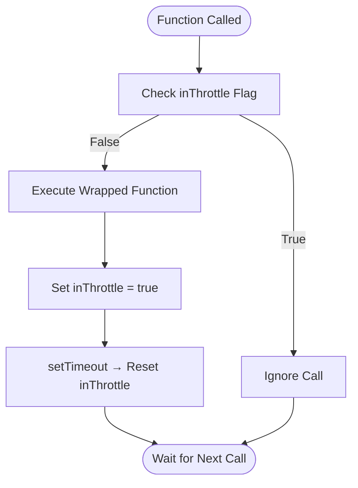
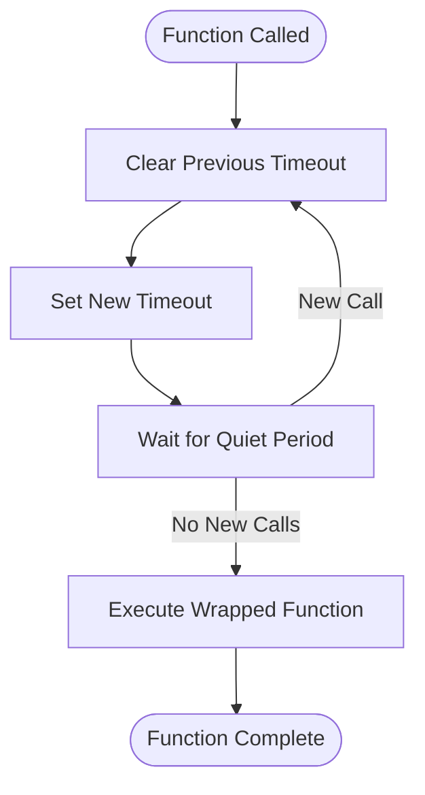
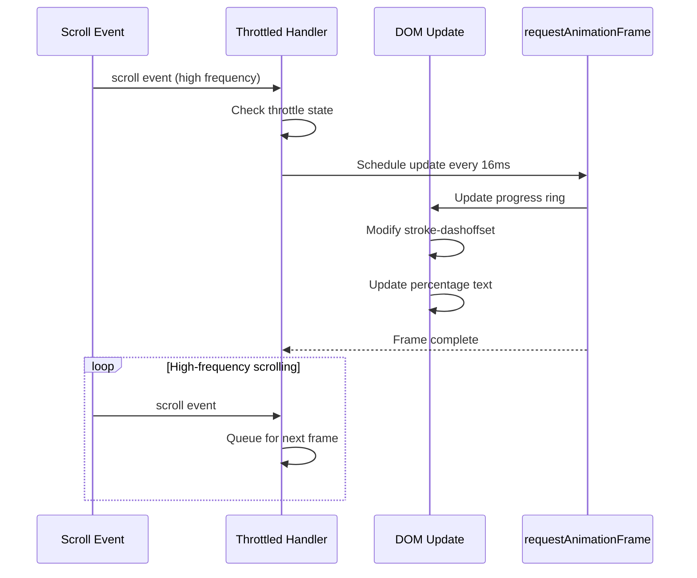

# Performance Utilities

<cite>
**Referenced Files in This Document**   
- [performance.ts](file://src/utils/performance.ts)
- [statusBar.ts](file://src/scripts/statusBar.ts)
- [VimSystem.ts](file://src/systems/VimSystem.ts)
- [device.ts](file://src/utils/device.ts)
- [dom.ts](file://src/utils/dom.ts)
</cite>

## Table of Contents
1. [Introduction](#introduction)
2. [Throttling Implementation](#throttling-implementation)
3. [Debouncing Implementation](#debouncing-implementation)
4. [Animation Frame Scheduling](#animation-frame-scheduling)
5. [Real-World Usage Examples](#real-world-usage-examples)
6. [Performance Monitoring and Device Detection](#performance-monitoring-and-device-detection)
7. [Memory Management and Cleanup](#memory-management-and-cleanup)
8. [Common Pitfalls and Best Practices](#common-pitfalls-and-best-practices)
9. [Conclusion](#conclusion)

## Introduction
The performance utility module provides essential tools for optimizing web application performance through throttling, debouncing, and animation frame scheduling. These utilities address common performance challenges in event handling and rendering, particularly for high-frequency events like scrolling, resizing, and user input. The module implements closure-based timer patterns for rate limiting function execution and leverages requestAnimationFrame for synchronized rendering with the browser's refresh cycle. By centralizing performance optimization strategies, this module ensures consistent, efficient handling of performance-critical operations across the application.

**Section sources**
- [performance.ts](file://src/utils/performance.ts#L1-L20)

## Throttling Implementation
The throttle function implements a rate-limiting mechanism that ensures a wrapped function executes at most once per specified time interval. Using closure-based state management, it maintains an `inThrottle` flag that prevents function execution when within the cooldown period. The implementation uses `setTimeout` to reset this flag after the specified limit (default 16ms, approximately 60fps). When an event triggers the throttled function, it immediately executes if not in throttle mode, sets the flag, and schedules its reset. This pattern is particularly effective for scroll and resize events where immediate feedback is important but excessive execution must be prevented.



**Diagram sources**
- [performance.ts](file://src/utils/performance.ts#L58-L72)

**Section sources**
- [performance.ts](file://src/utils/performance.ts#L58-L72)
- [dom.ts](file://src/utils/dom.ts#L291-L297)

## Debouncing Implementation
The debounce function implements a delay-based execution pattern that postpones function execution until after a specified quiet period. It maintains a timeout reference in closure scope, clearing any pending execution on each invocation and setting a new one. Only when the function hasn't been called for the specified wait period (default 250ms) does the wrapped function execute. This approach is ideal for user input scenarios like search fields or form validation, where processing should occur after the user has finished typing. The implementation ensures that intermediate states are ignored, reducing unnecessary computations and API calls.



**Diagram sources**
- [performance.ts](file://src/utils/performance.ts#L74-L88)

**Section sources**
- [performance.ts](file://src/utils/performance.ts#L74-L88)
- [dom.ts](file://src/utils/dom.ts#L300-L306)

## Animation Frame Scheduling
The AnimationScheduler class provides a centralized system for managing animations using requestAnimationFrame (RAF). It maintains a set of animation tasks and coordinates their execution to align with the browser's rendering cycle, ensuring smooth 60fps performance. The scheduler automatically starts when tasks are added and stops when all tasks complete, conserving resources. Each frame, it iterates through registered tasks, executing them and removing any that return false. This RAF-based approach eliminates jank by synchronizing updates with the display refresh rate and allows the browser to optimize rendering performance.

```mermaid
classDiagram
class AnimationScheduler {
-tasks : Set<() => boolean | void>
-isRunning : boolean
-animationId : number | null
+add(task : () => boolean | void) : () => void
+remove(task : () => boolean | void) : void
+destroy() : void
+getActiveTaskCount() : number
-start() : void
-stop() : void
-tick() : void
}
class AnimationTask {
<<interface>>
() => boolean | void
}
AnimationScheduler --> AnimationTask : "manages"
AnimationScheduler --> Window : "uses requestAnimationFrame"
```

**Diagram sources**
- [performance.ts](file://src/utils/performance.ts#L1-L56)
- [animations.ts](file://src/utils/animations.ts#L131-L151)

**Section sources**
- [performance.ts](file://src/utils/performance.ts#L1-L56)
- [animations.ts](file://src/utils/animations.ts#L131-L151)

## Real-World Usage Examples
The performance utilities are applied in various components throughout the application. In statusBar.ts, the progress ring animation uses throttling with a 16ms interval (~60fps) to update the visual indicator during scroll events, preventing excessive DOM manipulation. The scroll-to-top button visibility is also controlled by a throttled scroll handler. In VimSystem.ts, keypress handling could benefit from debouncing to manage rapid input sequences, though the current implementation uses a custom timing mechanism for vim command sequences. The dom.ts utilities expose both throttled and debounced event listeners as convenience methods, enabling consistent performance optimization patterns across the codebase.



**Diagram sources**
- [statusBar.ts](file://src/scripts/statusBar.ts#L150-L180)
- [performance.ts](file://src/utils/performance.ts#L108-L119)

**Section sources**
- [statusBar.ts](file://src/scripts/statusBar.ts#L150-L180)
- [VimSystem.ts](file://src/systems/VimSystem.ts#L100-L130)

## Performance Monitoring and Device Detection
The performance module integrates with device detection capabilities to adapt behavior based on device characteristics. While the current implementation uses fixed thresholds, the device.ts module provides functions to detect device tier, network conditions, and battery status. This information could be used to dynamically adjust throttle and debounce intervals based on device capabilities - using shorter intervals on high-end devices and longer ones on low-end devices. The performance utilities also include memory monitoring and low-power mode detection, allowing the application to reduce animation frequency or disable non-essential effects when system resources are constrained.

**Section sources**
- [device.ts](file://src/utils/device.ts#L250-L300)
- [performance.ts](file://src/utils/performance.ts#L120-L150)

## Memory Management and Cleanup
The module implements comprehensive memory management to prevent leaks commonly associated with timer-based functions. The AnimationScheduler automatically cleans up when tasks are removed, and the global cleanup manager handles page-level cleanup on unload. Each animation registration returns a cleanup function that removes the task from the scheduler. For debounced functions, the timeout reference is properly cleared on subsequent calls and when components are destroyed. The statusBar.ts implementation stores cleanup functions for all event listeners, enabling complete teardown when the status bar is no longer needed, preventing memory leaks during hot reloading or component unmounting.

**Section sources**
- [performance.ts](file://src/utils/performance.ts#L330-L354)
- [statusBar.ts](file://src/scripts/statusBar.ts#L200-L217)

## Common Pitfalls and Best Practices
Several common pitfalls are addressed by the implementation. Timer leaks are prevented by proper cleanup of timeout references in both throttle and debounce functions. The use of arrow functions for the tick method ensures correct this binding in the AnimationScheduler. Context binding is preserved through the use of func.apply(this, args) in both throttle and debounce implementations. Race conditions are minimized by the atomic nature of the throttle flag and debounce timeout operations. Best practices include using throttle for continuous events requiring immediate feedback (scroll, resize) and debounce for discrete operations after user input (search, form validation), with threshold selection based on both UX requirements and device capabilities.

**Section sources**
- [performance.ts](file://src/utils/performance.ts#L58-L119)
- [dom.ts](file://src/utils/dom.ts#L291-L306)

## Conclusion
The performance utility module provides a robust foundation for optimizing web application responsiveness and efficiency. By implementing well-tested patterns for throttling, debouncing, and animation scheduling, it addresses common performance bottlenecks while maintaining code clarity and reusability. The integration of cleanup mechanisms and consideration of device capabilities demonstrates a comprehensive approach to performance optimization that balances responsiveness with resource efficiency. These utilities enable developers to implement smooth, jank-free interactions while avoiding the pitfalls of improper event handling and memory management.