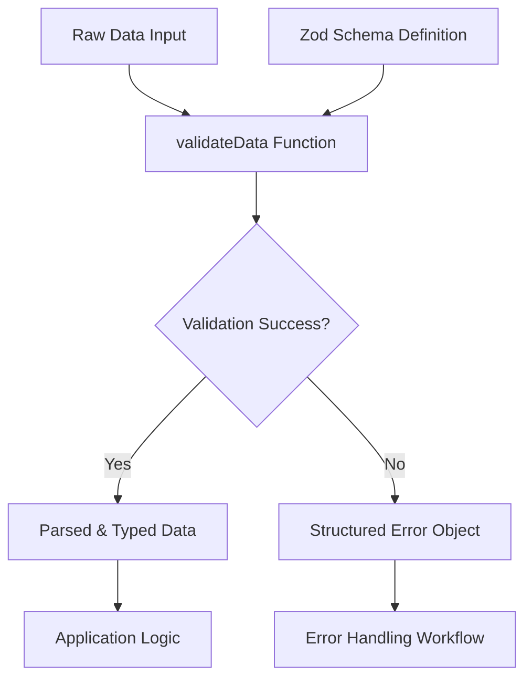
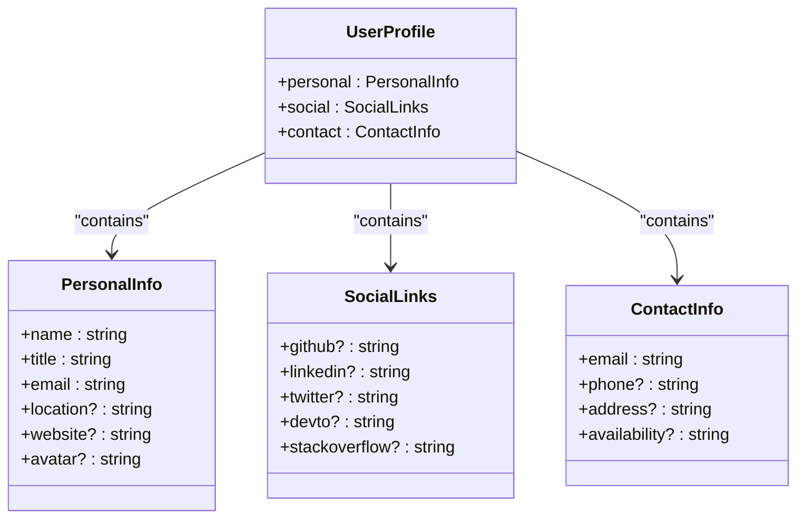
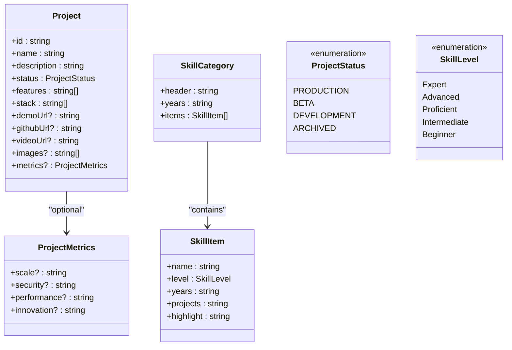
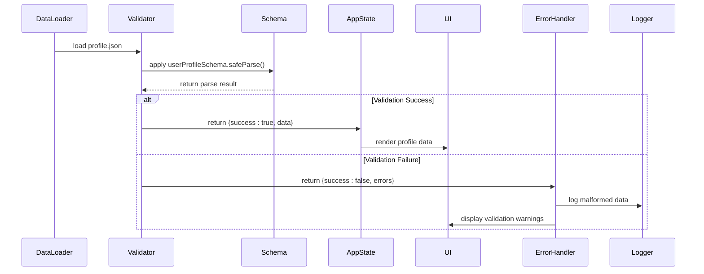
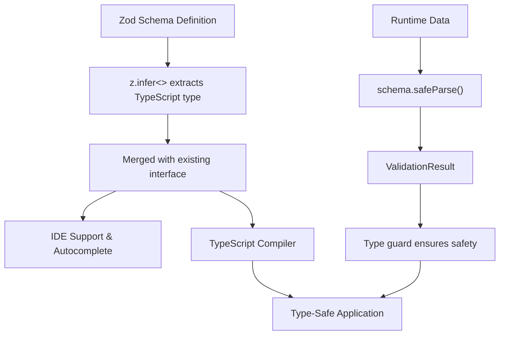

# Runtime Validation Schemas

<cite>
**Referenced Files in This Document**   
- [schemas.ts](file://src/utils/validation/schemas.ts)
- [profile.json](file://src/data/profile.json)
- [index.ts](file://src/types/index.ts)
- [config.ts](file://config.ts)
</cite>

## Table of Contents
1. [Introduction](#introduction)
2. [Core Validation Architecture](#core-validation-architecture)
3. [UserProfile Schema Definition](#userprofile-schema-definition)
4. [Project and Skill Validation Schemas](#project-and-skill-validation-schemas)
5. [Runtime Validation Workflow](#runtime-validation-workflow)
6. [TypeScript Integration and End-to-End Type Safety](#typescript-integration-and-end-to-end-type-safety)
7. [Error Handling and Development Guidance](#error-handling-and-development-guidance)
8. [Performance Considerations](#performance-considerations)
9. [Security Implications](#security-implications)
10. [Extending the Validation System](#extending-the-validation-system)

## Introduction
The runtime validation system in this application leverages Zod to ensure data integrity across configuration objects, user inputs, and data payloads. By defining comprehensive schemas in `schemas.ts`, the system provides strong typing and parsing guarantees that protect against malformed data while enabling seamless integration with TypeScript. This documentation details how Zod schemas validate critical data structures such as `profile.json`, theme configurations, and animation parameters at runtime, ensuring reliability and consistency throughout the application lifecycle.

## Core Validation Architecture
The validation system centers around Zod schemas defined in `schemas.ts`, which provide a declarative way to define expected data shapes and enforce type safety at runtime. The architecture combines schema definitions with a universal validation utility function that returns structured results, making it easy to handle both successful parses and validation failures consistently across the codebase.

**Diagram sources**
- [schemas.ts](file://src/utils/validation/schemas.ts#L20-L39)

**Section sources**
- [schemas.ts](file://src/utils/validation/schemas.ts#L1-L39)

## UserProfile Schema Definition
The `userProfileSchema` in `schemas.ts` defines the structure for user profile data loaded from `profile.json`. It validates nested objects for personal information, social links, and contact details, ensuring required fields like name, title, and email are present and properly formatted. Optional fields such as location, website, and avatar URLs are validated only when provided, using appropriate Zod types like `.email()` and `.url()` for format verification.

The schema enforces minimum length constraints on required string fields and ensures all URLs are well-formed. When combined with the `UserProfile` interface from `types/index.ts`, it provides end-to-end type safety from data loading through component rendering.

**Diagram sources**
- [schemas.ts](file://src/utils/validation/schemas.ts#L5-L20)
- [index.ts](file://src/types/index.ts#L680-L700)
- [profile.json](file://src/data/profile.json#L1-L250)

**Section sources**
- [schemas.ts](file://src/utils/validation/schemas.ts#L5-L20)
- [index.ts](file://src/types/index.ts#L680-L700)

## Project and Skill Validation Schemas
Beyond user profiles, the application defines additional Zod schemas within `types/index.ts` for validating complex data structures like projects and skills. These include `ProjectSchema`, `SkillItemSchema`, and `EducationSchema`, each with field-specific validation rules and error messages. For example, `ProjectSchema` ensures that every project has a non-empty ID, name, description, and status, while validating that URLs (demo, GitHub, video) are properly formatted when present.

Union types are used extensively to constrain values to specific sets, such as `ProjectStatus` ('PRODUCTION' | 'BETA' | 'DEVELOPMENT' | 'ARCHIVED') and `SkillLevel` ('Expert' | 'Advanced' | 'Proficient' | 'Intermediate' | 'Beginner'). These schemas support complex object validation with nested arrays and optional metric properties, providing robust guarantees for dynamic content rendering.

**Diagram sources**
- [index.ts](file://src/types/index.ts#L300-L350)
- [index.ts](file://src/types/index.ts#L450-L500)

**Section sources**
- [index.ts](file://src/types/index.ts#L300-L350)
- [index.ts](file://src/types/index.ts#L450-L500)

## Runtime Validation Workflow
The validation workflow begins when raw data is loaded from external sources such as JSON files or API endpoints. The `validateData` utility function in `schemas.ts` applies the appropriate Zod schema using `safeParse`, which never throws exceptions and instead returns a result object indicating success or failure. This pattern enables graceful error handling without disrupting application flow.

For `profile.json` data, the system uses `userProfileSchema.safeParse()` to validate the entire structure before assigning it to the application state. If validation fails, the structured error object contains `fieldErrors` that can be used to identify exactly which fields failed and why, enabling targeted debugging and error reporting.

**Diagram sources**
- [schemas.ts](file://src/utils/validation/schemas.ts#L20-L39)
- [profile.json](file://src/data/profile.json#L1-L250)

**Section sources**
- [schemas.ts](file://src/utils/validation/schemas.ts#L20-L39)

## TypeScript Integration and End-to-End Type Safety
The system achieves end-to-end type safety by combining Zod schemas with TypeScript interfaces. The `z.infer<typeof schema>` utility extracts TypeScript types directly from Zod schemas, ensuring perfect alignment between runtime validation and compile-time type checking. In `schemas.ts`, `UserProfileData` is defined as `z.infer<typeof userProfileSchema> & UserProfile`, merging the inferred type with the existing interface for enhanced type accuracy.

This integration provides excellent IDE support, with autocompletion and type checking throughout the codebase. Components that consume profile data receive fully typed props, reducing bugs and improving developer experience. The combination of `defineCollection` in `config.ts` with Zod schemas also ensures content collections are validated at build time, catching issues early in the development process.

**Diagram sources**
- [schemas.ts](file://src/utils/validation/schemas.ts#L35-L39)
- [index.ts](file://src/types/index.ts#L680-L700)
- [config.ts](file://config.ts#L1-L17)

**Section sources**
- [schemas.ts](file://src/utils/validation/schemas.ts#L35-L39)
- [config.ts](file://config.ts#L1-L17)

## Error Handling and Development Guidance
The validation system employs a consistent error handling pattern using the `ValidationResult<T>` interface defined in `types/index.ts`. This structure includes a `success` flag, optional `data`, and detailed error information including a generic `error` message and `errors` object containing field-specific validation failures. During development, malformed data is logged with context to help identify and fix issues quickly.

The `safeParse` method is preferred over `parse` because it prevents runtime exceptions, allowing the application to handle invalid data gracefully. For UI components, validation errors can be displayed inline or used to trigger fallback behaviors, ensuring a smooth user experience even when data is incomplete or incorrect.

**Section sources**
- [schemas.ts](file://src/utils/validation/schemas.ts#L20-L39)
- [index.ts](file://src/types/index.ts#L50-L60)

## Performance Considerations
While runtime validation adds overhead during initialization, the performance impact is minimized through strategic implementation. Schema validation occurs primarily during application startup when loading configuration and profile data, rather than during frequent user interactions. The use of `safeParse` is optimized by Zod for fast execution, and validated data is cached in the application state to avoid repeated parsing.

For large datasets, the system could implement lazy validation or selective field checking to further reduce overhead. However, given the relatively small size of configuration files like `profile.json`, the current approach provides an excellent balance between data integrity and performance. The validation cost is a worthwhile trade-off for the reliability and security benefits it provides.

**Section sources**
- [schemas.ts](file://src/utils/validation/schemas.ts#L20-L39)
- [profile.json](file://src/data/profile.json#L1-L250)

## Security Implications
The Zod-based validation system enhances security by preventing common vulnerabilities through strict parsing. By validating all incoming data against defined schemas, the system protects against injection attacks and ensures only properly formatted data enters the application. The use of `.email()` and `.url()` validators prevents malformed inputs that could lead to security issues.

Additionally, the schema definitions prevent prototype pollution by explicitly defining allowed fields and rejecting unknown properties by default. This strict parsing approach ensures that maliciously crafted payloads cannot modify object prototypes or inject unexpected behavior. Input sanitization is effectively built into the validation process, as only data matching the expected format and type is accepted.

**Section sources**
- [schemas.ts](file://src/utils/validation/schemas.ts#L5-L20)
- [index.ts](file://src/types/index.ts#L300-L350)

## Extending the Validation System
To define new schemas, developers should follow the pattern established in `schemas.ts` and `types/index.ts`. New Zod schemas should be exported constants, accompanied by corresponding TypeScript interfaces when needed. The `validateData` utility function can be reused for any schema, providing consistent error handling across the application.

When adding new data types, developers should consider using Zod's advanced features such as refinements, transformations, and union types to express complex validation logic. For example, effect configurations could use discriminated unions to validate different animation parameter sets based on type. All new schemas should be thoroughly tested to ensure they correctly validate both valid and invalid inputs.

**Section sources**
- [schemas.ts](file://src/utils/validation/schemas.ts#L1-L39)
- [index.ts](file://src/types/index.ts#L300-L500)