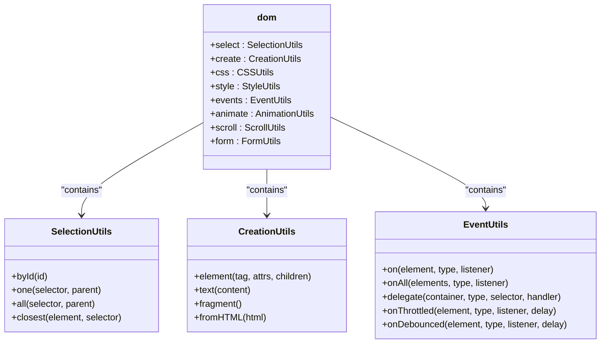
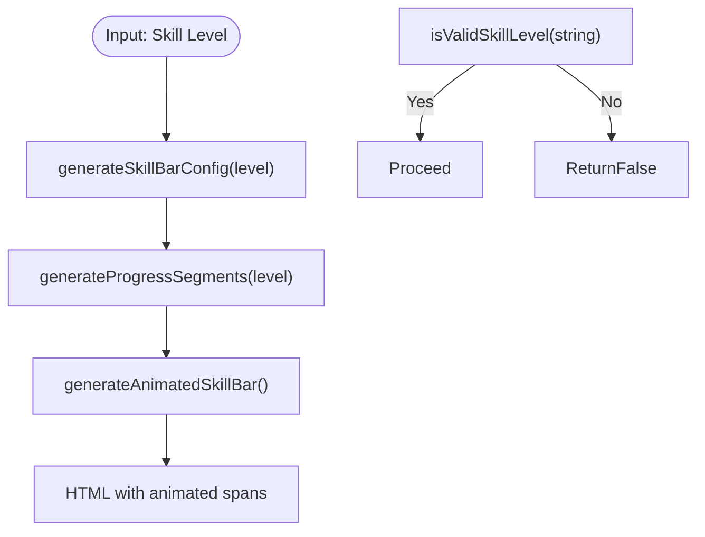
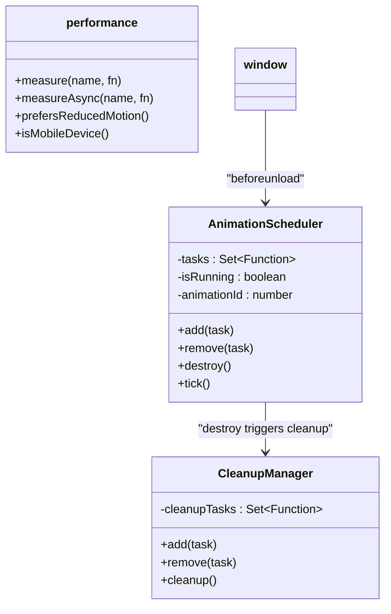

# Utility Functions

<cite>
**Referenced Files in This Document**   
- [dom.ts](file://src/utils/dom.ts)
- [helpers.ts](file://src/utils/helpers.ts)
- [performance.ts](file://src/utils/performance.ts)
- [client.ts](file://src/utils/client.ts)
- [schemas.ts](file://src/utils/validation/schemas.ts)
- [VimSystem.ts](file://src/systems/VimSystem.ts)
- [EffectSystem.ts](file://src/animation/EffectSystem.ts)
</cite>

## Table of Contents
1. [Introduction](#introduction)
2. [DOM Utilities](#dom-utilities)
3. [Helper Functions](#helper-functions)
4. [Performance Optimization](#performance-optimization)
5. [Client Feature Detection](#client-feature-detection)
6. [Runtime Validation](#runtime-validation)
7. [Design Patterns and Architecture](#design-patterns-and-architecture)
8. [Integration Examples](#integration-examples)
9. [Error Handling and Edge Cases](#error-handling-and-edge-cases)
10. [Extensibility and Best Practices](#extensibility-and-best-practices)

## Introduction
The utility modules in this codebase provide foundational functionality across the application, enabling consistent, type-safe, and performant interactions with the DOM, user input, and browser APIs. These utilities are designed with modularity, reusability, and performance in mind, supporting both low-level operations and high-level abstractions. This document explores each utility category in depth, detailing their implementation, usage patterns, and integration with core systems.

## DOM Utilities

The `dom.ts` module offers a comprehensive suite of functions for DOM manipulation, organized into logical namespaces: selection, creation, styling, events, animation, scrolling, and form handling. These utilities abstract away common DOM patterns while ensuring type safety and automatic cleanup.

### Selection and Creation
DOM elements can be safely queried using typed methods such as `select.byId`, `select.one`, and `select.all`, which return `null` or arrays of properly typed `HTMLElement` instances. Element creation is handled through the `create.element` factory function, which accepts tag names, attributes, and children, automatically handling data and ARIA attributes.

### Event Management with Automatic Cleanup
The `events` namespace provides robust event handling with built-in cleanup registration. Methods like `events.on`, `events.delegate`, and `events.onThrottled` return cleanup functions that unregister listeners, preventing memory leaks. This pattern enables observer-style resource management across the application.

### Animation and Form Utilities
Built-in animation helpers such as `fadeIn`, `fadeOut`, `slideDown`, and `slideUp` return promises for async control flow. Form utilities include `form.getData` and `form.setData` for structured data extraction and population, with optional animated reset functionality.

**Diagram sources**
- [dom.ts](file://src/utils/dom.ts#L1-L529)

**Section sources**
- [dom.ts](file://src/utils/dom.ts#L1-L529)

## Helper Functions

The `helpers.ts` file contains general-purpose utility functions focused on content generation, particularly for skill visualization and level-based rendering. These functions emphasize functional composition and immutability.

### Skill Bar Generation
Functions like `generateSkillBarConfig` and `generateProgressSegments` map skill levels (e.g., Expert, Advanced) to visual representations using ASCII characters and CSS classes. The `generateAnimatedSkillBar` function adds typing-effect animations with configurable delays.

### Level Conversion and Validation
Utilities such as `percentageToSkillLevel` and `skillLevelToPercentage` enable bidirectional conversion between numeric values and categorical levels. `getSkillLevelNumeric` and `getSkillLevelColor` support sorting and theming based on skill level.

**Diagram sources**
- [helpers.ts](file://src/utils/helpers.ts#L1-L177)

**Section sources**
- [helpers.ts](file://src/utils/helpers.ts#L1-L177)

## Performance Optimization

The `performance.ts` module centralizes performance-critical utilities, including throttling, debouncing, animation scheduling, and resource loading.

### Throttling and Debouncing
The `throttle` and `debounce` functions wrap callback functions to limit execution frequency, essential for handling high-frequency events like scroll or resize. Default delays are optimized for UI responsiveness (16ms for throttle, 250ms for debounce).

### Centralized Animation Scheduling
The `AnimationScheduler` class manages all animation callbacks via `requestAnimationFrame`, ensuring synchronized updates and efficient batching. The `animate` function registers tasks with automatic cleanup, while `observeIntersection` integrates with `requestAnimationFrame` for smooth lazy loading.

### Memory and Cleanup Management
The `CleanupManager` class tracks cleanup functions and executes them collectively, used globally via `globalCleanupManager`. This ensures proper teardown on page unload, including animation scheduler destruction.

**Diagram sources**
- [performance.ts](file://src/utils/performance.ts#L1-L354)

**Section sources**
- [performance.ts](file://src/utils/performance.ts#L1-L354)

## Client Feature Detection

The `client.ts` module handles client-side interactions, particularly for action buttons, with built-in state management and feature detection.

### Action Button Management
The `initActionButtons` function sets up event delegation for `.action-btn` elements, supporting actions like 'demo', 'github', 'case-study', and 'download'. It manages button states (loading, success, error) with visual feedback and timeout-based state resets.

### Synthetic Event Handling
Click handling uses synthetic events to ensure correct `currentTarget` binding, enabling reliable delegation. The system gracefully handles popup blockers and failed downloads through error state visualization.

**Section sources**
- [client.ts](file://src/utils/client.ts#L1-L135)

## Runtime Validation

The `schemas.ts` file leverages Zod for runtime validation of user profiles and configuration data, ensuring data integrity across the application.

### Schema Definition
The `userProfileSchema` defines a nested structure for personal, social, and contact information, with strict type constraints (e.g., email format, URL validation). Optional fields are explicitly marked to support partial updates.

### Validation Interface
The `validateData` function returns a `ValidationResult` with success status, parsed data, or structured error information using Zod's `flatten().fieldErrors`. This enables precise error reporting in UI components.

**Section sources**
- [schemas.ts](file://src/utils/validation/schemas.ts#L1-L40)

## Design Patterns and Architecture

The utility modules employ several key design patterns that enhance maintainability and scalability.

### Factory Functions for DOM Elements
The `create.element` function acts as a factory, abstracting DOM creation with attribute normalization and type safety. This reduces boilerplate and ensures consistent element construction.

### Observer-Style Cleanup Registration
Event listeners and animation tasks return cleanup functions that are automatically managed by higher-level systems. This pattern prevents memory leaks and enables deterministic teardown.

### Functional Composition in Helpers
Helper functions are pure and composable, allowing complex behaviors (e.g., animated skill bars) to be built from simple, testable units. This supports reuse and reduces side effects.

## Integration Examples

### VimSystem Using DOM Events
The `VimSystem` class uses `dom.events.on` to bind keydown listeners, leveraging the cleanup function for proper teardown in its `destroy` method. It also uses `dom.select.byId` to update the status display.

**Section sources**
- [VimSystem.ts](file://src/systems/VimSystem.ts#L16-L251)
- [dom.ts](file://src/utils/dom.ts#L1-L529)

### EffectSystem Using Helper Functions
The `EffectSystem` utilizes color interpolation and particle animation logic that could be enhanced with helper functions from `helpers.ts` for color scheme generation and transition effects.

**Section sources**
- [EffectSystem.ts](file://src/animation/EffectSystem.ts#L721-L860)
- [helpers.ts](file://src/utils/helpers.ts#L1-L177)

## Error Handling and Edge Cases

Each utility includes defensive programming practices:
- DOM utilities return `null` or empty arrays for missing elements
- Event handlers wrap callbacks in try-catch blocks
- Validation functions provide structured error output
- Cleanup functions are idempotent and safe to call multiple times
- Animation scheduler isolates task failures to prevent cascading errors

## Extensibility and Best Practices

New utilities should follow these guidelines:
- Maintain type safety using TypeScript generics and interfaces
- Export pure functions whenever possible
- Include automatic cleanup for resources (listeners, intervals)
- Optimize bundle size by avoiding unnecessary dependencies
- Document usage patterns and edge cases
- Prefer composition over inheritance for flexibility