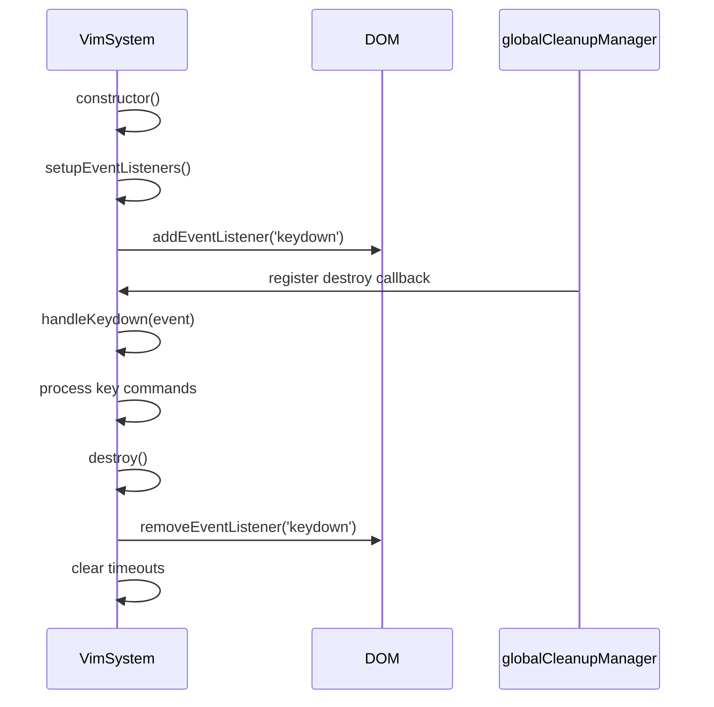
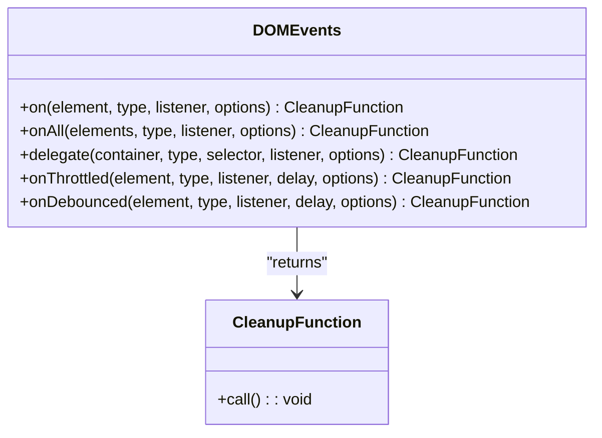
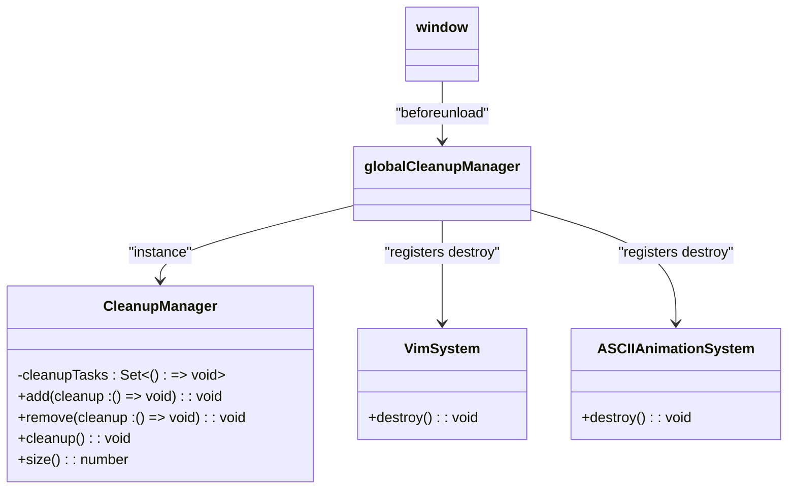
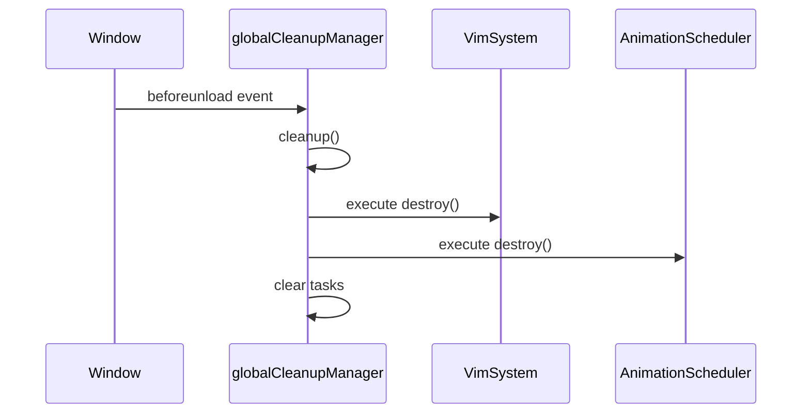
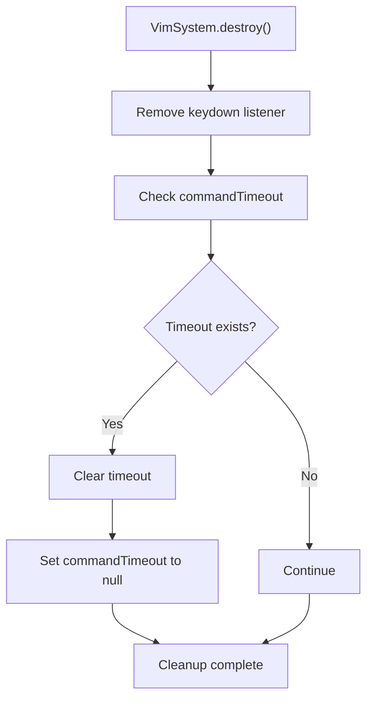
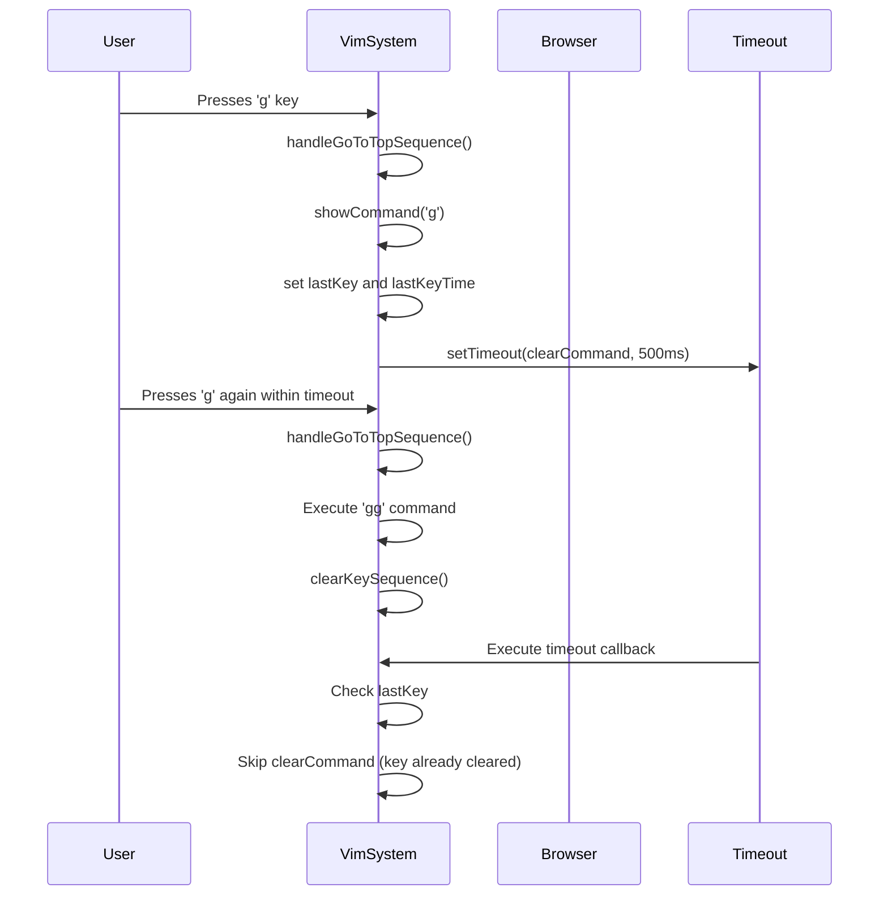
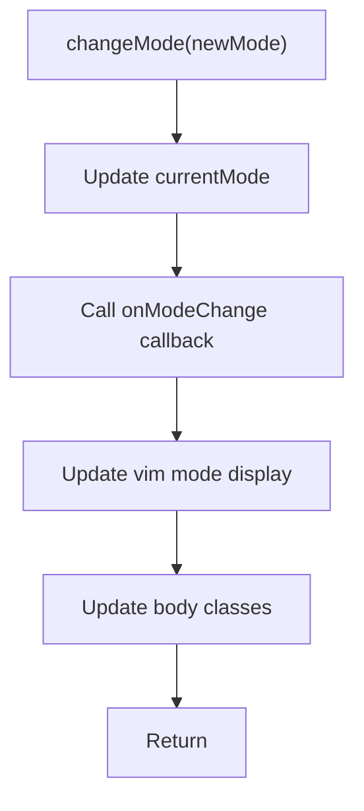
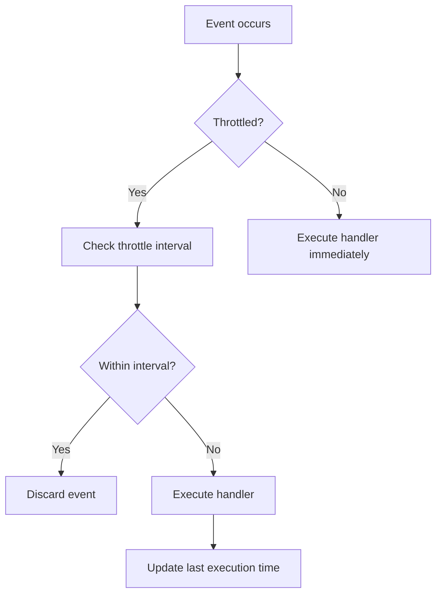

# Event Handling and Cleanup

<cite>
**Referenced Files in This Document**   
- [VimSystem.ts](file://src/systems/VimSystem.ts)
- [dom.ts](file://src/utils/dom.ts)
- [performance.ts](file://src/utils/performance.ts)
</cite>

## Table of Contents
1. [Introduction](#introduction)
2. [Event Listener Lifecycle in VimSystem](#event-listener-lifecycle-in-vimsystem)
3. [DOM Utility Wrappers for Safe Event Binding](#dom-utility-wrappers-for-safe-event-binding)
4. [Global Cleanup Manager Integration](#global-cleanup-manager-integration)
5. [Memory Leak Prevention Strategies](#memory-leak-prevention-strategies)
6. [Event Handler Scoping and Asynchronous Operations](#event-handler-scoping-and-asynchronous-operations)
7. [Common Issues and Debugging Tips](#common-issues-and-debugging-tips)
8. [Performance Implications and Optimization](#performance-implications-and-optimization)

## Introduction
The VimSystem implements a robust event handling and lifecycle management system that ensures keyboard event listeners are properly attached and detached to prevent memory leaks during navigation or page transitions. This document details the architecture and implementation of event handling in the VimSystem, focusing on the integration with DOM utility wrappers, the role of the globalCleanupManager in centralizing teardown logic, and strategies for preventing common issues such as orphaned listeners. The system employs a combination of direct event binding, cleanup registration, and centralized management to maintain performance and prevent resource leaks.

## Event Listener Lifecycle in VimSystem

The VimSystem class manages keyboard event listeners through a well-defined lifecycle that begins with initialization and ends with proper cleanup. During construction, the system sets up event listeners that respond to keyboard input, and provides a destroy method to ensure proper teardown.

**Diagram sources**
- [VimSystem.ts](file://src/systems/VimSystem.ts#L36-L42)
- [VimSystem.ts](file://src/systems/VimSystem.ts#L235-L251)

**Section sources**
- [VimSystem.ts](file://src/systems/VimSystem.ts#L36-L42)
- [VimSystem.ts](file://src/systems/VimSystem.ts#L235-L251)

## DOM Utility Wrappers for Safe Event Binding

The system utilizes a comprehensive set of DOM utility wrappers in dom.ts that provide safe methods for event binding and unbinding. These utilities return cleanup functions that can be invoked to remove event listeners, ensuring proper resource management.

The `events` module in dom.ts provides several methods for event handling:
- `on()`: Adds a single event listener and returns a cleanup function
- `onAll()`: Adds listeners to multiple elements and returns a combined cleanup function
- `delegate()`: Implements event delegation for dynamic content
- `onThrottled()`: Adds throttled event listeners for performance-critical events
- `onDebounced()`: Adds debounced event listeners for events like resize

These wrapper functions ensure that event listeners are properly managed by returning cleanup functions that encapsulate the corresponding `removeEventListener` calls.

**Diagram sources**
- [dom.ts](file://src/utils/dom.ts#L225-L330)

**Section sources**
- [dom.ts](file://src/utils/dom.ts#L225-L330)

## Global Cleanup Manager Integration

The system employs a globalCleanupManager to centralize teardown logic across the application. This singleton instance of the CleanupManager class allows components to register cleanup functions that will be executed when the application is unloaded or when components are destroyed.

The globalCleanupManager is initialized in performance.ts and automatically executes all registered cleanup tasks when the page unloads:

When the VimSystem is instantiated, it automatically registers its destroy method with the globalCleanupManager through the ASCIIAnimationSystem, ensuring that cleanup occurs even if the destroy method is not explicitly called.

**Diagram sources**
- [performance.ts](file://src/utils/performance.ts#L294-L354)
- [ASCIIAnimationSystem.ts](file://src/animation/ASCIIAnimationSystem.ts#L131-L133)

**Section sources**
- [performance.ts](file://src/utils/performance.ts#L294-L354)
- [ASCIIAnimationSystem.ts](file://src/animation/ASCIIAnimationSystem.ts#L131-L133)

## Memory Leak Prevention Strategies

The system implements multiple strategies to prevent memory leaks, particularly focusing on proper event listener management and resource cleanup. The primary approach combines immediate cleanup with centralized management.

The VimSystem class demonstrates proper cleanup in its destroy method, which removes the keydown event listener and clears any pending timeouts:

Additional memory leak prevention strategies include:
- Using WeakMaps for storing metadata (not explicitly shown but implied by best practices)
- Returning cleanup functions from event binding methods
- Centralizing cleanup through the globalCleanupManager
- Properly handling asynchronous operations and timers

The system also prevents common issues such as duplicate event listeners by ensuring that listeners are properly removed before new ones are added, and by using the cleanup functions returned by the DOM utility wrappers.

**Diagram sources**
- [VimSystem.ts](file://src/systems/VimSystem.ts#L235-L251)

**Section sources**
- [VimSystem.ts](file://src/systems/VimSystem.ts#L235-L251)

## Event Handler Scoping and Asynchronous Operations

The event handling system maintains proper scoping across asynchronous operations and animation frames. The VimSystem preserves its context through various asynchronous operations, including timeouts and animation frame callbacks.

The system handles asynchronous operations by:
- Preserving instance state across async boundaries
- Using instance methods as event handlers to maintain context
- Properly managing timeouts with instance variables
- Checking state before executing deferred operations

This approach ensures that event handlers remain properly scoped and that asynchronous operations do not create memory leaks or race conditions.

**Diagram sources**
- [VimSystem.ts](file://src/systems/VimSystem.ts#L124-L160)

**Section sources**
- [VimSystem.ts](file://src/systems/VimSystem.ts#L124-L160)

## Common Issues and Debugging Tips

The system addresses several common issues related to event handling and lifecycle management:

### Orphaned Listeners
Orphaned listeners can occur when components are destroyed but their event listeners remain attached. The system prevents this through:
- Explicit cleanup in destroy methods
- Registration with globalCleanupManager
- Use of cleanup functions from DOM utilities

### Conflicting Inputs After Mode Changes
The VimSystem handles mode changes by updating both the internal state and the UI representation:

### Debugging Tips
When debugging event handling issues:
1. Check for active listeners using browser developer tools
2. Set breakpoints in event callbacks to verify execution
3. Monitor the globalCleanupManager size to ensure cleanup tasks are registered
4. Verify that destroy methods are being called
5. Check for unhandled promises or unresolved timeouts

Common debugging patterns include:
- Logging the number of active cleanup tasks: `globalCleanupManager.size()`
- Adding console logs in event handlers to verify they are called
- Using breakpoints in the destroy method to ensure it executes
- Monitoring memory usage during navigation

**Section sources**
- [VimSystem.ts](file://src/systems/VimSystem.ts#L162-L178)
- [VimSystem.ts](file://src/systems/VimSystem.ts#L207-L215)

## Performance Implications and Optimization

The system considers performance implications of frequent listener attachment and detachment, implementing several optimization strategies:

### Throttling and Debouncing
For high-frequency events, the system provides throttled and debounced event listeners through the DOM utilities:

The `onThrottled()` and `onDebounced()` methods in the DOM utilities allow for performance optimization in high-frequency scenarios:
- `onThrottled()`: Limits event handling to a maximum frequency (default 16ms, ~60fps)
- `onDebounced()`: Waits for a pause in events before executing (default 250ms)

### Event Pooling Considerations
While the system doesn't implement explicit event pooling, the design patterns support efficient event handling:
- Centralized event management reduces overhead
- Cleanup functions prevent memory leaks
- Throttling and debouncing reduce processing load

### Performance Monitoring
The system includes performance utilities that can be used to monitor event handling efficiency:
- The globalCleanupManager tracks the number of registered cleanup tasks
- The animationScheduler manages animation frame callbacks efficiently
- The performance.measure() and performance.measureAsync() functions can be used to profile event handling

Best practices for writing leak-proof event code in this system include:
1. Always use the DOM utility wrappers for event binding
2. Register cleanup functions with globalCleanupManager for long-lived components
3. Implement proper destroy methods that clean up all resources
4. Use throttling for high-frequency events like resize or scroll
5. Use debouncing for events that should only trigger after a pause
6. Always clear timeouts and intervals in cleanup functions

**Section sources**
- [dom.ts](file://src/utils/dom.ts#L291-L330)
- [performance.ts](file://src/utils/performance.ts#L50-L80)