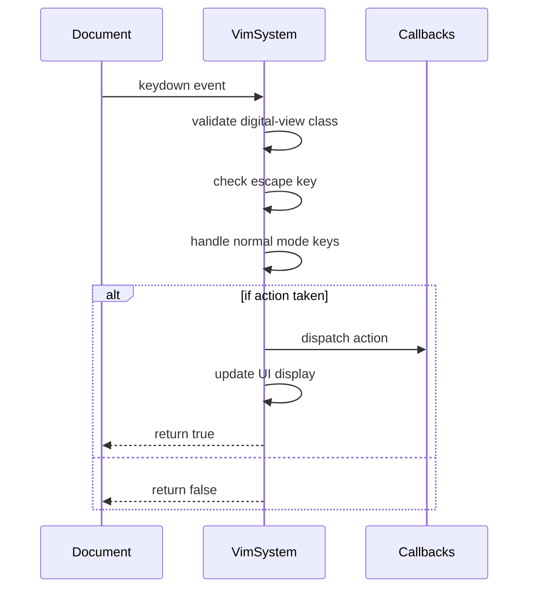
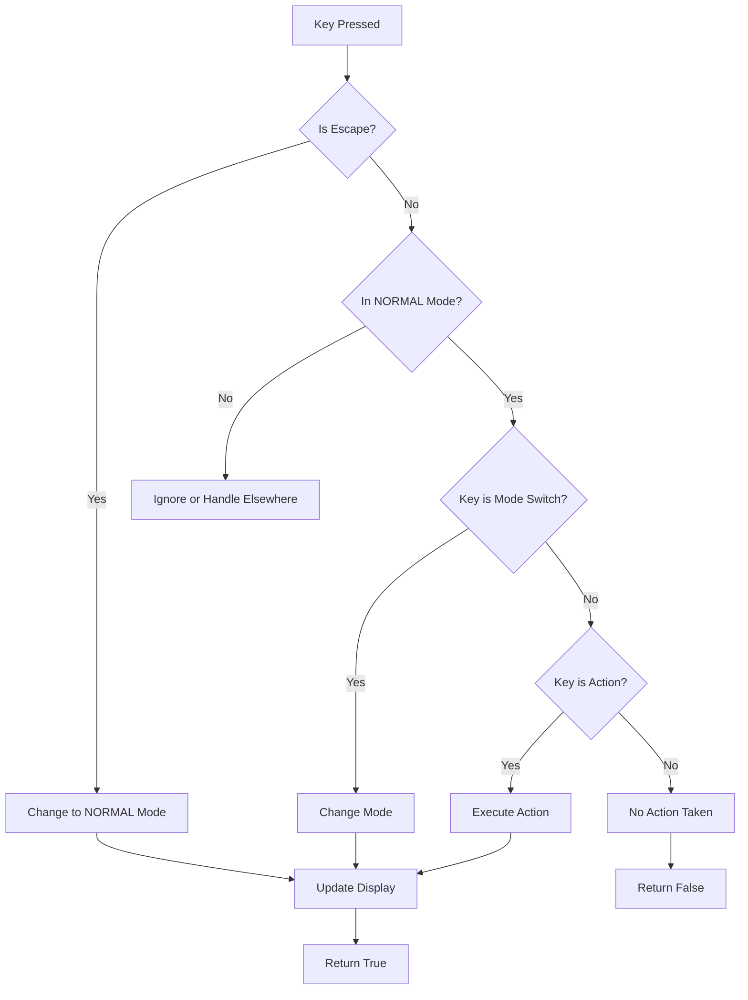
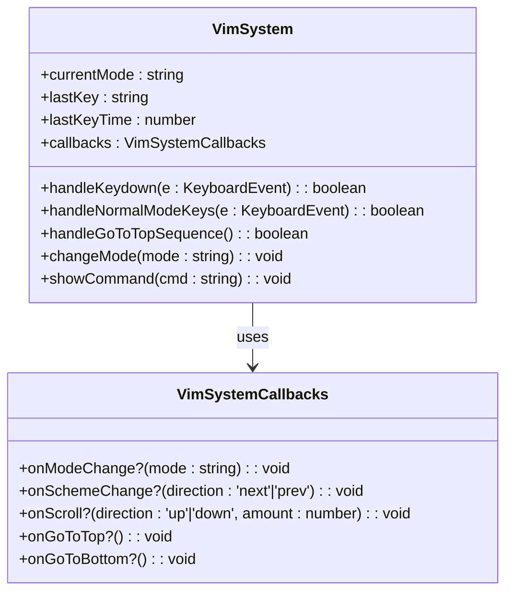
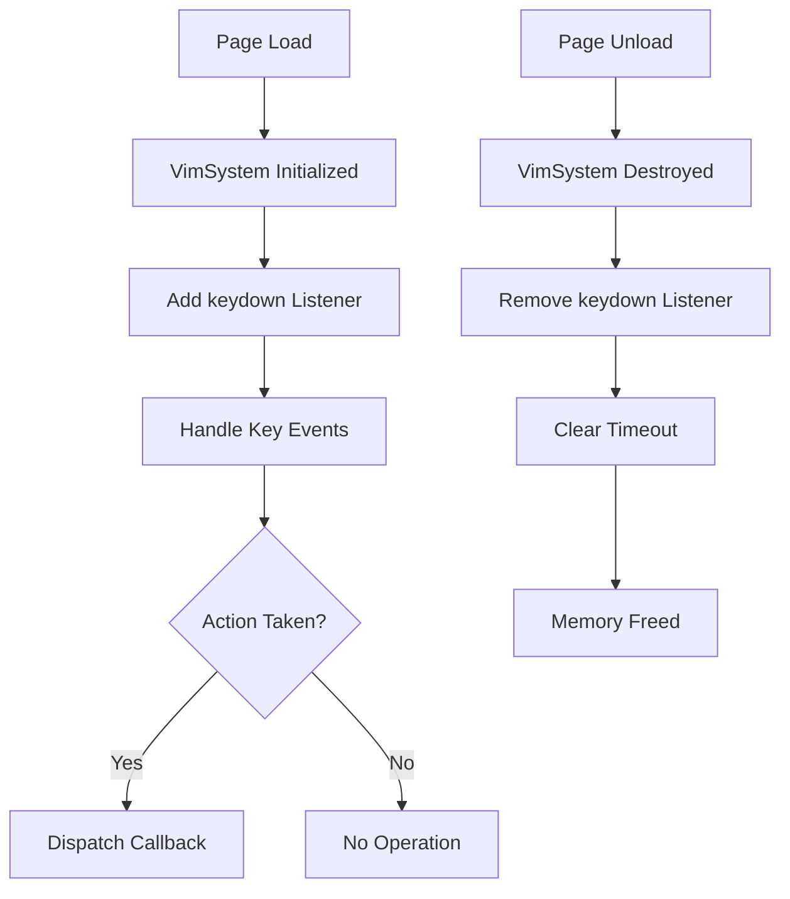

# Keybinding Resolution

<cite>
**Referenced Files in This Document**   
- [VimSystem.ts](file://src/systems/VimSystem.ts)
- [constants.ts](file://src/utils/constants.ts)
- [dom.ts](file://src/utils/dom.ts)
- [performance.ts](file://src/utils/performance.ts)
- [statusBar.ts](file://src/scripts/statusBar.ts)
</cite>

## Table of Contents
1. [Introduction](#introduction)
2. [Event Listener Registration and Management](#event-listener-registration-and-management)
3. [Keybinding Resolution and Mode Handling](#keybinding-resolution-and-mode-handling)
4. [Core Keybindings and Command Mapping](#core-keybindings-and-command-mapping)
5. [Centralized Configuration via Constants](#centralized-configuration-via-constants)
6. [Event Delegation and Propagation Control](#event-delegation-and-propagation-control)
7. [Conflict Mitigation and Browser Default Handling](#conflict-mitigation-and-browser-default-handling)
8. [Extensibility and Custom Command Integration](#extensibility-and-custom-command-integration)
9. [Performance and Memory Management](#performance-and-memory-management)
10. [Conclusion](#conclusion)

## Introduction
The VimSystem in this application implements a modal keyboard navigation interface inspired by Vim editor conventions. It enables users to navigate and interact with the portfolio using keyboard shortcuts without relying on mouse input. The system operates in distinct modes—NORMAL, INSERT, VISUAL, and COMMAND—each with specific behaviors and key mappings. This document details how keyboard events are captured, resolved to actions based on the current mode, and dispatched through a centralized configuration system. It also covers event handling best practices, conflict resolution strategies, and performance optimizations that ensure responsive and reliable operation.

**Section sources**
- [VimSystem.ts](file://src/systems/VimSystem.ts#L1-L251)
- [constants.ts](file://src/utils/constants.ts#L1-L198)

## Event Listener Registration and Management
The VimSystem registers a global `keydown` event listener on the `document` object during initialization via the `setupEventListeners` method. This ensures that all keyboard input is intercepted regardless of focus state, enabling consistent shortcut behavior across the application. The event handler, `handleKeydown`, processes incoming events and determines whether they should be consumed based on the current mode and active conditions.

To prevent memory leaks and ensure proper cleanup, the system provides a `destroy` method that explicitly removes the event listener. This method is designed to be called when the system is no longer needed, such as during component unmounting or page transitions. Additionally, timeout-based operations (e.g., command display duration) are tracked and cleared upon destruction to avoid stale callbacks.

**Diagram sources**
- [VimSystem.ts](file://src/systems/VimSystem.ts#L38-L42)
- [VimSystem.ts](file://src/systems/VimSystem.ts#L44-L85)

**Section sources**
- [VimSystem.ts](file://src/systems/VimSystem.ts#L38-L42)
- [VimSystem.ts](file://src/systems/VimSystem.ts#L240-L251)

## Keybinding Resolution and Mode Handling
Keybinding resolution is mode-dependent, with the `handleKeydown` method first checking for the Escape key to allow immediate return to NORMAL mode from any other mode. When in NORMAL mode, the system delegates to `handleNormalModeKeys`, which evaluates the pressed key against predefined mappings from `VIM_KEYBINDINGS`.

Each key press is matched against constants for mode switching (e.g., 'i' for INSERT, 'v' for VISUAL), navigation (e.g., 'j/k' for scrolling), and theme cycling (e.g., 'n/N'). The system uses strict equality comparisons (`===`) to ensure accurate key detection and avoids ambiguity between similar keys.

A special case exists for the 'gg' sequence used to jump to the top of the page. The `handleGoToTopSequence` method tracks the last key pressed and its timestamp, comparing it with the current input to detect consecutive 'g' presses within a 500ms window defined by `SEQUENCE_TIMEOUT`. This mechanism enables multi-key command recognition while maintaining responsiveness for single-key shortcuts.

**Diagram sources**
- [VimSystem.ts](file://src/systems/VimSystem.ts#L44-L85)
- [VimSystem.ts](file://src/systems/VimSystem.ts#L87-L137)
- [VimSystem.ts](file://src/systems/VimSystem.ts#L139-L160)

**Section sources**
- [VimSystem.ts](file://src/systems/VimSystem.ts#L44-L160)

## Core Keybindings and Command Mapping
The VimSystem implements several core keybindings that map directly to user interface actions:

- **'j' / 'k'**: Vertical navigation via smooth scrolling up or down by a fixed amount (`SCROLL_AMOUNT = 50`). These keys trigger the `onScroll` callback with direction and amount parameters.
- **'gg' / 'G'**: Jump to top or bottom of the document. 'gg' requires a double-tap sequence, while 'G' immediately triggers `onGoToBottom`.
- **'n' / 'N'**: Cycle forward or backward through available color schemes by invoking the `onSchemeChange` callback with 'next' or 'prev' direction.

Commands are visually acknowledged through the status bar, where the `showCommand` method temporarily displays the executed command (e.g., "j ↓", "NEXT →") before reverting to the current mode indicator after `COMMAND_DISPLAY_DURATION` (1500ms). This feedback mechanism enhances discoverability and confirms user input.

**Diagram sources**
- [VimSystem.ts](file://src/systems/VimSystem.ts#L1-L251)

**Section sources**
- [VimSystem.ts](file://src/systems/VimSystem.ts#L87-L137)

## Centralized Configuration via Constants
All key mappings and timing parameters are defined in `constants.ts` under the `VIM_KEYBINDINGS` object, enabling centralized configuration and easy customization. This structure separates key definitions from logic, allowing changes without modifying the core event handling code.

Key categories include:
- `MODE_KEYS`: Escape, Insert ('i'), Visual ('v'), Command (':')
- `NAVIGATION`: Scroll down ('j'), scroll up ('k'), go to top ('g'), go to bottom ('G')
- `SCHEME`: Next theme ('n'), previous theme ('N')
- `TIMINGS`: Sequence timeout, command display duration, scroll amount

Additionally, `COMMAND_DESCRIPTIONS` provides short textual feedback for each action, ensuring consistency in status bar messages. The use of `as const` enforces type safety and prevents accidental mutation of these values at runtime.

**Section sources**
- [constants.ts](file://src/utils/constants.ts#L38-L78)

## Event Delegation and Propagation Control
While VimSystem uses direct event listening on the document level, other components in the application employ event delegation for performance and dynamic content support. The `dom.events.delegate` utility allows attaching listeners to container elements that respond only when specific child selectors match, reducing the total number of active listeners.

For example, the status bar navigation uses delegation on the `.status-bar` element to handle clicks on `.status-item` links. This approach remains effective even when DOM elements are added or removed dynamically, as the listener resides on a stable parent.

Propagation is carefully managed to avoid interference between subsystems. VimSystem does not stop event propagation (`e.stopPropagation()`) but relies on `preventDefault()` to suppress browser-default behaviors for handled shortcuts. This allows other non-conflicting listeners to process the same event if needed.

**Section sources**
- [dom.ts](file://src/utils/dom.ts#L240-L275)
- [statusBar.ts](file://src/scripts/statusBar.ts#L10-L39)

## Conflict Mitigation and Browser Default Handling
To prevent conflicts with native browser shortcuts and interactive elements, VimSystem employs several mitigation strategies:

- **Context Awareness**: Key handling only occurs when the body has the `digital-view` class, disabling Vim shortcuts in alternative views.
- **Default Prevention**: `e.preventDefault()` is called for all handled navigation and theme commands to stop default scrolling or form submission behaviors.
- **Focus Exclusion**: Although not explicitly implemented in the current code, best practices suggest excluding input fields and contenteditable areas from Vim processing to allow normal text entry.

These measures ensure that typing in form fields or interacting with buttons does not inadvertently trigger Vim commands. Future enhancements could include checking `document.activeElement` to dynamically disable shortcuts when focused on interactive controls.

**Section sources**
- [VimSystem.ts](file://src/systems/VimSystem.ts#L46-L48)
- [VimSystem.ts](file://src/systems/VimSystem.ts#L108-L137)

## Extensibility and Custom Command Integration
The system supports extensibility through both configuration and inheritance. New commands can be added by extending the `VIM_KEYBINDINGS` object or by subclassing `VimSystem` and overriding `handleNormalModeKeys` or adding new handler methods.

The `VimSystemCallbacks` interface allows external components to inject custom behavior for each action type (e.g., `onScroll`, `onSchemeChange`). This decoupling enables integration with various UI modules without modifying the core logic.

For advanced use cases, developers can register additional key listeners or create mode-specific handlers while reusing the existing mode management and display infrastructure. The modular design facilitates both simple configuration changes and deep customization.

**Section sources**
- [VimSystem.ts](file://src/systems/VimSystem.ts#L10-L22)
- [VimSystem.ts](file://src/systems/VimSystem.ts#L87-L137)

## Performance and Memory Management
Performance is optimized through efficient event handling and proper resource cleanup. The global keydown listener is registered once and reused, minimizing overhead. Timeouts for command display are tracked and cleared during destruction to prevent memory leaks.

Memory management is further enhanced by the `globalCleanupManager` from `performance.ts`, which maintains a registry of cleanup functions. Although VimSystem currently manages its own listener removal, integration with this global manager would centralize lifecycle handling and ensure consistent cleanup across subsystems.

The use of `requestAnimationFrame` in related components (e.g., status bar scrolling) ensures smooth animations without blocking the main thread. Passive event listeners with `{ passive: true }` are used where appropriate to improve scroll performance, though VimSystem's keydown listener requires active processing.

**Diagram sources**
- [VimSystem.ts](file://src/systems/VimSystem.ts#L240-L251)
- [performance.ts](file://src/utils/performance.ts#L344-L354)

**Section sources**
- [VimSystem.ts](file://src/systems/VimSystem.ts#L240-L251)
- [performance.ts](file://src/utils/performance.ts#L344-L354)

## Conclusion
The VimSystem provides a robust, mode-based keyboard navigation framework that enhances accessibility and user efficiency. By leveraging centralized configuration, careful event management, and clear separation of concerns, it delivers a responsive and extensible interface. The use of constants for key mappings, combined with well-defined callbacks, allows for flexible integration with various UI components. Proper cleanup mechanisms and performance-aware coding practices ensure long-term stability and resource efficiency. With minor enhancements for focus context awareness, the system could achieve even greater reliability in complex interactive environments.