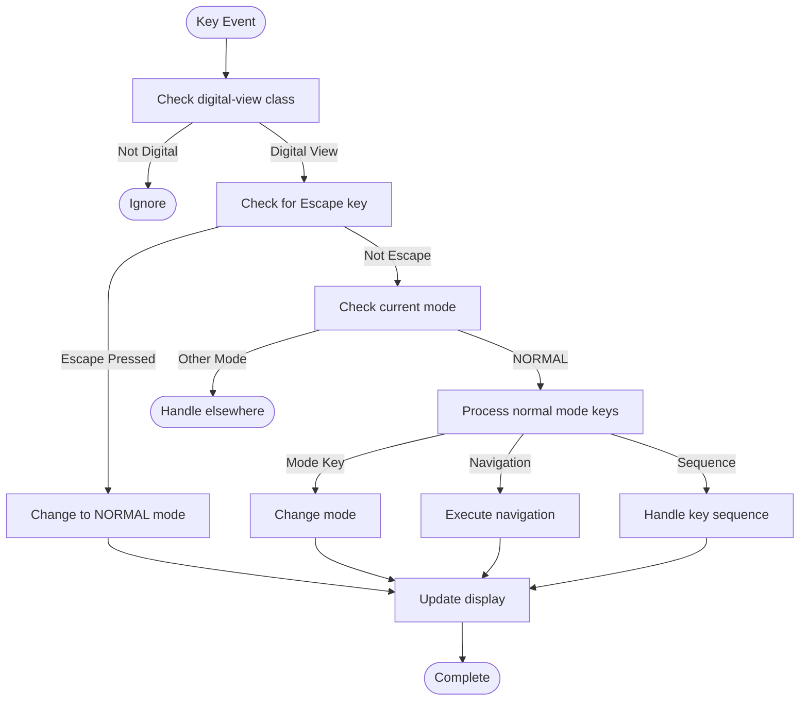
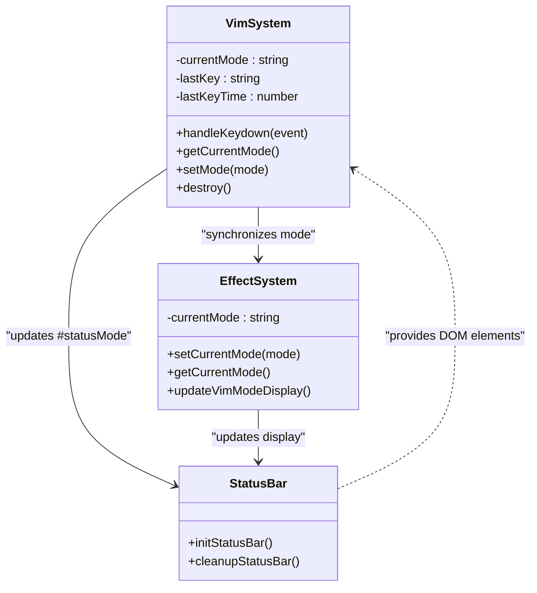

# Mode Management

<cite>
**Referenced Files in This Document**   
- [VimSystem.ts](file://src/systems/VimSystem.ts)
- [index.ts](file://src/types/index.ts)
- [constants.ts](file://src/utils/constants.ts)
- [statusBar.ts](file://src/scripts/statusBar.ts)
- [EffectSystem.ts](file://src/animation/EffectSystem.ts)
</cite>

## Table of Contents
1. [Introduction](#introduction)
2. [Core Mode States](#core-mode-states)
3. [Mode Transition Logic](#mode-transition-logic)
4. [Visual Feedback System](#visual-feedback-system)
5. [Event Handling and Key Processing](#event-handling-and-key-processing)
6. [State Management and Memory Considerations](#state-management-and-memory-considerations)
7. [Common Issues and Solutions](#common-issues-and-solutions)
8. [Integration with UI Components](#integration-with-ui-components)
9. [Conclusion](#conclusion)

## Introduction
The mode management subsystem in VimSystem implements a modal interface inspired by Vim editor conventions, providing users with distinct interaction states that optimize keyboard-driven navigation and control. This document details the implementation of four primary modes—NORMAL, INSERT, VISUAL, and COMMAND—each serving specific user interaction patterns within the application. The system leverages a centralized state management approach using the VimMode enum to enforce mode-specific behaviors and ensure safe transitions between states. Mode changes are triggered through keyboard events or programmatic API calls, with comprehensive visual feedback provided via the status bar. The design emphasizes accessibility for beginners learning modal editing concepts while maintaining technical rigor in state encapsulation and transition safety for advanced users.

## Core Mode States
The VimSystem defines four distinct operational modes that govern user interaction behavior:

- **NORMAL**: Default state for navigation and command execution
- **INSERT**: Text input mode for direct content manipulation
- **VISUAL**: Selection mode for highlighting and operating on text ranges
- **COMMAND**: Command-line mode for executing advanced operations

These modes are formally defined in the `VimMode` interface within the type system, ensuring type safety across the codebase. The current mode is tracked as a private property in the `VimSystem` class, initialized to `NORMAL` by default. Each mode represents a unique state in the application's finite state machine, with specific behaviors and permitted actions. The mode state directly influences how keyboard events are interpreted, enabling context-sensitive keybindings that maximize efficiency in keyboard-driven workflows.

**Section sources**
- [index.ts](file://src/types/index.ts#L115-L117)
- [constants.ts](file://src/utils/constants.ts#L12-L15)
- [VimSystem.ts](file://src/systems/VimSystem.ts#L18-L19)

## Mode Transition Logic
Mode transitions in VimSystem are implemented through explicit state changes triggered by specific key events or programmatic calls. The system uses a centralized `changeMode` method to update the current mode state and notify subscribers via callback mechanisms. Key-based transitions follow Vim conventions:

- `i` enters INSERT mode from NORMAL
- `v` activates VISUAL mode
- `:` switches to COMMAND mode
- `Escape` returns to NORMAL mode from any other mode

The transition logic is encapsulated within the `handleKeydown` and `handleNormalModeKeys` methods, which evaluate incoming keyboard events against the current mode state. When a mode-switching key is detected, the system calls `changeMode` with the target mode, updates DOM classes to reflect the new state, and provides visual feedback. The implementation ensures atomic state transitions with proper event handling, preventing race conditions or invalid state combinations. Programmatic mode changes are supported through the public `setMode` API, allowing external components to control the editing state.

```mermaid
stateDiagram-v2
[*] --> NORMAL
NORMAL --> INSERT : i
NORMAL --> VISUAL : v
NORMAL --> COMMAND : :
INSERT --> NORMAL : Escape
VISUAL --> NORMAL : Escape
COMMAND --> NORMAL : Escape
NORMAL --> NORMAL : j,k,g,G,n,N
```

**Diagram sources**
- [VimSystem.ts](file://src/systems/VimSystem.ts#L124-L160)
- [constants.ts](file://src/utils/constants.ts#L17-L24)

**Section sources**
- [VimSystem.ts](file://src/systems/VimSystem.ts#L85-L122)
- [constants.ts](file://src/utils/constants.ts#L17-L24)

## Visual Feedback System
The mode management system provides immediate visual feedback through multiple channels, primarily centered on the status bar display. When a mode change occurs or a command is executed, the system updates the `#statusMode` element to reflect the current state or action. The `showCommand` method temporarily displays command descriptions (e.g., "INSERT", "COMMAND") before automatically reverting to the current mode name after a configurable timeout period defined in `VIM_KEYBINDINGS.TIMINGS.COMMAND_DISPLAY_DURATION`.

Visual feedback is enhanced through CSS class manipulation on both the status element and document body. The `updateVimModeDisplay` method sets a class name corresponding to the current mode (e.g., `status-mode normal`), enabling mode-specific styling. Similarly, the `updateBodyClasses` method adds a `vim-{mode}` class to the document body, allowing global style adjustments based on the active mode. This dual feedback system ensures users receive both direct textual confirmation and contextual visual cues about the current editing state, reducing cognitive load and preventing mode confusion.

**Section sources**
- [VimSystem.ts](file://src/systems/VimSystem.ts#L162-L205)
- [statusBar.ts](file://src/scripts/statusBar.ts#L0-L39)

## Event Handling and Key Processing
The VimSystem implements a sophisticated event handling pipeline that processes keyboard input based on the current mode state. The system attaches a single `keydown` event listener to the document, which routes events through the `handleKeydown` method. This method first checks if the application is in digital view mode before proceeding with mode-specific processing.

In NORMAL mode, the system evaluates keys against predefined bindings for navigation (j, k), scrolling (g, G), and mode switching (i, v, :). Special handling is implemented for sequence commands like 'gg' (go to top), which uses timestamp tracking to distinguish between single 'g' presses and the double 'gg' sequence. The system prevents default browser behaviors for handled keys using `preventDefault`, ensuring seamless keyboard navigation without unintended page interactions. Each recognized command triggers appropriate callbacks and updates the visual display, creating a responsive and predictable user experience.



**Diagram sources**
- [VimSystem.ts](file://src/systems/VimSystem.ts#L85-L122)
- [VimSystem.ts](file://src/systems/VimSystem.ts#L124-L160)

**Section sources**
- [VimSystem.ts](file://src/systems/VimSystem.ts#L85-L122)
- [constants.ts](file://src/utils/constants.ts#L26-L46)

## State Management and Memory Considerations
The mode management system maintains state efficiently using minimal memory footprint, storing only essential properties: current mode, last key pressed, last key timestamp, and timeout references. The state is encapsulated within the `VimSystem` class instance, preventing global namespace pollution and enabling multiple instances if needed. Memory management is handled through proper cleanup in the `destroy` method, which removes event listeners and clears any active timeouts to prevent memory leaks.

For long-running sessions, the system's memory usage remains constant regardless of duration, as no accumulating data structures are used. The only dynamic allocations occur temporarily during key sequence processing, with automatic cleanup via timeouts or explicit clearing. The implementation avoids closures that could create reference cycles, and all event listeners are properly detached during teardown. This design ensures stable performance over extended usage periods without memory bloat or degradation.

**Section sources**
- [VimSystem.ts](file://src/systems/VimSystem.ts#L18-L25)
- [VimSystem.ts](file://src/systems/VimSystem.ts#L245-L251)

## Common Issues and Solutions
Several common issues in modal systems are addressed in the VimSystem implementation:

**Unintended Mode Exits**: Focus loss or browser shortcuts could disrupt mode state. The system mitigates this by only processing keys when the `digital-view` class is present, creating a clear boundary for modal behavior.

**Key Sequence Conflicts**: The 'g' key serves both as a standalone command and prefix for 'gg'. This is resolved through timestamp-based sequence detection with a configurable timeout (`SEQUENCE_TIMEOUT`), allowing the system to distinguish between intentional sequences and accidental double presses.

**Visual Feedback Persistence**: To prevent stale command displays, the system uses timeout tracking with the `commandTimeout` property, ensuring temporary messages are cleared even if subsequent events don't trigger updates.

**Event Listener Leaks**: The `destroy` method provides explicit cleanup of event listeners and timeouts, essential for SPA navigation or component reinitialization.

**Cross-Component State Sync**: The callback system (`onModeChange`, `onScroll`, etc.) allows other components to react to mode changes without tight coupling, maintaining separation of concerns.

**Section sources**
- [VimSystem.ts](file://src/systems/VimSystem.ts#L85-L122)
- [VimSystem.ts](file://src/systems/VimSystem.ts#L245-L251)
- [constants.ts](file://src/utils/constants.ts#L48-L51)

## Integration with UI Components
The mode management system integrates seamlessly with other UI components through multiple mechanisms. The `EffectSystem` class synchronizes with Vim mode changes via its `setCurrentMode` method, ensuring visual effects align with the current editing context. Both systems update the document body classes and status display using identical patterns, creating a unified visual language.

The status bar initialization in `statusBar.ts` establishes the DOM elements that VimSystem later manipulates, particularly the `#statusMode` element. This dependency is implicit but critical—without the status bar being initialized, mode feedback would not be visible to users. The system's callback architecture allows decoupled integration with navigation controls, scroll behavior, and color scheme management, enabling coordinated behavior across the application without direct dependencies.



**Diagram sources**
- [VimSystem.ts](file://src/systems/VimSystem.ts#L18-L251)
- [EffectSystem.ts](file://src/animation/EffectSystem.ts#L100-L115)
- [statusBar.ts](file://src/scripts/statusBar.ts#L177-L217)

**Section sources**
- [VimSystem.ts](file://src/systems/VimSystem.ts#L18-L251)
- [EffectSystem.ts](file://src/animation/EffectSystem.ts#L100-L115)
- [statusBar.ts](file://src/scripts/statusBar.ts#L177-L217)

## Conclusion
The mode management subsystem in VimSystem provides a robust, type-safe implementation of modal editing that balances Vim-like efficiency with modern web application requirements. By clearly defining the four primary modes and their transition logic, the system creates an intuitive yet powerful user interface paradigm. The implementation demonstrates careful attention to state management, visual feedback, and memory efficiency, ensuring reliable performance across usage scenarios. Through its event-driven architecture and callback system, the subsystem integrates effectively with other components while maintaining loose coupling. The design successfully accommodates both beginners learning modal editing concepts and experts requiring precise control over application state, making it a versatile foundation for keyboard-centric interfaces.