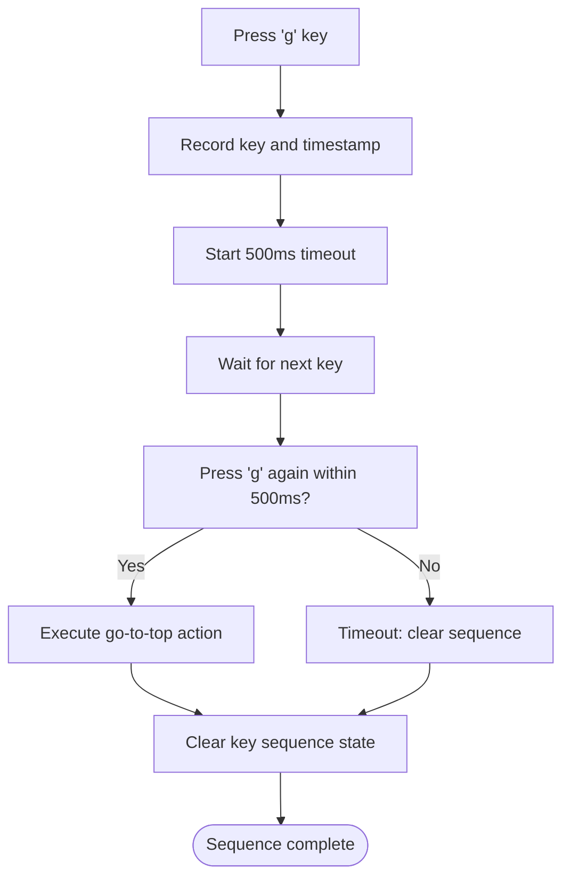

# Vim Navigation System

<cite>
**Referenced Files in This Document**   
- [VimSystem.ts](file://src/systems/VimSystem.ts)
- [constants.ts](file://src/utils/constants.ts)
- [dom.ts](file://src/utils/dom.ts)
- [performance.ts](file://src/utils/performance.ts)
- [ASCIIAnimationSystem.ts](file://src/animation/ASCIIAnimationSystem.ts)
- [EffectSystem.ts](file://src/animation/EffectSystem.ts)
- [statusBar.ts](file://src/scripts/statusBar.ts)
- [index.ts](file://src/types/index.ts)
</cite>

## Table of Contents
1. [Introduction](#introduction)
2. [Modal Navigation System](#modal-navigation-system)
3. [Event Handling and Keybinding Management](#event-handling-and-keybinding-management)
4. [Mode Transitions and State Management](#mode-transitions-and-state-management)
5. [Keybindings and Command Sequences](#keybindings-and-command-sequences)
6. [DOM Utilities and Event Abstraction](#dom-utilities-and-event-abstraction)
7. [Integration with Animation Systems](#integration-with-animation-systems)
8. [Initialization and Cleanup Procedures](#initialization-and-cleanup-procedures)
9. [Common Issues and Solutions](#common-issues-and-solutions)
10. [Performance Considerations](#performance-considerations)
11. [Debugging and Customization](#debugging-and-customization)

## Introduction
The Vim Navigation System implements a modal interface inspired by the Vim text editor, providing keyboard-driven navigation and interaction for the portfolio application. This system enables users to navigate content efficiently using familiar Vim-style keybindings while maintaining accessibility and visual feedback. The implementation follows a modular architecture with clear separation of concerns between input handling, state management, and visual feedback components.

**Section sources**
- [VimSystem.ts](file://src/systems/VimSystem.ts#L1-L20)

## Modal Navigation System
The VimSystem implements four distinct modes that govern user interaction: NORMAL, INSERT, VISUAL, and COMMAND. Each mode provides a specific set of behaviors and keybindings tailored to different interaction patterns. The system is designed to provide immediate visual feedback through the status bar, indicating the current mode and any active commands.

In NORMAL mode, users can navigate and perform actions without entering text, making it the default state for browsing content. INSERT mode allows for text input when focused on form elements, temporarily suspending navigation commands. VISUAL mode enables text selection and highlighting operations, while COMMAND mode provides access to advanced functions through command-line style inputs.

The modal approach prevents command conflicts and provides context-aware keyboard shortcuts, enhancing both efficiency and discoverability. Mode transitions occur seamlessly based on user input, with visual indicators updating in real-time to reflect the current state.

**Diagram sources**
- [VimSystem.ts](file://src/systems/VimSystem.ts#L15-L20)
- [constants.ts](file://src/utils/constants.ts#L34-L38)

**Section sources**
- [VimSystem.ts](file://src/systems/VimSystem.ts#L15-L20)
- [constants.ts](file://src/utils/constants.ts#L34-L38)

## Event Handling and Keybinding Management
The VimSystem manages global keyboard event listeners through a centralized event handling system. It registers a single keydown event listener on the document object, which processes all keyboard input when the application is in digital view mode. This approach minimizes event listener overhead while ensuring comprehensive keyboard accessibility.

Event processing follows a priority-based system where certain keys (like Escape) are handled regardless of the current mode, while others are context-sensitive. The system prevents default browser behaviors for navigation keys to maintain consistent user experience across different browsers and platforms.

Key events are processed through a chain of responsibility pattern, where the system first checks for mode-switching commands, then processes navigation and action commands specific to the current mode. This hierarchical processing ensures predictable behavior and prevents command conflicts.

**Diagram sources**
- [VimSystem.ts](file://src/systems/VimSystem.ts#L45-L55)
- [VimSystem.ts](file://src/systems/VimSystem.ts#L60-L65)

**Section sources**
- [VimSystem.ts](file://src/systems/VimSystem.ts#L45-L85)

## Mode Transitions and State Management
The VimSystem manages mode transitions through a stateful approach using the VimMode enum to represent the current operational context. The internal state is maintained through the currentMode property, which is updated via the changeMode method whenever a mode transition occurs.

State changes trigger multiple side effects to ensure visual consistency across the application. The updateVimModeDisplay method updates the status bar text and CSS classes, while updateBodyClasses applies mode-specific classes to the document body. These visual indicators help users maintain context awareness during navigation.

The system employs a callback mechanism to notify other components of mode changes, enabling integration with animation systems and other UI elements. This decoupled architecture allows different parts of the application to respond appropriately to mode transitions without creating tight dependencies.

**Diagram sources**
- [VimSystem.ts](file://src/systems/VimSystem.ts#L15-L20)
- [constants.ts](file://src/utils/constants.ts#L34-L38)
- [index.ts](file://src/types/index.ts#L120-L124)

**Section sources**
- [VimSystem.ts](file://src/systems/VimSystem.ts#L15-L20)
- [VimSystem.ts](file://src/systems/VimSystem.ts#L145-L155)

## Keybindings and Command Sequences
The VimSystem implements a comprehensive set of keybindings organized by functionality and mode. Navigation commands include 'j' and 'k' for scrolling down and up respectively, with a configurable scroll amount defined in the constants. The system supports command sequences like 'gg' for jumping to the top of the page, requiring precise timing to distinguish between single and sequential key presses.

Theme cycling is implemented through 'n' and 'N' keys, which trigger callbacks to cycle through available color schemes in forward and reverse directions. The system prevents default browser behaviors for these keys to ensure consistent application-level handling.

Command descriptions are displayed in the status bar using short, descriptive text that appears temporarily when a command is executed. This immediate feedback helps users learn and remember keybindings without disrupting their workflow.

**Diagram sources**
- [VimSystem.ts](file://src/systems/VimSystem.ts#L124-L160)
- [constants.ts](file://src/utils/constants.ts#L55-L58)
- [constants.ts](file://src/utils/constants.ts#L75-L78)

**Section sources**
- [VimSystem.ts](file://src/systems/VimSystem.ts#L124-L160)
- [constants.ts](file://src/utils/constants.ts#L49-L103)

## DOM Utilities and Event Abstraction
The system leverages a comprehensive DOM utility library to abstract common DOM operations and ensure cross-browser compatibility. The dom module provides type-safe methods for element selection, creation, class manipulation, and event handling with proper cleanup mechanisms.

Event delegation is used to efficiently manage event listeners, particularly in components like the status bar where multiple interactive elements share common behaviors. The events utility provides methods for adding throttled and debounced event listeners, which helps optimize performance for high-frequency events like scrolling.

The CSS class utility ensures consistent class manipulation across the application, with methods for adding, removing, toggling, and replacing classes. This abstraction prevents common DOM manipulation errors and ensures proper cleanup of temporary classes.

**Section sources**
- [dom.ts](file://src/utils/dom.ts#L1-L530)
- [statusBar.ts](file://src/scripts/statusBar.ts#L1-L217)

## Integration with Animation Systems
The VimSystem integrates closely with the ASCIIAnimationSystem and EffectSystem to provide visual feedback and thematic consistency. When mode changes occur, the system triggers corresponding visual effects through callback functions that update the animation state.

The EffectSystem responds to mode changes by updating visual effects and color schemes, creating a cohesive experience between keyboard navigation and visual presentation. For example, entering VISUAL mode might trigger a selection highlight animation, while COMMAND mode could activate a terminal-style interface effect.

Theme cycling through 'n' and 'N' keys triggers animated transitions between color schemes, with a temporary "theme-changing" class applied to the body element to enable CSS transitions. This integration creates a responsive, dynamic interface that reacts to user input with appropriate visual feedback.

**Diagram sources**
- [ASCIIAnimationSystem.ts](file://src/animation/ASCIIAnimationSystem.ts#L41-L85)
- [ASCIIAnimationSystem.ts](file://src/animation/ASCIIAnimationSystem.ts#L195-L243)
- [EffectSystem.ts](file://src/animation/EffectSystem.ts#L765-L818)

**Section sources**
- [ASCIIAnimationSystem.ts](file://src/animation/ASCIIAnimationSystem.ts#L41-L85)
- [EffectSystem.ts](file://src/animation/EffectSystem.ts#L765-L818)

## Initialization and Cleanup Procedures
The VimSystem initializes by setting up global event listeners in the constructor, specifically attaching a keydown event listener to the document object. This listener is bound to the handleKeydown method, ensuring proper context preservation.

The destroy method provides a cleanup mechanism that removes event listeners and clears any active timeouts, preventing memory leaks when the system is no longer needed. This is particularly important in single-page applications where components may be dynamically created and destroyed.

Integration with the globalCleanupManager ensures that cleanup procedures are automatically executed when the page unloads, providing an additional layer of memory management. The ASCIIAnimationSystem coordinates the destruction of all subsystems, including the VimSystem, through its own destroy method.

**Diagram sources**
- [VimSystem.ts](file://src/systems/VimSystem.ts#L25-L30)
- [VimSystem.ts](file://src/systems/VimSystem.ts#L225-L235)
- [performance.ts](file://src/utils/performance.ts#L345-L354)

**Section sources**
- [VimSystem.ts](file://src/systems/VimSystem.ts#L25-L30)
- [VimSystem.ts](file://src/systems/VimSystem.ts#L225-L235)

## Common Issues and Solutions
The system addresses several common issues related to keyboard navigation in web applications. Event propagation conflicts are mitigated by strategic use of preventDefault() on navigation keys, while ensuring that form elements in INSERT mode retain normal text input behavior.

Focus management is handled by restricting Vim navigation to the digital-view mode, preventing interference with interactive elements like form inputs and buttons. The system checks for the presence of the digital-view class before processing navigation commands, allowing other parts of the application to handle keyboard input when appropriate.

A potential issue with the 'gg' sequence detection is addressed through careful timing management. The system uses a 500ms timeout to distinguish between a single 'g' press and the 'gg' sequence, with cleanup procedures to clear the sequence state if the second 'g' is not received in time.

**Section sources**
- [VimSystem.ts](file://src/systems/VimSystem.ts#L45-L50)
- [VimSystem.ts](file://src/systems/VimSystem.ts#L124-L160)
- [statusBar.ts](file://src/scripts/statusBar.ts#L1-L217)

## Performance Considerations
The system incorporates several performance optimizations to ensure smooth operation. Event listeners are minimized by using a single document-level keydown handler rather than multiple element-specific listeners. The use of passive event listeners where appropriate prevents scrolling performance issues.

Memory management is addressed through proper cleanup of event listeners and timeouts, with the destroy method ensuring that no references are left dangling. The globalCleanupManager provides a centralized mechanism for cleanup operations, reducing the risk of memory leaks.

The system avoids unnecessary DOM queries by caching references to frequently accessed elements like the status mode display. Visual updates are batched and optimized to minimize layout thrashing and repaints, contributing to a responsive user interface.

**Section sources**
- [VimSystem.ts](file://src/systems/VimSystem.ts#L225-L235)
- [performance.ts](file://src/utils/performance.ts#L345-L354)
- [dom.ts](file://src/utils/dom.ts#L1-L530)

## Debugging and Customization
The system provides several static utility methods to facilitate debugging and customization. The isVimKey method allows external components to determine if a given key is part of the Vim keybinding system, which can be useful for debugging keyboard input issues.

Customization options include the ability to modify keybindings through the VIM_KEYBINDINGS constants, though this requires careful consideration to maintain usability. New commands can be added by extending the handleNormalModeKeys method and updating the callback interface to include additional handler functions.

Debugging can be enhanced by monitoring the commandTimeout state and the currentMode value, which provide insight into the system's internal state. The temporary command display in the status bar serves as a built-in debugging feature, showing users exactly which commands are being processed.

**Section sources**
- [VimSystem.ts](file://src/systems/VimSystem.ts#L245-L251)
- [constants.ts](file://src/utils/constants.ts#L49-L103)
- [VimSystem.ts](file://src/systems/VimSystem.ts#L85-L125)